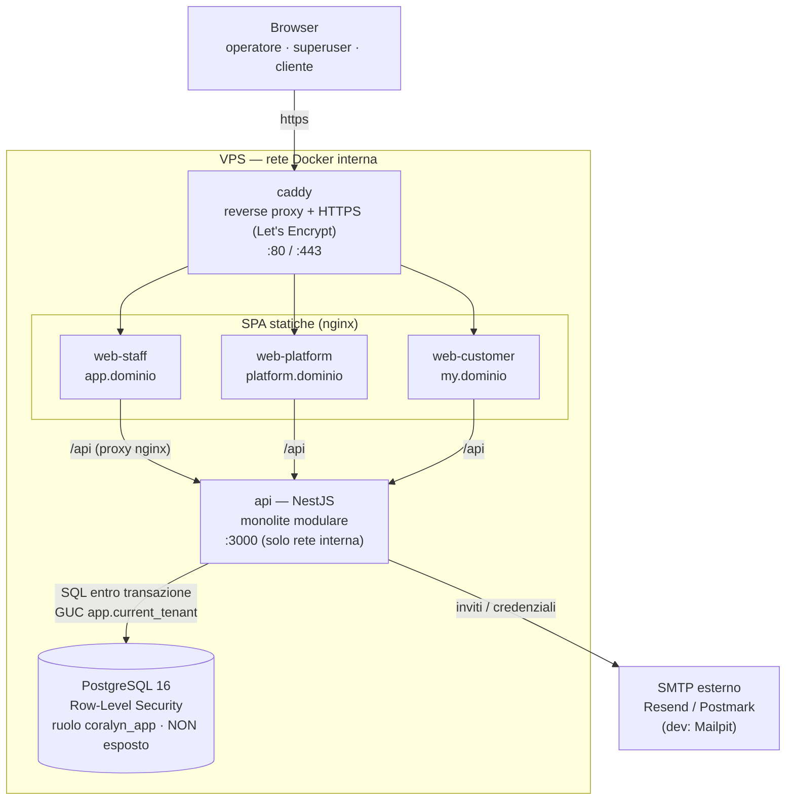
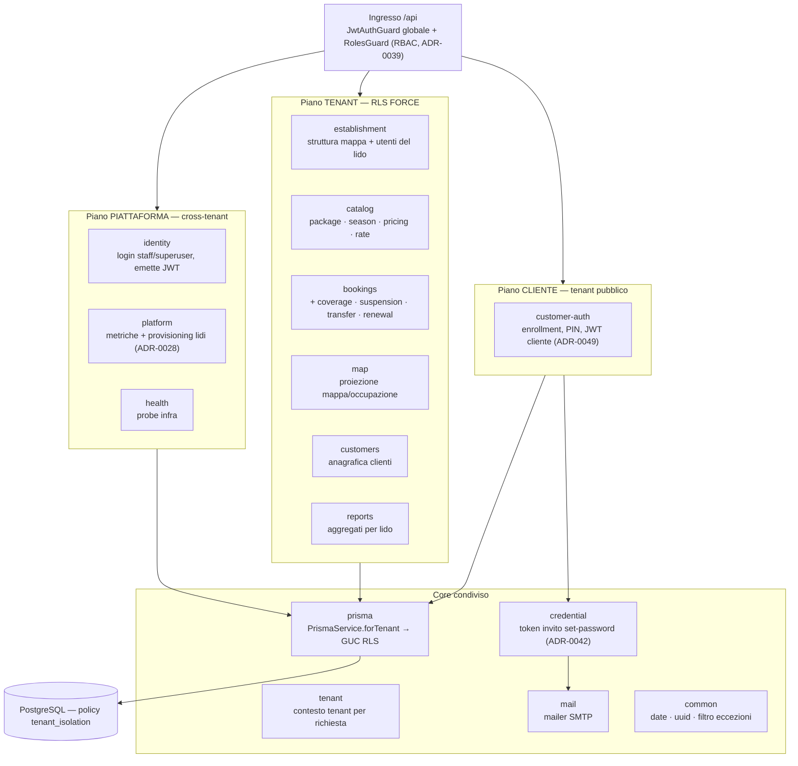
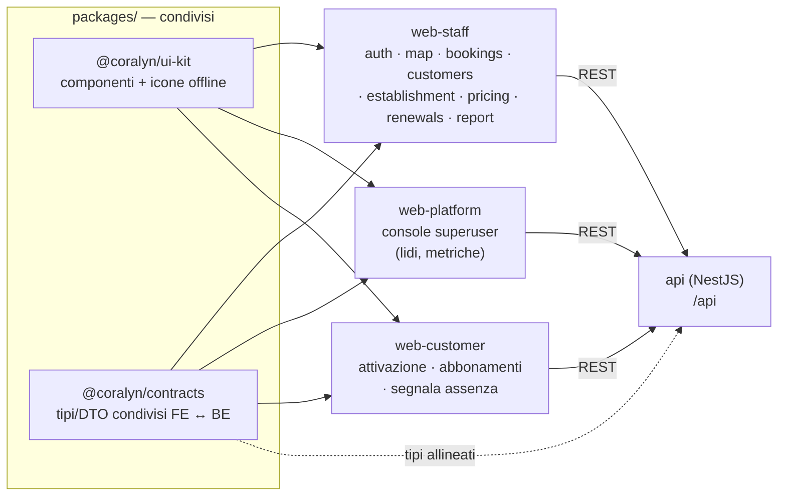

# Architettura di sistema — Coralyn

> Vista d'insieme del programma: come sono fatti e come dialogano i pezzi (deployment,
> moduli backend, frontend, isolamento tenant). Complementare — **non** ridondante — con:
> il modello dati in [data-model.md](data-model.md) (ER), i flussi di dominio in
> [flows.md](flows.md), e le decisioni in [../architecture/decisions/](../architecture/decisions/).
> Stile architetturale: **monolite modulare, API-first** ([ADR-0007](../architecture/decisions/0007-stile-architetturale.md)).

---

## 1. Vista di deployment (produzione)

Un solo VPS con Docker. Caddy è l'unico punto esposto (termina HTTPS); ogni SPA è servita
da un nginx che proxa `/api` al backend; il database non è raggiungibile da Internet.
Dettagli operativi in [../deploy/README.md](../deploy/README.md).



> **Dev vs prod:** in sviluppo le SPA girano coi dev-server Vite (`pnpm dev`), l'email va a
> **Mailpit**, e il DB è esposto su localhost. La produzione (`docker-compose.prod.yml`)
> aggiunge Caddy, usa SMTP reale e tiene il DB interno. Codice identico.

---

## 2. Backend — mappa dei moduli (bounded context)

Un solo deployable, suddiviso in moduli a confini espliciti ([ADR-0007](../architecture/decisions/0007-stile-architetturale.md)).
Tutto entra da un unico ingresso HTTP sotto `/api` ([ADR-0022](../architecture/decisions/0022-base-path-api.md))
con guardia globale. I moduli si dividono in tre **piani** per relazione col tenant, più un
core condiviso.



Sintesi dei moduli:

| Modulo | Responsabilità | Tenant |
|---|---|---|
| `identity` | Autenticazione staff/superuser, emissione JWT ([ADR-0024](../architecture/decisions/0024-strategia-auth.md)) | cross-tenant |
| `platform` | Console superuser: metriche + provisioning nuovi lidi | cross-tenant |
| `establishment` | Struttura fisica del lido (settori/file/ombrelloni) + utenti admin | tenant |
| `catalog` | Listino: pacchetti, stagioni, pricing, tariffe ([ADR-0032](../architecture/decisions/0032-pricing-engine-precedenza.md)) | tenant |
| `bookings` | Prenotazioni (daily/periodic/subscription), coverage, sospensione, cessione, rinnovo | tenant |
| `map` | Proiezione della mappa e dell'occupazione | tenant |
| `customers` | Anagrafica clienti del lido | tenant |
| `reports` | Report/aggregati per stabilimento | tenant |
| `customer-auth` | Auth dei clienti finali (enrollment provisioned, PIN, JWT `kind=customer`) | tenant pubblico |
| `credential` + `mail` | Token di invito e consegna via email | trasversale |
| `tenant` + `prisma` | Contesto tenant e accesso DB RLS-safe | trasversale |

---

## 3. Frontend — tre app, pacchetti condivisi

Tre SPA Vue 3 distinte, che condividono componenti (`ui-kit`) e i **tipi di contratto**
(`contracts`, generati e allineati col backend). Ogni app parla col backend via REST `/api`.



---

## 4. Isolamento multi-tenant — il meccanismo (difesa in profondità)

Il cuore della sicurezza dati ([ADR-0010](../architecture/decisions/0010-isolamento-multi-tenant.md)):
**shared database, shared schema, tenancy a livello di riga**, con **due livelli** di enforcement.
Il tenant è dedotto dal JWT (non da un header, [ADR-0026](../architecture/decisions/0026-identita-rls-utente.md));
`PrismaService.forTenant` imposta la GUC `app.current_tenant` dentro la transazione; le policy
RLS `tenant_isolation` FORCE filtrano; il ruolo `coralyn_app` è `NOBYPASSRLS` (non può aggirarle).

```mermaid
sequenceDiagram
    autonumber
    participant U as Browser
    participant N as nginx (SPA)
    participant G as JwtAuthGuard + RolesGuard
    participant S as Service (es. BookingsService)
    participant P as PrismaService.forTenant
    participant DB as PostgreSQL (RLS)

    U->>N: richiesta + Authorization: Bearer &lt;JWT&gt;
    N->>G: proxy /api/...
    G->>G: verify(JWT) → { sub, role, establishmentId }
    Note over G: req.tenantId = claims.establishmentId<br/>(superuser: null → cross-tenant)
    G->>S: richiesta autorizzata (ruolo verificato)
    S->>P: forTenant(tenantId, fn)
    P->>DB: BEGIN; set_config('app.current_tenant', tenantId, true)
    P->>DB: query di business (nella stessa transazione)
    Note over DB: policy tenant_isolation FORCE +<br/>ruolo coralyn_app NOBYPASSRLS →<br/>ritorna SOLO le righe del tenant
    DB-->>S: righe del solo tenant
    S-->>U: risposta
```

**Perché due livelli:** anche se un giorno un filtro applicativo venisse dimenticato, il
database stesso non restituisce righe di altri tenant. È la rete di sicurezza che rende
l'isolamento logico affidabile quanto serve, mantenendo una sola migrazione e un solo
backup per tutti i tenant.

**Piano di autenticazione (due mondi distinti):**

| | Staff / Superuser | Cliente finale |
|---|---|---|
| Modulo | `identity` | `customer-auth` |
| Credenziale | email + password (argon2id, [ADR-0025](../architecture/decisions/0025-hashing-password.md)) | enrollment provisioned + PIN ([ADR-0049](../architecture/decisions/0049-auth-cliente-provisioned-tenant-pubblico.md)) |
| Token | JWT staff (`establishmentId` nel claim; `null` = superuser cross-tenant) | JWT `kind=customer` (respinto dalle rotte staff) |
| App | web-staff / web-platform | web-customer |

---

## 5. Percorsi di evoluzione (già previsti, non riscritture)

- **Scala orizzontale API:** il backend è stateless (auth via JWT) → più container `api`
  dietro Caddy.
- **DB gestito / pooler:** Postgres su servizio managed quando il DB diventa il collo di bottiglia.
- **Escape hatch silo:** un singolo lido molto grande promosso a **DB dedicato** senza
  toccare il codice ([ADR-0010](../architecture/decisions/0010-isolamento-multi-tenant.md), deferred D-010).
- **IA come servizio separato:** eventuali funzioni IA in un servizio dedicato consumato via
  API, non dentro il core ([ADR-0007](../architecture/decisions/0007-stile-architetturale.md)).

Dettagli di manutenzione/scaling operativo: [../deploy/MANUTENZIONE.md](../deploy/MANUTENZIONE.md).
