# Modello dati del Core (ER)

> ⚠️ **Nomenclatura:** entità, campi e identificatori sono in **inglese** (codice e DB,
> [ADR-0030](../architecture/decisions/0030-codice-e-db-in-inglese.md)). La prosa esplicativa
> resta in italiano; la mappatura termine-di-dominio ↔ identificatore è nel
> [glossario](../architecture/glossary.md). Le entità ancora **non implementate**
> (`Waitlist`, `AuditLog`) hanno nomi di design, da confermare quando verranno realizzate.
> `Booking` è **implementata** (slice A1 — `type=daily`; slice A4.1 — `type=periodic` e
> `type=subscription`: tutti e tre i tipi ora creano prenotazioni reali. `packageId` presente e nullable
> da A3.1). `Package`, `Season`, `Pricing` e `Rate` sono **implementate** (slice A3.1, con RLS
> `tenant_isolation` FORCE e vincolo di non-ambiguità sulla firma delle dimensioni).
>
> **Refinement A3.1 rispetto al design originale:** `Rate.period` (json) → due colonne tipizzate
> `periodStart`/`periodEnd` (`@db.Date`); `Rate.scope "sector/row"` → FK nullable `sectorId`/`rowId`
> (coerente con [ADR-0023](../architecture/decisions/0023-contatti-cliente-colonne-tipizzate.md));
> `Rate` porta `establishmentId` direttamente (per RLS sulla tabella, coerente con tutte le entità
> tenant-scoped); `Booking.packageId` nullable è **valorizzato dal selettore** (slice A3.2: il modale
> sceglie il `Package`, `GET /api/packages` lista i pacchetti del tenant). Pacchetto = dimensione
> **opzionale** (`null` = tariffa base, nessun pacchetto).
>
> **Slice A4.1 (periodiche + abbonamenti):** `BookingsService` deriva l'intervallo dal `type`
> (`deriveInterval`, server-autoritativo) — `periodic`: `startDate`/`endDate` espliciti, validati contro
> la Stagione risolta da `startDate` (un periodo che sfora `season.endDate` → **422**, mai split
> multi-stagione, tracciato in [D-033](../architecture/deferred.md)); `subscription`: il server risolve la
> Stagione attiva (`CatalogService.resolveSeasonWithin`) e impone `startDate=season.startDate`,
> `endDate=season.endDate` (il client non può specificare una fine). Nessuna migrazione: schema, engine di
> pricing e proiezione mappa erano già generali su intervalli.
>
> **Slice A4.2 (rinnovo + anzianità):** `previousBookingId` è ora **valorizzato** da
> `POST /api/bookings/:id/renew` (server-autoritativo: copia customer/umbrella/timeSlot/package dalla
> sorgente, riprezza sul listino della stagione destinazione con lo stesso `priceAndWrite` condiviso da
> `create`). L'anzianità è **derivata** dalla lunghezza della catena `previousBookingId` (risalita
> iterativa via Prisma, RLS-safe). Cabine e sospensione/cessione/disdetta restano rimandate
> ([D-012](../architecture/deferred.md), [D-013](../architecture/deferred.md)). Nessuna migrazione
> anche in questa slice.
>
> **Slice D-011 (prelazione abbonamenti, ADR-0034):** nuova entità `RenewalCampaign` (una migrazione,
> con RLS `tenant_isolation` FORCE come tutte le entità tenant-scoped). Persiste **solo** la scadenza
> + il legame fra stagione di origine e stagione di destinazione: lo stato per-abbonato della finestra
> (`open`/`exercised`/`expired`) è **derivato lazy** (nessuna riga aggiuntiva, nessun job/scheduler).
> Nessun nuovo `BookingStatus`, nessun campo su `Booking`.
>
> **Slice D-013 (disdetta + fondazione occupazione a intervalli):** la **disdetta anticipata** (sotto-slice
> 1/3, [ADR-0011](../architecture/decisions/0011-incasso-base-nel-core.md)) ha aggiunto su `Booking` i campi
> `terminatedAt`, `refundedAmount`, `terminationReason` (lo `status` resta `confirmed`, `endDate` troncata a
> `E-1`; nessun nuovo enum). La **fondazione della sospensione** ([ADR-0046](../architecture/decisions/0046-occupazione-a-intervalli-coverage.md),
> mergiata) ha estratto l'occupazione fisica dalle colonne dirette su `Booking` a una child table
> **`BookingCoverage`** (1..N intervalli per prenotazione): l'anti-overlap `coverage_no_overlap` (EXCLUDE su
> `daterange`) vive **qui**, non più su `Booking` (il vecchio `booking_no_overlap` è stato rimosso). La
> **sospensione** vera e propria — **`BookingSuspension`**, che **scava un buco** nella copertura (due
> modalità *chiusa* `[S,R-1]` / *aperta* con riattiva, unificate da `endDate` nullable) **senza toccare lo
> span di contratto** su `Booking` (prezzo/rinnovo/prelazione/seniority restano invariati: un sospeso
> conserva i diritti) — è mergiata. Spec
> [2026-07-08-subscription-suspension-design.md](../superpowers/specs/2026-07-08-subscription-suspension-design.md).
> La **cessione/subentro** — passaggio di titolarità di un
> abbonamento da un cliente A (cedente) a un cliente B (subentrante) sulla **stessa** `Booking`
> (`customerId` A→B; seniority e prelazione preservate, ereditate da B), con storico su una nuova child
> table **`BookingTransfer`** (mirror `BookingSuspension`) e riconciliazione incasso a **movimento netto**
> su `Booking.amountCollected` (`refundedAmount` **non** toccato — la cessione è un trasferimento, non una
> perdita di ricavo). `BookingCoverage` **non è toccata** dalla cessione (tocca il titolare, non
> l'occupazione) — **è mergiata**. Vedi [ADR-0047](../architecture/decisions/0047-cessione-subentro-titolarita-incasso.md) e
> la spec
> [2026-07-08-subscription-cession-design.md](../superpowers/specs/2026-07-08-subscription-cession-design.md).
>
> **Slice D-035 (assenze comunicate, sotto-slice S1+S2, implementata):** l'abbonato comunica (per ora
> all'operatore, in attesa del canale self-service S3+S4) di essere sicuro di non essere presente in uno
> specifico giorno del proprio abbonamento; **solo** dietro consenso esplicito e attivo l'operatore può
> registrare una **release** che apre la rivendita di quel giorno. `Booking.absenceConsentAt` è lo **stato
> corrente** del consenso (`null` = nessun consenso; valorizzato = consenso attivo), grant/revoke via
> `PATCH` admin-only, idempotente. La release vera e propria — nuova child table **`AbsenceRelease`**
> (mirror `BookingSuspension`/`BookingTransfer`, pura storia RLS FORCE) — scava un **carve a giorno-singolo**
> in `BookingCoverage` (la versione a un solo giorno del carve sospensione): span di contratto e cassa
> dell'abbonato (`amountCollected`/`refundedAmount`) restano **invariati** — nessun rimborso, nessun credito
> ([ADR-0048](../architecture/decisions/0048-assenze-comunicate-release-occupazione.md): la compensazione
> segue la rinuncia al diritto, non il mancato utilizzo). La rivendita è una `Booking` `type=daily`
> indipendente, sul flusso giornaliero esistente. `AbsenceRelease.source` (`operator|customer`) predispone il
> canale cliente (S4). Vedi [ADR-0048](../architecture/decisions/0048-assenze-comunicate-release-occupazione.md)
> e la spec
> [2026-07-09-assenze-comunicate-release-operatore-design.md](../superpowers/specs/2026-07-09-assenze-comunicate-release-operatore-design.md).
>
> **Slice D-035 (canale cliente, sotto-slice S3 — fondazione auth, implementata):** due nuove tabelle
> **fuori-RLS** — `CustomerEnrollmentToken` e `CustomerSession` — danno al cliente del lido un accesso
> self-service **provisioned dall'operatore** (non self-registration). L'operatore genera un **enrollment
> token opaco** (nel QR/link) + un **PIN** a 6 cifre; il cliente attiva one-time+PIN e riceve un **access JWT
> cliente** breve (`kind:'customer'`, 30m) + un **refresh token device-bound rotante**. Sono fuori-RLS come
> `User`/`CredentialSetupToken` ([ADR-0026](../architecture/decisions/0026-identita-rls-utente.md)): dato
> d'identità **pre-tenant**, con `establishmentId` **denormalizzato** come sorgente del tenant (un
> `CustomerJwtGuard` dedicato lo estrae dal claim e popola `req.tenantId`, così `forTenant`/RLS restano
> invariati a valle). Segreti solo-hash (token `sha256`, PIN argon2id via `PasswordHasher`); refresh rotante
> con theft-detection (riuso ⇒ revoca catena); rate-limit controller-scoped su `/customer/*`. Risolve
> [D-026](../architecture/deferred.md)/[D-027](../architecture/deferred.md)/[D-029](../architecture/deferred.md).
> Vedi [ADR-0049](../architecture/decisions/0049-auth-cliente-provisioned-tenant-pubblico.md) e la spec
> [2026-07-10-canale-cliente-self-service-d035-s3-s4-design.md](../superpowers/specs/2026-07-10-canale-cliente-self-service-d035-s3-s4-design.md).
> S4 (feature release `source='customer'` + app `web-customer`) è un piano separato.

Fonte di verità del modello dati del Core operativo. Decisioni:
[mappa](../architecture/decisions/0005-modello-mappa.md),
[prenotazioni & pricing](../architecture/decisions/0006-dominio-prenotazioni-e-pricing.md).

```mermaid
erDiagram
    ESTABLISHMENT ||--o{ SECTOR : "ha"
    ESTABLISHMENT ||--o{ CUSTOMER : "registra"
    ESTABLISHMENT ||--o{ PACKAGE : "definisce"
    ESTABLISHMENT ||--o{ SEASON : "ha"
    ESTABLISHMENT ||--o{ BOOKING : "possiede"
    ESTABLISHMENT ||--o{ WAITLIST : "possiede"
    ESTABLISHMENT ||--o{ USER : "ha"
    ESTABLISHMENT ||--o{ TIME_SLOT : "definisce"
    ESTABLISHMENT ||--o{ UMBRELLA_TYPE : "definisce"
    ESTABLISHMENT ||--o{ AUDIT_LOG : "registra"
    ESTABLISHMENT ||--o{ RENEWAL_CAMPAIGN : "apre"
    USER ||--o{ AUDIT_LOG : "genera"
    TIME_SLOT ||--o{ RATE : "qualifica"
    TIME_SLOT ||--o{ BOOKING : "slot di"
    SECTOR ||--o{ ROW : "contiene"
    ROW |o--o{ UMBRELLA : "contiene (nullable = ritirato, D-055)"
    UMBRELLA_TYPE |o--o{ UMBRELLA : "classifica"
    SEASON ||--o{ PRICING : "contiene"
    PRICING ||--o{ RATE : "contiene"
    PACKAGE ||--o{ RATE : "qualifica"
    PACKAGE ||--o{ BOOKING : "scelto in"
    CUSTOMER ||--o{ BOOKING : "effettua"
    UMBRELLA ||--o{ BOOKING : "oggetto di"
    BOOKING ||--o| BOOKING : "rinnovata in"
    BOOKING ||--|{ BOOKING_COVERAGE : "occupa via (1..N)"
    BOOKING ||--o{ BOOKING_SUSPENSION : "sospesa da"
    BOOKING ||--o{ BOOKING_TRANSFER : "ceduta via (0..N)"
    BOOKING ||--o{ ABSENCE_RELEASE : "assenza liberata via (0..N)"
    UMBRELLA ||--o{ BOOKING_COVERAGE : "coperto da"
    ESTABLISHMENT ||--o{ BOOKING_COVERAGE : "possiede"
    ESTABLISHMENT ||--o{ BOOKING_SUSPENSION : "possiede"
    ESTABLISHMENT ||--o{ BOOKING_TRANSFER : "possiede"
    ESTABLISHMENT ||--o{ ABSENCE_RELEASE : "possiede"
    CUSTOMER ||--o{ BOOKING_TRANSFER : "cede via (previousCustomer)"
    CUSTOMER ||--o{ BOOKING_TRANSFER : "riceve via (newCustomer)"
    CUSTOMER ||--o{ CUSTOMER_ENROLLMENT_TOKEN : "accesso provisioned via"
    CUSTOMER ||--o{ CUSTOMER_SESSION : "sessione via"
    ESTABLISHMENT ||--o{ CUSTOMER_ENROLLMENT_TOKEN : "possiede (denorm, fuori-RLS)"
    ESTABLISHMENT ||--o{ CUSTOMER_SESSION : "possiede (denorm, fuori-RLS)"
    CUSTOMER_ENROLLMENT_TOKEN ||--o{ CUSTOMER_SESSION : "attiva (0..N)"
    CUSTOMER_SESSION ||--o| CUSTOMER_SESSION : "ruotata da (rotatedFrom)"
    CUSTOMER ||--o{ WAITLIST : "richiede"
    SEASON ||--o{ RENEWAL_CAMPAIGN : "origine di"
    SEASON ||--o{ RENEWAL_CAMPAIGN : "destinazione di"

    ESTABLISHMENT {
        uuid id PK
        string name
        json config
    }
    SECTOR {
        uuid id PK
        uuid establishmentId FK
        string name
        int sortOrder
    }
    ROW {
        uuid id PK
        uuid establishmentId FK
        uuid sectorId FK
        string label
        int sortOrder
    }
    UMBRELLA {
        uuid id PK
        uuid establishmentId FK
        uuid rowId FK "nullable = ritirato, sganciato dalla fila (D-055/ADR-0053)"
        uuid umbrellaTypeId FK "nullable; NULL = normale (ADR-0016)"
        string label "numero fisico reale; unico tra gli ATTIVI per Establishment (D-055/ADR-0053)"
        int logicalOrder
        datetime retiredAt "nullable; valorizzato = ritirato, soft-delete (D-055/ADR-0053)"
        string retiredFrom "nullable; snapshot storico «Settore · Fila» al ritiro (D-055/ADR-0053)"
        json presentationPosition "layer visivo (D-005)"
    }
    UMBRELLA_TYPE {
        uuid id PK
        uuid establishmentId FK
        string name "Normale|Mini-palma|Palma|..."
        int sortOrder
        string icon "opzionale: chiave icona per il marker di mappa (ADR-0020)"
    }
    PACKAGE {
        uuid id PK
        uuid establishmentId FK
        string name
        json equipment "n. lettini, sdraio, ..."
    }
    TIME_SLOT {
        uuid id PK
        uuid establishmentId FK
        string name "Giornata intera|Mattina|Pomeriggio"
        time startTime
        time endTime
        int sortOrder
    }
    CUSTOMER {
        uuid id PK
        uuid establishmentId FK
        string firstName
        string lastName
        string phone "nullable; contatto (ADR-0023)"
        string email "nullable; contatto, validato @IsEmail (ADR-0023)"
        string notes "nullable; annotazione libera dello staff (ADR-0023)"
    }
    SEASON {
        uuid id PK
        uuid establishmentId FK
        string name
        date startDate
        date endDate
    }
    PRICING {
        uuid id PK
        uuid establishmentId FK
        uuid seasonId FK
    }
    RATE {
        uuid id PK
        uuid establishmentId FK "tenant (per RLS diretta)"
        uuid pricingId FK
        string type "daily|periodic|subscription; nullable = wildcard"
        uuid sectorId FK "nullable = wildcard (posizione Settore)"
        uuid rowId FK "nullable = wildcard (posizione Fila, più specifica)"
        uuid packageId FK "nullable = wildcard"
        uuid timeSlotId FK "nullable = wildcard (fascia)"
        date periodStart "nullable = tutta la stagione"
        date periodEnd "nullable = tutta la stagione"
        decimal price
        string unit "day (× giorni) | period (forfait)"
    }
    BOOKING {
        uuid id PK
        uuid establishmentId FK
        uuid customerId FK "mutabile via cessione (ADR-0047): A->B, identita del contratto preservata"
        uuid umbrellaId FK
        uuid timeSlotId FK "slot prenotato"
        uuid packageId FK
        uuid previousBookingId FK "rinnovo (self-link, nullable)"
        date startDate
        date endDate
        string type "daily|periodic|subscription"
        string status
        decimal totalPrice
        json extras
        string paymentStatus "unpaid|partial|paid"
        decimal amountCollected
        string paymentMethod "cash|card|transfer|other"
        date collectionDate
        timestamp terminatedAt "nullable; marca la disdetta anticipata (D-013 1/3)"
        decimal refundedAmount "default 0; rimborsi aggregati (disdetta + sospensioni)"
        string terminationReason "nullable; nota operatore della disdetta"
        timestamp absenceConsentAt "nullable; stato consenso 'assenze comunicate' (D-035 S1)"
    }
    BOOKING_COVERAGE {
        uuid id PK
        uuid bookingId FK
        uuid establishmentId FK "tenant (RLS)"
        uuid umbrellaId FK
        date startDate
        date endDate
        int slotStartMin "minuti occupati, DB-autoritativi via trigger coverage_fill_slot_minutes_trg"
        int slotEndMin
        string status "denormalizzato da Booking; il partial constraint coverage_no_overlap filtra 'confirmed'"
    }
    BOOKING_SUSPENSION {
        uuid id PK
        uuid bookingId FK
        uuid establishmentId FK "tenant (RLS FORCE)"
        date startDate "S — primo giorno sospeso"
        date endDate "nullable; R-1 = ultimo giorno sospeso; NULL = aperta (da riattivare)"
        decimal refundedAmount "default 0; rimborso di QUESTA sospensione"
        string reason "nullable"
        timestamp reactivatedAt "nullable; valorizzato quando un'aperta viene chiusa via Riattiva"
        timestamp createdAt
    }
    BOOKING_TRANSFER {
        uuid id PK
        uuid bookingId FK
        uuid establishmentId FK "tenant (RLS FORCE)"
        uuid previousCustomerId FK "cedente (A) al momento della cessione"
        uuid newCustomerId FK "subentrante (B)"
        date effectiveDate "informativa + base pro-rata; non splitta il contratto"
        decimal refundToPrevious "default 0; movimento lordo, non aggregato su Booking.refundedAmount"
        decimal collectedFromNew "default 0; movimento lordo"
        string reason "nullable"
        timestamp createdAt
    }
    ABSENCE_RELEASE {
        uuid id PK
        uuid bookingId FK "CASCADE"
        uuid establishmentId FK "RESTRICT; tenant (RLS FORCE)"
        date date "giorno liberato; fascia = quella del Booking, implicita"
        string source "operator|customer (default operator); S4 additivo"
        timestamp canceledAt "nullable; annullo soft prima della rivendita; null = attiva"
        string reason "nullable"
        timestamp createdAt
    }
    CUSTOMER_ENROLLMENT_TOKEN {
        uuid id PK
        uuid customerId FK "CASCADE"
        uuid establishmentId FK "denorm: SORGENTE DEL TENANT (fuori-RLS, ADR-0026)"
        string tokenHash "sha256(raw); raw solo nel link consegnato, mai a riposo"
        string pinHash "argon2id(PIN); 2o fattore, mai in chiaro"
        int pinAttempts "default 0; lock a CUSTOMER_PIN_MAX_ATTEMPTS"
        timestamp expiresAt
        timestamp activatedAt "nullable; one-time: valorizzato alla 1a attivazione"
        timestamp revokedAt "nullable; revoca operatore / lock PIN"
        uuid createdByUserId "admin che ha provisionato"
        timestamp createdAt
    }
    CUSTOMER_SESSION {
        uuid id PK
        uuid customerId FK "CASCADE"
        uuid establishmentId FK "denorm: tenant (fuori-RLS)"
        uuid enrollmentTokenId FK "CASCADE; la catena della sessione"
        string refreshTokenHash "sha256(raw); raw solo sul device, device-bound"
        uuid rotatedFromId FK "nullable, self-link; catena di rotazione per theft-detection"
        timestamp expiresAt
        timestamp revokedAt "nullable; rotazione / logout / revoca operatore"
        timestamp lastUsedAt "nullable"
        timestamp createdAt
    }
    WAITLIST {
        uuid id PK
        uuid establishmentId FK
        uuid customerId FK
        string scope
        json period
        string status "waiting|promoted|cancelled"
    }
    RENEWAL_CAMPAIGN {
        uuid id PK
        uuid establishmentId FK
        uuid originSeasonId FK "stagione degli aventi-diritto (abbonati uscenti)"
        uuid destinationSeasonId FK "stagione entrante da riservare; unique per Establishment"
        date deadline "scadenza uniforme per campagna (ADR-0031)"
        timestamp createdAt
    }
    USER {
        uuid id PK
        uuid establishmentId FK "null per superuser"
        string email
        string role "admin|staff|superuser"
    }
    AUDIT_LOG {
        uuid id PK
        uuid establishmentId FK "tenant dell'evento (null se globale)"
        uuid userId FK
        string action
        string entity
        uuid entityId
        json detail "sanificato"
        timestamp createdAt
    }
```

## Invarianti e regole

- **Tenant scoping**: ogni entità di business porta `establishmentId`; ogni query è
  filtrata per tenant tramite scoping centrale (guard + middleware) e **Row-Level
  Security** PostgreSQL come rete di sicurezza
  ([ADR-0007](../architecture/decisions/0007-stile-architetturale.md),
  [ADR-0010](../architecture/decisions/0010-isolamento-multi-tenant.md)).
- **Incasso base** (slice A2, **implementato**): lo stato di pagamento vive sulla `Booking`
  ([ADR-0011](../architecture/decisions/0011-incasso-base-nel-core.md)). `paymentStatus`
  (`unpaid`/`partial`/`paid`) è **derivato server-side** da `amountCollected` vs `totalPrice`
  (mai input) via `PATCH /api/bookings/:id/payment`; `paymentMethod`/`collectionDate` completano
  il record. L'entità `Payment` ricca (acconti multipli, ricevute, storni) arriverà con la Cassa
  ([D-009](../architecture/deferred.md)).
- **Rinnovo / anzianità**: `previousBookingId` collega un abbonamento a quello
  della stagione precedente; la catena dà storico e anzianità
  ([ADR-0012](../architecture/decisions/0012-gestione-abbonamenti.md)). **Implementato (A4.2)**:
  `POST /api/bookings/:id/renew` valorizza `previousBookingId`; l'anzianità è derivata dalla catena
  (risalita iterativa via Prisma, non persistita separatamente). Cabine e sospensione/cessione/disdetta
  restano rimandate ([D-012](../architecture/deferred.md), [D-013](../architecture/deferred.md)).
- **Prelazione (D-011, implementata, [ADR-0034](../architecture/decisions/0034-prelazione-finestre-lazy.md))**:
  `RenewalCampaign` è l'**unico** stato persistito (scadenza + legame stagione origine/destinazione,
  una campagna per stagione di destinazione). La finestra per-abbonato e il suo stato
  (`open`/`exercised`/`expired`) sono **derivati** a lettura, confrontando `deadline` con
  `todayInRome()` e l'esistenza di un rinnovo confermato nella stagione di destinazione — nessuna riga
  aggiuntiva. **Invariante di hold**: mentre una finestra è aperta, l'ombrellone+fascia dell'avente
  diritto è **riservato** (409 a un altro cliente che tenti di prenotarlo nella stagione di
  destinazione); il **rilascio è lazy** (nessuno scheduler): alla scadenza (`today > deadline`) o alla
  chiusura della campagna, il blocco cade da solo alla valutazione successiva. Il proprio rinnovo non è
  mai bloccato dal proprio hold. L'hold è verificato dentro `BookingsService.priceAndWrite`, accanto
  all'anti-overlap, non come vincolo DB (stessa filosofia di [D-030](../architecture/deferred.md)).
  Nessun nuovo `BookingStatus`.
- **Audit & superuser**: gli eventi di dominio sono registrati in `AuditLog`
  (sanificati, tenant-tagged); il ruolo `superuser` di piattaforma li consulta
  cross-tenant in sola lettura
  ([ADR-0015](../architecture/decisions/0015-osservabilita-e-console-superuser.md)).
- **Disponibilità per slot**: l'unità di disponibilità è (`Umbrella`, data,
  `TimeSlot`); con un'unica `TimeSlot` "Giornata intera" il modello degrada al caso
  per-giorno.
- **Anti-overlap (per slot)**: non esistono due `Booking` in stato confermato che
  si sovrappongano sullo stesso `Umbrella` per intervalli di date intersecanti **e
  `TimeSlot` uguale o sovrapposto**. Mattina e pomeriggio sullo stesso ombrellone/giorno
  non si sovrappongono ([ADR-0013](../architecture/decisions/0013-granularita-disponibilita-a-slot.md)).
  **Dalla slice A4.1** il controllo è esercitato realmente su **intervalli** (`periodic`/`subscription`
  multi-giorno), non solo sul singolo giorno di una `daily`: `dateRangesOverlap` confronta gli estremi
  delle due prenotazioni, in AND con `slotsOverlap` sulla fascia. **Dalla fondazione sospensione
  ([ADR-0046](../architecture/decisions/0046-occupazione-a-intervalli-coverage.md))** il vincolo DB vive su
  `BookingCoverage` (`coverage_no_overlap`, EXCLUDE su `daterange` filtrato `status='confirmed'`); il vecchio
  `booking_no_overlap` è stato rimosso.
- **Occupazione a intervalli (`BookingCoverage`, [ADR-0046](../architecture/decisions/0046-occupazione-a-intervalli-coverage.md))**:
  l'**occupazione fisica** di una prenotazione è una o più righe `BookingCoverage` (1..N intervalli sullo
  stesso ombrellone), disgiunte per il constraint. Al `create`/`renew` è **1 intervallo = span nominale**;
  le operazioni di dominio che liberano tempo (disdetta = troncamento, sospensione = carve) agiscono **qui**,
  non sullo span di contratto. La lettura d'occupazione (mappa/liste/report) e l'anti-overlap interrogano la
  copertura; i minuti `slotStartMin`/`slotEndMin` sono riempiti da un trigger DB (mai dal client).
- **Disdetta e sospensione (D-013), contratto ↔ occupazione separati**: lo **span di contratto**
  (`Booking.startDate/endDate`) guida prezzo, rinnovo, **prelazione**, seniority; la **copertura** guida
  l'occupazione. La **disdetta** (1/3, implementata) tronca *entrambi* in modo permanente (`endDate=E-1`,
  `terminatedAt`, rimborso in `refundedAmount`). La **sospensione** (`BookingSuspension`, implementata e MERGIATA) scava
  un **buco** nella sola copertura `[S,R-1]` e **non tocca** lo span: un sospeso resta abbonato con tutti i
  diritti; il buco è rivendibile (walk-in) e, in modalità chiusa, la coda `[R,end]` resta riservata. Due
  modalità unificate da `endDate` nullable (aperta = `NULL`, chiusa via riattiva). `refundedAmount` **aggrega**
  disdetta + sospensioni, così il netto `amountCollected − refundedAmount` resta fonte unica per i report.
  `BookingSuspension` è tenant-scoped (RLS FORCE) e pura storia/accountability (l'anti-double-booking è
  garantito dalla copertura, non da qui).
- **Cessione/subentro (D-013, implementata e MERGIATA, [ADR-0047](../architecture/decisions/0047-cessione-subentro-titolarita-incasso.md))**:
  la cessione tocca **il titolare, non l'occupazione**. `Booking.customerId` è **mutabile** — passa da A
  (cedente) a B (subentrante) sulla **stessa** riga; span di contratto, prezzo, `previousBookingId`
  (seniority) e prelazione restano invariati e seguono B automaticamente. `BookingCoverage` non è toccata
  (nessun carve, nessuna interazione con `coverage_no_overlap`). La riconciliazione incasso è un
  **movimento netto** su `amountCollected` (`− refundToPrevious + collectedFromNew`, clampato
  `[0, totalPrice]`, `paymentStatus` ricalcolato); **`refundedAmount` non viene toccato** dalla cessione (è
  un trasferimento, non una perdita di ricavo — a differenza di disdetta/sospensione), così
  `netto = amountCollected − refundedAmount` resta fonte unica. Lo storico vive sulla nuova child table
  **`BookingTransfer`** (mirror `BookingSuspension`: RLS FORCE, pura storia, nessun `createdBy` → audit
  attore deferito a D-047).
- **Assenze comunicate (D-035 S1+S2, implementata, [ADR-0048](../architecture/decisions/0048-assenze-comunicate-release-occupazione.md))**:
  una release tocca **solo l'occupazione di un giorno**, mai lo span di contratto né la cassa dell'abbonato.
  `Booking.absenceConsentAt` è lo **stato corrente** del consenso "assenze comunicate" (`null`/valorizzato,
  grant/revoke idempotente via `PATCH` admin-only); **nessuna release è possibile senza consenso attivo**
  (`422 NO_CONSENT`) — nessuna presunzione d'assenza. La release scava un **carve a giorno-singolo** in
  `BookingCoverage` (testa/coda del frammento coperto, mirror del carve-chiuso sospensione), lasciando lo
  span e `amountCollected`/`refundedAmount` **invariati** (ADR-0048: la compensazione segue la rinuncia al
  diritto, non il mancato utilizzo — a differenza di disdetta/sospensione che rimborsano). La storia vive
  sulla nuova child table **`AbsenceRelease`** (mirror `BookingSuspension`/`BookingTransfer`: RLS FORCE, pura
  storia, nessun `createdBy` → audit attore deferito a D-047); `source` (`operator|customer`) predispone il
  canale cliente self-service (S4, deferito insieme a S3 auth-cliente). L'annullo di una release è ammesso
  solo se il giorno non è già stato rivenduto (altrimenti `409`, mirror `reactivate` sospensione). La
  rivendita non introduce un endpoint nuovo: è una `Booking type=daily` indipendente sul flusso di
  prenotazione giornaliera esistente.
- **Risoluzione prezzo** (slice A3.1, **implementato**): il pricing engine puro (`resolvePrice`)
  seleziona la `Rate` applicabile secondo la **precedenza esplicita lessicografica**
  periodo › fila › settore › pacchetto › fascia › tipo ([ADR-0032](../architecture/decisions/0032-pricing-engine-precedenza.md)).
  Ogni dimensione null è wildcard; una `Rate` catch-all (tutte le dimensioni null) è la rete di
  default obbligatoria di un listino ben formato. No-match → **422** (mai €0 silenzioso); nessuna
  stagione attiva → **422** (NO_SEASON). `UmbrellaType` esclusa dal pricing ([D-018](../architecture/deferred.md)).
  Ambiguità impossibile per costruzione: `@@unique` sulla firma delle dimensioni con
  `NULLS NOT DISTINCT`. Il `totalPrice` è **calcolato dal server** (non accettato dal client):
  `POST /api/bookings` richiama `CatalogService.quote(...)` nella stessa transazione. Il `packageId`
  scelto (slice A3.2, opzionale; `null` = tariffa base) è pre-validato nel tenant (→ 422 se invalido) e
  passato all'engine come dimensione di prezzo (precedenza pacchetto, [ADR-0032](../architecture/decisions/0032-pricing-engine-precedenza.md)).
- **Posizione**: `logicalOrder` governa l'ordinamento nella fila;
  `presentationPosition` è un layer visivo opzionale (porta aperta alla planimetria,
  [D-005](../architecture/deferred.md)).
- **Etichetta ombrellone**: `label` è il **numero/identificativo fisico reale**
  (stringa libera: `"1"`, `"47"`, `"A1"`, `"12bis"`), **unico tra gli ATTIVI per
  Establishment** (indice unico parziale `WHERE "retiredAt" IS NULL`, invisibile al DSL
  Prisma, [D-055](../architecture/deferred.md)/[ADR-0053](../architecture/decisions/0053-ritiro-ombrellone-soft-delete.md))
  e **disaccoppiato** da `logicalOrder` e dalla tipologia. L'auto‑generazione del setup è
  una comodità: etichette modificabili singolarmente, buchi ammessi
  ([ADR-0016](../architecture/decisions/0016-tipologia-ombrellone.md)). I **ritirati**
  conservano la propria label a fini storici: una volta ritirato un «12», un nuovo «12»
  attivo può essere creato subito — collisione accettata, mai nello stesso istante tra due
  attivi.
- **Ritiro ombrellone (soft-delete)**: un ombrellone con storico prenotazioni non è
  eliminabile (guardia block-409 di `delete` + FK `Booking.umbrellaId` RESTRICT,
  [ADR-0052](../architecture/decisions/0052-editor-struttura-cantiere.md)); `retiredAt`
  (nullable, non-null = ritirato) lo dismette dalla spiaggia operativa **sganciandolo dalla
  fila** (`rowId → null`) preservando lo storico intatto, con `retiredFrom` a registrarne lo
  snapshot testuale di posizione. Reversibile via `Ripristina` (sceglie la fila di
  destinazione, ricalcola `logicalOrder`). Guardia di ritiro: prenotazioni **confermate** con
  `endDate` futura bloccano (409); scadute/cancellate no
  ([D-055](../architecture/deferred.md)/[ADR-0053](../architecture/decisions/0053-ritiro-ombrellone-soft-delete.md)).
- **Tipologia**: `UmbrellaType` (per Establishment) classifica gli ombrelloni (es. Normale,
  Mini‑palma, Palma) **ortogonalmente alla posizione**; `Umbrella.umbrellaTypeId` è
  nullable (`NULL` = normale). È **classificazione** (display, scelta cliente,
  disponibilità per tipo), **non** una dimensione di prezzo: il prezzo resta per posizione
  ([ADR-0006](../architecture/decisions/0006-dominio-prenotazioni-e-pricing.md));
  prezzo‑per‑tipo rimandato ([D-018](../architecture/deferred.md),
  [ADR-0016](../architecture/decisions/0016-tipologia-ombrellone.md)). Porta una `icon`
  opzionale (chiave del registry icone del `ui-kit`) per il marker di tipo sulla mappa
  ([ADR-0020](../architecture/decisions/0020-resa-mappa.md)).
- **Ombrelloni speciali**: gli esemplari fuori griglia (es. palme) si modellano come un
  **Sector dedicato** ("Speciali") con Row; nell'MVP ogni `Umbrella` resta in una
  `Row` (standalone rimandato, [D-019](../architecture/deferred.md))
  ([ADR-0016](../architecture/decisions/0016-tipologia-ombrellone.md)).
- **Disambiguazione**: `Customer` = il bagnante; il *tenant* è lo `Establishment`
  (mai chiamarlo "customer" nel codice).
- **Contatti del Cliente**: `phone` ed `email` sono **colonne tipizzate nullable**
  (non un `json contatti`), `notes` è un `text` libero di servizio; l'`email` è validata
  server-side (`@IsEmail`). Scelta motivata in
  [ADR-0023](../architecture/decisions/0023-contatti-cliente-colonne-tipizzate.md);
  cancellazione/anonimizzazione del Customer (GDPR) rimandata a
  [D-024](../architecture/deferred.md).
- **Identità & RLS**: `User` porta `establishmentId` **nullable** (null = superuser di
  piattaforma) e il `role` è un **enum DB** (`admin|staff|superuser`). A differenza delle altre
  tabelle tenant-scoped, `User` **non** abilita la policy RLS `tenant_isolation`: il login è
  pre-tenant e l'accesso è mediato solo da `IdentityService`
  ([ADR-0026](../architecture/decisions/0026-identita-rls-utente.md)). Il tenant delle richieste
  è ricavato dal **JWT** dalla `JwtAuthGuard`, che popola `req.tenantId`
  ([ADR-0024](../architecture/decisions/0024-strategia-auth.md)).
- **Auth canale cliente (D-035 S3, [ADR-0049](../architecture/decisions/0049-auth-cliente-provisioned-tenant-pubblico.md))**:
  `CustomerEnrollmentToken` e `CustomerSession` sono **fuori-RLS** come `User`/`CredentialSetupToken` (dato
  d'identità **pre-tenant**): l'`establishmentId` **denormalizzato** è la **sorgente del tenant**, non una
  colonna filtrata da RLS. L'accesso è **provisioned dall'operatore** (admin), mai self-registration: token
  opaco one-time + PIN (secondo fattore), entrambi **solo-hash** a riposo (token `sha256`, PIN argon2id via
  `PasswordHasher`). L'attivazione emette un **access JWT cliente** breve (`kind:'customer'`, claim `sub`
  /`establishmentId`) + un **refresh token device-bound rotante**; un `CustomerJwtGuard` **dedicato**
  (controller-scoped, le rotte `/customer/*` sono `@Public()` rispetto alla `JwtAuthGuard` staff) valida
  l'access JWT e popola `req.tenantId = establishmentId` **dal claim**, così `forTenant`/RLS restano invariati
  a valle. Ownership a **due assi**: RLS isola il tenant, il principal (`req.customer.id`) isola il cliente
  nel tenant. La sessione ruota a ogni refresh (`rotatedFromId`); il **riuso** di un refresh già ruotato è
  furto ⇒ **revoca dell'intera catena** (`enrollmentTokenId`). Fallimenti auth = **401 generico** (no
  enumeration, D-029); rate-limit controller-scoped su `/customer/*` (D-027). Risolve
  [D-026](../architecture/deferred.md)/[D-027](../architecture/deferred.md)/[D-029](../architecture/deferred.md);
  [D-028](../architecture/deferred.md) (percorso RLS `User`) valutato e confermato non-trigger.
