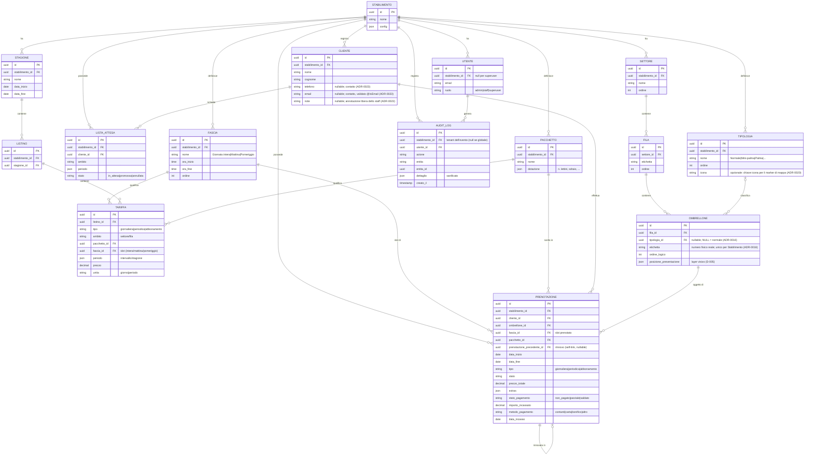

# Modello dati del Core (ER)

Fonte di verità del modello dati del Core operativo. Termini di dominio in italiano
([ADR-0003](../architecture/decisions/0003-language-convention.md)). Decisioni:
[mappa](../architecture/decisions/0005-modello-mappa.md),
[prenotazioni & pricing](../architecture/decisions/0006-dominio-prenotazioni-e-pricing.md).

## Invarianti e regole

- **Tenant scoping**: ogni entità di business porta `stabilimento_id`; ogni query è
  filtrata per tenant tramite scoping centrale (guard + middleware) e **Row-Level
  Security** PostgreSQL come rete di sicurezza
  ([ADR-0007](../architecture/decisions/0007-stile-architetturale.md),
  [ADR-0010](../architecture/decisions/0010-isolamento-multi-tenant.md)).
- **Incasso base**: lo stato di pagamento vive sulla `PRENOTAZIONE`
  ([ADR-0011](../architecture/decisions/0011-incasso-base-nel-core.md)); l'entità
  `Pagamento` completa arriverà con la Cassa ([D-009](../architecture/deferred.md)).
- **Rinnovo / anzianità**: `prenotazione_precedente_id` collega un abbonamento a quello
  della stagione precedente; la catena dà storico e anzianità
  ([ADR-0012](../architecture/decisions/0012-gestione-abbonamenti.md)). Prelazione
  automatica e cabine sono rimandate ([D-011](../architecture/deferred.md),
  [D-012](../architecture/deferred.md)).
- **Audit & superuser**: gli eventi di dominio sono registrati in `AUDIT_LOG`
  (sanificati, tenant-tagged); il ruolo `superuser` di piattaforma li consulta
  cross-tenant in sola lettura
  ([ADR-0015](../architecture/decisions/0015-osservabilita-e-console-superuser.md)).
- **Disponibilità per slot**: l'unità di disponibilità è (`OMBRELLONE`, data,
  `FASCIA`); con un'unica `FASCIA` "Giornata intera" il modello degrada al caso
  per-giorno.
- **Anti-overlap (per slot)**: non esistono due `PRENOTAZIONE` in stato confermato che
  si sovrappongano sullo stesso `OMBRELLONE` per intervalli di date intersecanti **e
  `FASCIA` uguale o sovrapposta**. Mattina e pomeriggio sullo stesso ombrellone/giorno
  non si sovrappongono ([ADR-0013](../architecture/decisions/0013-granularita-disponibilita-a-slot.md)).
- **Risoluzione prezzo**: il pricing engine seleziona la `TARIFFA` applicabile a una
  `PRENOTAZIONE` combinando {tipo, ambito posizione, pacchetto, **fascia**, periodo},
  dalla regola più specifica alla più generica. Le dimensioni della `TARIFFA` possono
  essere generiche (non specificate) per fungere da regola di default.
- **Posizione**: `ordine_logico` governa l'ordinamento nella fila;
  `posizione_presentazione` è un layer visivo opzionale (porta aperta alla planimetria,
  [D-005](../architecture/deferred.md)).
- **Etichetta ombrellone**: `etichetta` è il **numero/identificativo fisico reale**
  (stringa libera: `"1"`, `"47"`, `"A1"`, `"12bis"`), **unico per Stabilimento** e
  **disaccoppiato** da `ordine_logico` e dalla tipologia. L'auto‑generazione del setup è
  una comodità: etichette modificabili singolarmente, buchi ammessi
  ([ADR-0016](../architecture/decisions/0016-tipologia-ombrellone.md)).
- **Tipologia**: `Tipologia` (per Stabilimento) classifica gli ombrelloni (es. Normale,
  Mini‑palma, Palma) **ortogonalmente alla posizione**; `Ombrellone.tipologia_id` è
  nullable (`NULL` = normale). È **classificazione** (display, scelta cliente,
  disponibilità per tipo), **non** una dimensione di prezzo: il prezzo resta per posizione
  ([ADR-0006](../architecture/decisions/0006-dominio-prenotazioni-e-pricing.md));
  prezzo‑per‑tipo rimandato ([D-018](../architecture/deferred.md),
  [ADR-0016](../architecture/decisions/0016-tipologia-ombrellone.md)). Porta una `icona`
  opzionale (chiave del registry icone del `ui-kit`) per il marker di tipo sulla mappa
  ([ADR-0020](../architecture/decisions/0020-resa-mappa.md)).
- **Ombrelloni speciali**: gli esemplari fuori griglia (es. palme) si modellano come un
  **Settore dedicato** ("Speciali") con Fila; nell'MVP ogni `Ombrellone` resta in una
  `Fila` (standalone rimandato, [D-019](../architecture/deferred.md))
  ([ADR-0016](../architecture/decisions/0016-tipologia-ombrellone.md)).
- **Disambiguazione**: `CLIENTE` = il bagnante; il *tenant* è lo `STABILIMENTO`
  (mai chiamarlo "cliente" nel codice).
- **Contatti del Cliente**: `telefono` ed `email` sono **colonne tipizzate nullable**
  (non un `json contatti`), `note` è un `text` libero di servizio; l'`email` è validata
  server-side (`@IsEmail`). Scelta motivata in
  [ADR-0023](../architecture/decisions/0023-contatti-cliente-colonne-tipizzate.md);
  cancellazione/anonimizzazione del Cliente (GDPR) rimandata a
  [D-024](../architecture/deferred.md).
