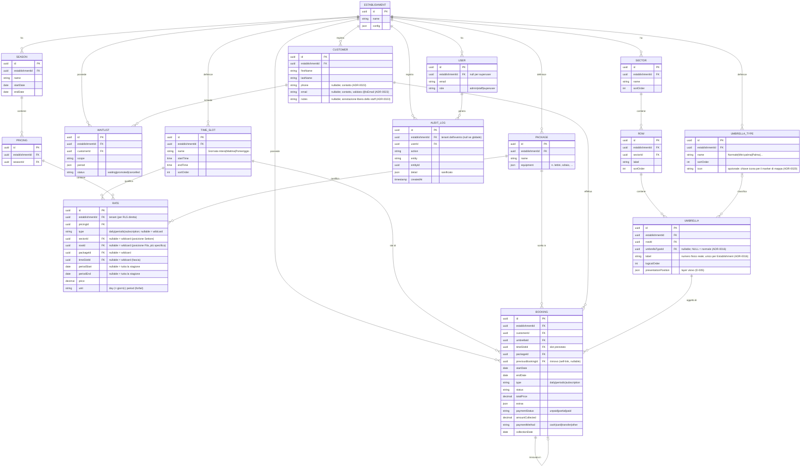

# Modello dati del Core (ER)

> ⚠️ **Nomenclatura:** entità, campi e identificatori sono in **inglese** (codice e DB,
> [ADR-0030](../architecture/decisions/0030-codice-e-db-in-inglese.md)). La prosa esplicativa
> resta in italiano; la mappatura termine-di-dominio ↔ identificatore è nel
> [glossario](../architecture/glossary.md). Le entità ancora **non implementate**
> (`Waitlist`, `AuditLog`) hanno nomi di design, da confermare quando verranno realizzate.
> `Booking` è **implementata** (slice A1 — `type=daily`; slice A4.1 — `type=periodic` e
> `type=subscription`: tutti e tre i tipi ora creano prenotazioni reali. `packageId` presente e nullable
> da A3.1). `Package`, `Season`, `Pricing` e `Rate` sono **implementate** (slice A3.1, con RLS
> `tenant_isolation` FORCE e vincolo di non-ambiguità sulla firma delle dimensioni).
>
> **Refinement A3.1 rispetto al design originale:** `Rate.period` (json) → due colonne tipizzate
> `periodStart`/`periodEnd` (`@db.Date`); `Rate.scope "sector/row"` → FK nullable `sectorId`/`rowId`
> (coerente con [ADR-0023](../architecture/decisions/0023-contatti-cliente-colonne-tipizzate.md));
> `Rate` porta `establishmentId` direttamente (per RLS sulla tabella, coerente con tutte le entità
> tenant-scoped); `Booking.packageId` nullable è **valorizzato dal selettore** (slice A3.2: il modale
> sceglie il `Package`, `GET /api/packages` lista i pacchetti del tenant). Pacchetto = dimensione
> **opzionale** (`null` = tariffa base, nessun pacchetto).
>
> **Slice A4.1 (periodiche + abbonamenti):** `BookingsService` deriva l'intervallo dal `type`
> (`deriveInterval`, server-autoritativo) — `periodic`: `startDate`/`endDate` espliciti, validati contro
> la Stagione risolta da `startDate` (un periodo che sfora `season.endDate` → **422**, mai split
> multi-stagione, tracciato in [D-033](../architecture/deferred.md)); `subscription`: il server risolve la
> Stagione attiva (`CatalogService.resolveSeasonWithin`) e impone `startDate=season.startDate`,
> `endDate=season.endDate` (il client non può specificare una fine). Nessuna migrazione: schema, engine di
> pricing e proiezione mappa erano già generali su intervalli. `previousBookingId` resta **inutilizzato
> fino ad A4.2** (rinnovo).

Fonte di verità del modello dati del Core operativo. Decisioni:
[mappa](../architecture/decisions/0005-modello-mappa.md),
[prenotazioni & pricing](../architecture/decisions/0006-dominio-prenotazioni-e-pricing.md).

## Invarianti e regole

- **Tenant scoping**: ogni entità di business porta `establishmentId`; ogni query è
  filtrata per tenant tramite scoping centrale (guard + middleware) e **Row-Level
  Security** PostgreSQL come rete di sicurezza
  ([ADR-0007](../architecture/decisions/0007-stile-architetturale.md),
  [ADR-0010](../architecture/decisions/0010-isolamento-multi-tenant.md)).
- **Incasso base** (slice A2, **implementato**): lo stato di pagamento vive sulla `Booking`
  ([ADR-0011](../architecture/decisions/0011-incasso-base-nel-core.md)). `paymentStatus`
  (`unpaid`/`partial`/`paid`) è **derivato server-side** da `amountCollected` vs `totalPrice`
  (mai input) via `PATCH /api/bookings/:id/payment`; `paymentMethod`/`collectionDate` completano
  il record. L'entità `Payment` ricca (acconti multipli, ricevute, storni) arriverà con la Cassa
  ([D-009](../architecture/deferred.md)).
- **Rinnovo / anzianità**: `previousBookingId` collega un abbonamento a quello
  della stagione precedente; la catena dà storico e anzianità
  ([ADR-0012](../architecture/decisions/0012-gestione-abbonamenti.md)). Il campo esiste dallo schema A1
  ma resta **inutilizzato (sempre `null`) fino ad A4.2**, che introduce l'azione di rinnovo. Prelazione
  automatica e cabine sono rimandate ([D-011](../architecture/deferred.md),
  [D-012](../architecture/deferred.md)).
- **Audit & superuser**: gli eventi di dominio sono registrati in `AuditLog`
  (sanificati, tenant-tagged); il ruolo `superuser` di piattaforma li consulta
  cross-tenant in sola lettura
  ([ADR-0015](../architecture/decisions/0015-osservabilita-e-console-superuser.md)).
- **Disponibilità per slot**: l'unità di disponibilità è (`Umbrella`, data,
  `TimeSlot`); con un'unica `TimeSlot` "Giornata intera" il modello degrada al caso
  per-giorno.
- **Anti-overlap (per slot)**: non esistono due `Booking` in stato confermato che
  si sovrappongano sullo stesso `Umbrella` per intervalli di date intersecanti **e
  `TimeSlot` uguale o sovrapposto**. Mattina e pomeriggio sullo stesso ombrellone/giorno
  non si sovrappongono ([ADR-0013](../architecture/decisions/0013-granularita-disponibilita-a-slot.md)).
  **Dalla slice A4.1** il controllo è esercitato realmente su **intervalli** (`periodic`/`subscription`
  multi-giorno), non solo sul singolo giorno di una `daily`: `dateRangesOverlap` confronta gli estremi
  delle due prenotazioni, in AND con `slotsOverlap` sulla fascia.
- **Risoluzione prezzo** (slice A3.1, **implementato**): il pricing engine puro (`resolvePrice`)
  seleziona la `Rate` applicabile secondo la **precedenza esplicita lessicografica**
  periodo › fila › settore › pacchetto › fascia › tipo ([ADR-0032](../architecture/decisions/0032-pricing-engine-precedenza.md)).
  Ogni dimensione null è wildcard; una `Rate` catch-all (tutte le dimensioni null) è la rete di
  default obbligatoria di un listino ben formato. No-match → **422** (mai €0 silenzioso); nessuna
  stagione attiva → **422** (NO_SEASON). `UmbrellaType` esclusa dal pricing ([D-018](../architecture/deferred.md)).
  Ambiguità impossibile per costruzione: `@@unique` sulla firma delle dimensioni con
  `NULLS NOT DISTINCT`. Il `totalPrice` è **calcolato dal server** (non accettato dal client):
  `POST /api/bookings` richiama `CatalogService.quote(...)` nella stessa transazione. Il `packageId`
  scelto (slice A3.2, opzionale; `null` = tariffa base) è pre-validato nel tenant (→ 422 se invalido) e
  passato all'engine come dimensione di prezzo (precedenza pacchetto, [ADR-0032](../architecture/decisions/0032-pricing-engine-precedenza.md)).
- **Posizione**: `logicalOrder` governa l'ordinamento nella fila;
  `presentationPosition` è un layer visivo opzionale (porta aperta alla planimetria,
  [D-005](../architecture/deferred.md)).
- **Etichetta ombrellone**: `label` è il **numero/identificativo fisico reale**
  (stringa libera: `"1"`, `"47"`, `"A1"`, `"12bis"`), **unico per Establishment** e
  **disaccoppiato** da `logicalOrder` e dalla tipologia. L'auto‑generazione del setup è
  una comodità: etichette modificabili singolarmente, buchi ammessi
  ([ADR-0016](../architecture/decisions/0016-tipologia-ombrellone.md)).
- **Tipologia**: `UmbrellaType` (per Establishment) classifica gli ombrelloni (es. Normale,
  Mini‑palma, Palma) **ortogonalmente alla posizione**; `Umbrella.umbrellaTypeId` è
  nullable (`NULL` = normale). È **classificazione** (display, scelta cliente,
  disponibilità per tipo), **non** una dimensione di prezzo: il prezzo resta per posizione
  ([ADR-0006](../architecture/decisions/0006-dominio-prenotazioni-e-pricing.md));
  prezzo‑per‑tipo rimandato ([D-018](../architecture/deferred.md),
  [ADR-0016](../architecture/decisions/0016-tipologia-ombrellone.md)). Porta una `icon`
  opzionale (chiave del registry icone del `ui-kit`) per il marker di tipo sulla mappa
  ([ADR-0020](../architecture/decisions/0020-resa-mappa.md)).
- **Ombrelloni speciali**: gli esemplari fuori griglia (es. palme) si modellano come un
  **Sector dedicato** ("Speciali") con Row; nell'MVP ogni `Umbrella` resta in una
  `Row` (standalone rimandato, [D-019](../architecture/deferred.md))
  ([ADR-0016](../architecture/decisions/0016-tipologia-ombrellone.md)).
- **Disambiguazione**: `Customer` = il bagnante; il *tenant* è lo `Establishment`
  (mai chiamarlo "customer" nel codice).
- **Contatti del Cliente**: `phone` ed `email` sono **colonne tipizzate nullable**
  (non un `json contatti`), `notes` è un `text` libero di servizio; l'`email` è validata
  server-side (`@IsEmail`). Scelta motivata in
  [ADR-0023](../architecture/decisions/0023-contatti-cliente-colonne-tipizzate.md);
  cancellazione/anonimizzazione del Customer (GDPR) rimandata a
  [D-024](../architecture/deferred.md).
- **Identità & RLS**: `User` porta `establishmentId` **nullable** (null = superuser di
  piattaforma) e il `role` è un **enum DB** (`admin|staff|superuser`). A differenza delle altre
  tabelle tenant-scoped, `User` **non** abilita la policy RLS `tenant_isolation`: il login è
  pre-tenant e l'accesso è mediato solo da `IdentityService`
  ([ADR-0026](../architecture/decisions/0026-identita-rls-utente.md)). Il tenant delle richieste
  è ricavato dal **JWT** dalla `JwtAuthGuard`, che popola `req.tenantId`
  ([ADR-0024](../architecture/decisions/0024-strategia-auth.md)).
