# Flussi principali del Core

Fonte di verità dei flussi operativi. Vedi
[ADR-0006](../architecture/decisions/0006-dominio-prenotazioni-e-pricing.md).

## 1. Setup iniziale (admin dello stabilimento)

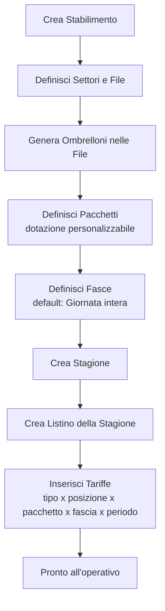

## 2. Operativo giornaliero (staff)

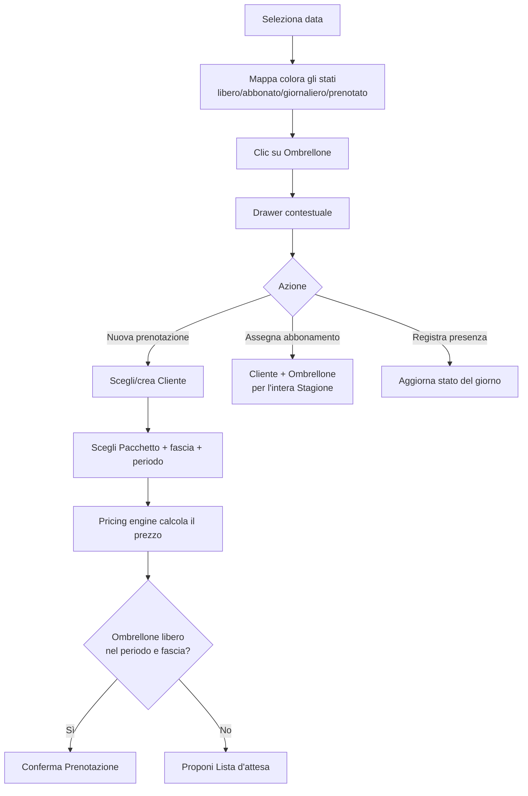

## 3. Stati della Prenotazione

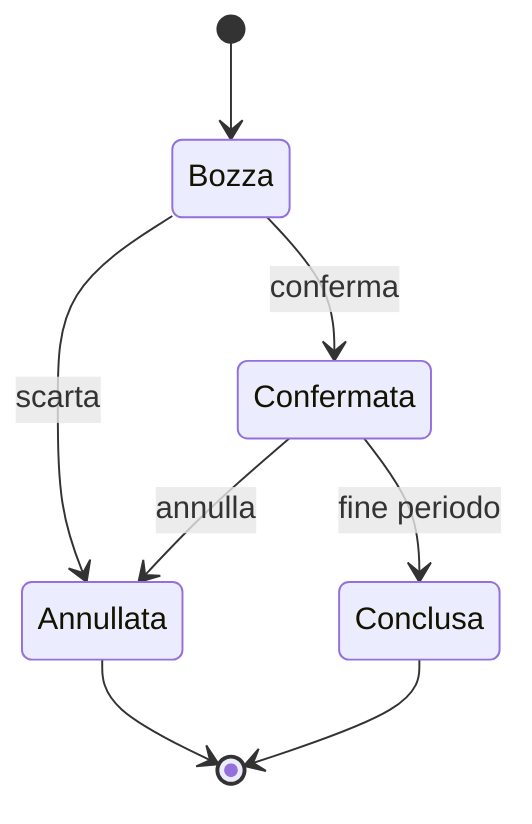

> Nota: lo stato "opzione/hold" temporaneo con scadenza automatica è rimandato
> ([D-006](../architecture/deferred.md)); nell'MVP la Lista d'attesa è promossa
> manualmente a Prenotazione.

## 4. Rinnovo abbonamento (inizio stagione)

Vedi [ADR-0012](../architecture/decisions/0012-gestione-abbonamenti.md).

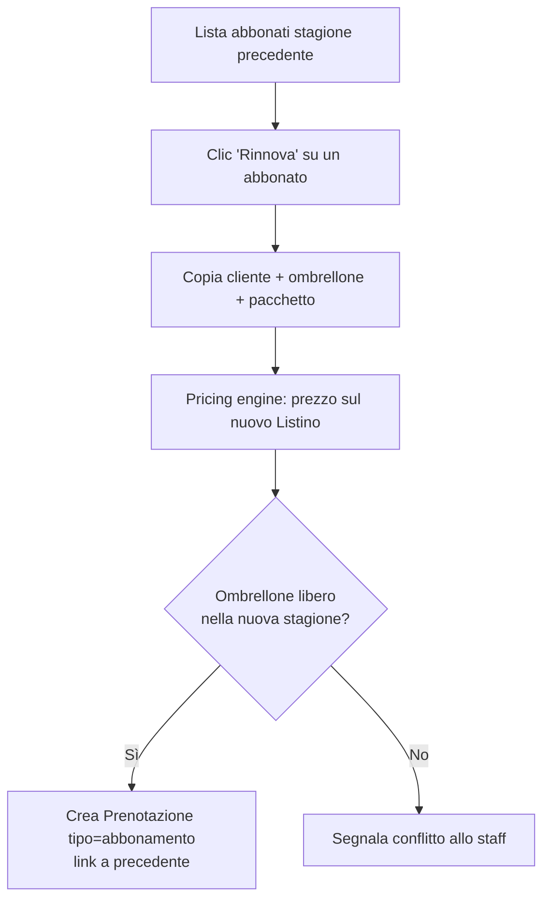

> La **prelazione automatica** (scadenze, rilascio del posto, priorità per anzianità)
> è rimandata ([D-011](../architecture/deferred.md)); nell'MVP la campagna rinnovi è
> guidata ma manuale.

## 5. Sospensione abbonamento (D-013, *in design*)

Un abbonato libera un periodo del proprio abbonamento (rivendita abilitata nel buco) e poi riprende. Agisce
**solo sull'occupazione** (`BookingCoverage`), mai sullo span di contratto: prezzo, rinnovo, prelazione e
seniority restano invariati. Vedi la
[spec](../superpowers/specs/2026-07-08-subscription-suspension-design.md),
[ADR-0046](../architecture/decisions/0046-occupazione-a-intervalli-coverage.md) (occupazione a intervalli),
[ADR-0011](../architecture/decisions/0011-incasso-base-nel-core.md) (rimborso).

**Decisione operatore** (ammin.) sulla Scheda cliente, bottoni adiacenti:

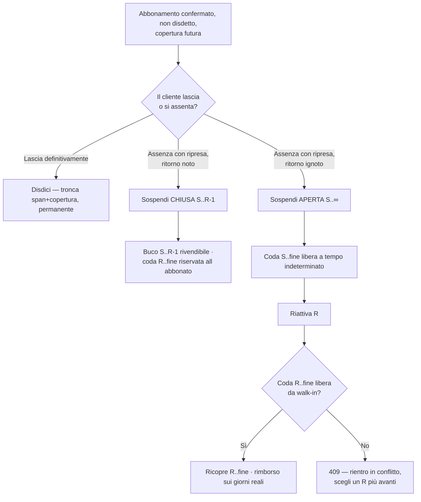

**Macchina a stati del record `BookingSuspension`** (discriminatore = `endDate IS NULL`):

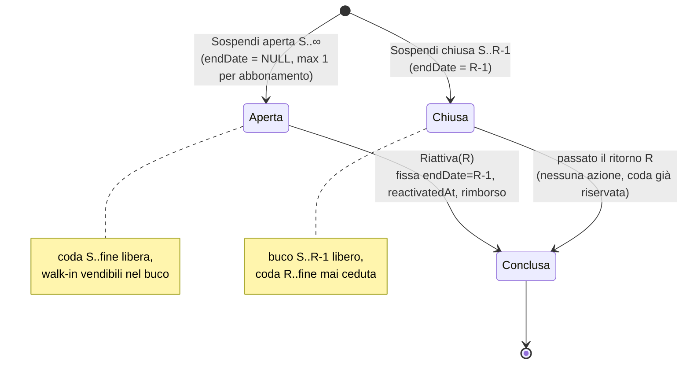

**Meccanica del carve sulla copertura** (dentro la transazione, tenant-scoped):

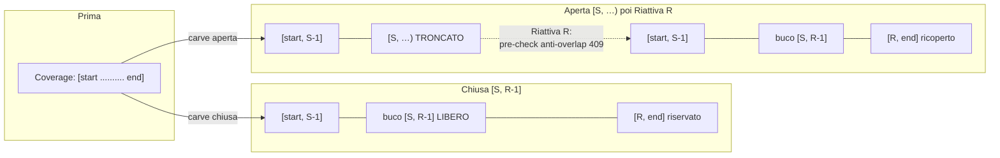

> **Invarianti chiave** (§6 spec): `S ≥ oggi`; solo `type=subscription`, `status=confirmed`, non disdetto;
> `[S,…]` dentro una copertura **futura** (non un buco già libero → 422); **una sola** sospensione aperta per
> abbonamento (409); la **chiusa** richiede un ritorno **entro** la stagione (`R-1 < endDate`, altrimenti 422
> "usa la disdetta" — invariante server, non nudge FE); il rimborso è discrezione dell'operatore
> (suggerimento pro-rata **solo FE**, il server valida i bound), aggregato su `Booking.refundedAmount`.

## 6. Cessione/subentro abbonamento (D-013, implementata e MERGIATA)

Un abbonato cede il posto a un altro cliente, che eredita il contratto — stesso ombrellone, stessa stagione,
**stessa anzianità e prelazione**. Agisce **solo sulla titolarità** (`Booking.customerId`), mai
sull'occupazione (`BookingCoverage`) né sullo span di contratto: prezzo, rinnovo, prelazione e seniority
seguono automaticamente il subentrante. Vedi la
[spec](../superpowers/specs/2026-07-08-subscription-cession-design.md),
[ADR-0047](../architecture/decisions/0047-cessione-subentro-titolarita-incasso.md) (trasferimento titolarità
+ riconciliazione incasso), [ADR-0011](../architecture/decisions/0011-incasso-base-nel-core.md) (incasso
base), [ADR-0046](../architecture/decisions/0046-occupazione-a-intervalli-coverage.md) (coverage, non
toccata).

**Decisione operatore** (admin) sulla Scheda cliente, bottone adiacente a "Disdici"/"Sospendi":

```mermaid
flowchart TD
    A[Abbonamento confermato, non disdetto,<br/>senza sospensione aperta] --> B[Cedi/Subentro]
    B --> G{Guardie}
    G -->|tipo≠subscription o stato≠confirmed| E1[422]
    G -->|già disdetto| E2[422]
    G -->|sospensione aperta| E3[409]
    G -->|subentrante inesistente nel tenant| E4[404]
    G -->|subentrante anonimizzato o = titolare attuale| E5[422 SAME_HOLDER]
    G -->|effectiveDate fuori [start,end]| E6[422 BAD_DATE]
    G -->|bound cassa violati| E7[422 BAD_REFUND / BAD_COLLECT / OVER_TOTAL]
    G -->|tutte superate| W[Scrivi in transazione]
    W --> W1[BookingTransfer.create<br/>previousCustomerId=A, newCustomerId=B, effectiveDate, movimenti lordi]
    W --> W2["Booking.update<br/>customerId=B, amountCollected=netto, paymentStatus"]
    W1 --> R[BookingDTO aggiornato]
    W2 --> R
    R --> N[Scheda di B: nuovo titolare + storico transfers<br/>Scheda di A: sezione 'Cessioni effettuate']
```

**Riconciliazione incasso** (dentro la transazione, tenant-scoped — vedi
[ADR-0047](../architecture/decisions/0047-cessione-subentro-titolarita-incasso.md) per la motivazione):

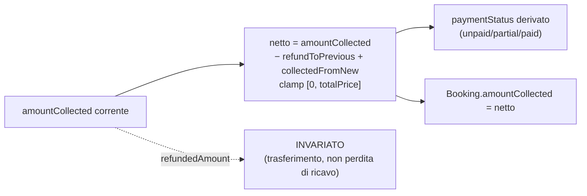

> **Invarianti chiave** (§6 spec): tipo `subscription`, stato `confirmed`, non disdetto (422); **nessuna
> sospensione aperta** (409 — si cede un contratto "pulito"); subentrante = `Customer` esistente nel tenant
> (404), non anonimizzato ([ADR-0043](../architecture/decisions/0043-erasure-e-retention-cliente-gdpr.md)),
> diverso dal titolare attuale (422 `SAME_HOLDER`); `effectiveDate ∈ [start, end]` (422 `BAD_DATE`, **nessun**
> vincolo `≥ oggi` — si può registrare una cessione anche per una data passata); bound cassa
> `0 ≤ refundToPrevious ≤ amountCollected` (422 `BAD_REFUND`), `collectedFromNew ≥ 0` (422 `BAD_COLLECT`),
> netto `≤ totalPrice` (422 `OVER_TOTAL`). Il suggerimento pro-rata che pre-compila i due importi è **solo
> FE**, nessun endpoint di preview; il server valida solo i bound. **Occupazione (`BookingCoverage`)
> invariata**: la mappa mostra l'ombrellone occupato con continuità prima e dopo la cessione.

## 7. Assenze comunicate: consenso → release → carve giorno-singolo → rivendita (D-035 S1+S2, implementata)

Un abbonato comunica (per ora **all'operatore**, che lo registra; il canale self-service è S3+S4, deferito)
di essere **sicuro di non essere presente** in uno specifico giorno del proprio abbonamento; **solo** dietro
consenso esplicito e attivo l'operatore registra una **release** che apre la rivendita di quel giorno. Agisce
**solo sull'occupazione di un giorno singolo** (`BookingCoverage`), mai sullo span di contratto né sulla
cassa dell'abbonato: nessun rimborso, nessun credito. Vedi la
[spec](../superpowers/specs/2026-07-09-assenze-comunicate-release-operatore-design.md),
[ADR-0048](../architecture/decisions/0048-assenze-comunicate-release-occupazione.md) (compensazione = rinuncia
al diritto, non mancato utilizzo), [ADR-0046](../architecture/decisions/0046-occupazione-a-intervalli-coverage.md)
(coverage, riusata), [ADR-0011](../architecture/decisions/0011-incasso-base-nel-core.md) (incasso, non
toccato).

**Decisione operatore** (admin) sulla Scheda cliente, azioni adiacenti a "Disdici"/"Sospendi"/"Cedi":

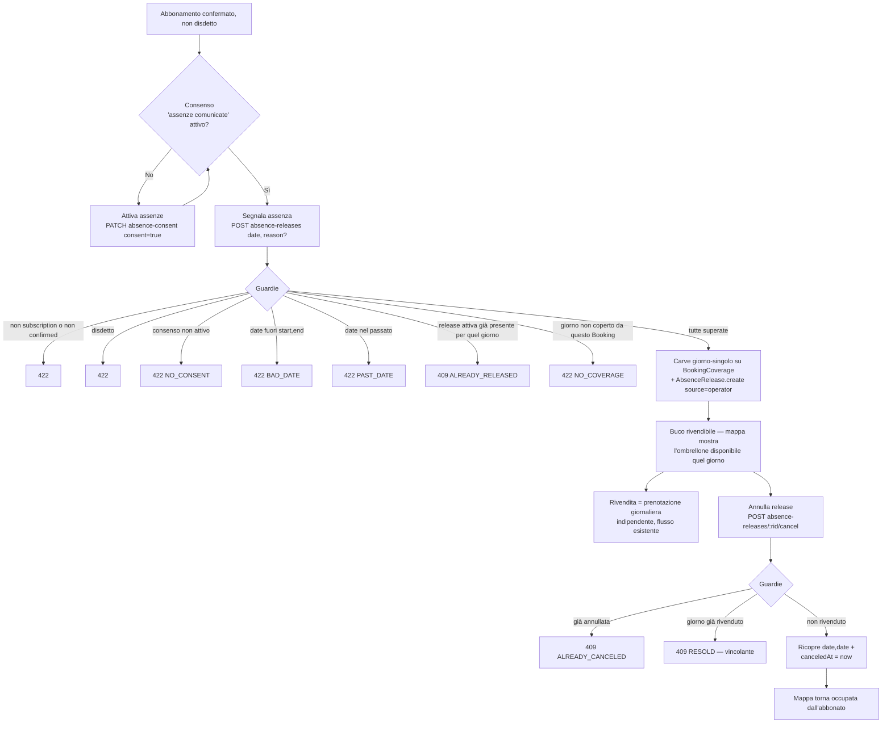

**Meccanica del carve giorno-singolo** (dentro la transazione, tenant-scoped — mirror del carve-chiuso
sospensione, a un solo giorno `D`):

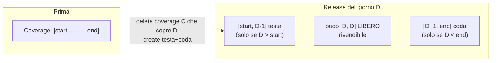

> **Invarianti chiave** (§6 spec): tipo `subscription`, stato `confirmed`, non disdetto (422); **consenso
> attivo** (`absenceConsentAt !== null`, altrimenti 422 `NO_CONSENT` — è il gate dell'invariante "nessuna
> presunzione d'assenza"); `date ∈ [startDate, endDate]` (422 `BAD_DATE`); `date ≥ oggi` (422 `PAST_DATE`,
> futuro e stesso-giorno ammessi, passato no); nessuna release attiva già presente per quel giorno (409
> `ALREADY_RELEASED`); il giorno deve essere attualmente coperto da questo Booking (422 `NO_COVERAGE`, mirror sospensione — non
> si libera ciò che è già libero). Annullo: release esistente per quel booking (404), non già annullata (409
> `ALREADY_CANCELED`), **giorno non ancora rivenduto** (409 `RESOLD` — stesso predicato
> `dateRangesOverlap`+`slotsOverlap` di rivendita/`reactivate`; se rivenduto l'annullo è vietato, la release è
> **vincolante**). `Booking.amountCollected`/`refundedAmount` **invariati** dopo la release (ADR-0048); la
> rivendita è una `Booking type=daily` indipendente col suo incasso a sé, nessun endpoint dedicato.

## 8. Macchina a stati dei CTA abbonamento — matrice guardie (D-013 + D-035, hardening implementato)

I sette CTA del ciclo abbonamento — i quattro di D-013 (`terminate`/disdici, `suspend`/sospendi, `reactivate`
/riattiva, `transfer`/cedi) e i tre di D-035 (`setAbsenceConsent`/consenso, `releaseAbsence`/segnala assenza,
`cancelAbsenceRelease`/annulla release) — erano stati costruiti e testati **in isolamento** su un abbonamento
pulito. Solo due archi cross-famiglia avevano una guardia (`suspend-open → transfer` 409; il ciclo interno
`suspend → reactivate`); tutte le altre combinazioni erano non guardate. Questo hardening chiude la macchina a
stati: ogni CTA è lecito **solo** negli stati in cui i suoi effetti su span/occupazione/cassa sono corretti. Vedi
la [spec](../superpowers/specs/2026-07-09-audit-macchina-stati-cta-abbonamento-design.md),
[ADR-0011](../architecture/decisions/0011-incasso-base-nel-core.md),
[ADR-0046](../architecture/decisions/0046-occupazione-a-intervalli-coverage.md),
[ADR-0047](../architecture/decisions/0047-cessione-subentro-titolarita-incasso.md),
[ADR-0048](../architecture/decisions/0048-assenze-comunicate-release-occupazione.md) (nessun nuovo ADR:
correttezza additiva sui quattro sopra).

**Stati distinguibili di un `Booking` abbonamento** (le stesse dimensioni delle sezioni 5-7, viste come macchina
a stati unica): **active** (`confirmed`, `!terminatedAt`, `endDate ≥ oggi`, nessuna sospensione aperta),
**suspended-open** (esiste una `BookingSuspension` con `endDate = null`), **suspended-closed** (solo sospensioni
chiuse nello storico), **terminated** (`terminatedAt` valorizzato), **cancelled** (`status = 'cancelled'`).
**expired** (`confirmed`, `endDate < oggi`) si comporta come **active** per le guardie di stato — sono i
controlli di data pre-esistenti di ogni CTA (`effectiveDate`/`returnDate`/`date` dentro lo span) a rifiutare da
sé le operazioni prive di senso, nessuna guardia dedicata. Ortogonali (non stati a sé): **consenso attivo**
(`absenceConsentAt`) e **release attiva** (`AbsenceRelease` non annullata/non rivenduta) — cfr. §3 della spec.

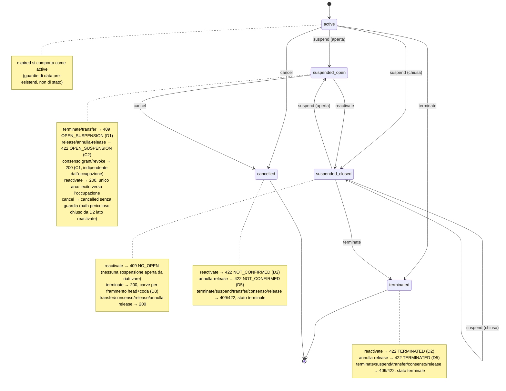

**Matrice guardie stato × CTA** (✓ lecito · ✗ rifiutato con codice; **grassetto** = guardia chiusa in questo
hardening, copiata da spec §5):

| Stato | terminate | suspend | reactivate | transfer | consenso grant/revoke | release | annulla release |
|---|---|---|---|---|---|---|---|
| **active** | ✓ | ✓ | ✗ NO_OPEN 409 | ✓ | ✓ | ✓ (se consenso) | ✓ (se release) |
| **suspended-open** | ✗ **OPEN_SUSPENSION 409 (D1)** | ✗ OPEN_EXISTS 409 | ✓ | ✗ OPEN_SUSPENSION 409 | **✓ (C1)** | ✗ **OPEN_SUSPENSION 422 (C2)** | ✗ **OPEN_SUSPENSION 422 (C2)** |
| **suspended-closed** | ✓ *(D3 multi-frammento)* | ✓ | ✗ NO_OPEN 409 | ✓ | ✓ | ✓ | ✓ |
| **terminated** | ✗ ALREADY_TERMINATED 409 | ✗ TERMINATED 422 | ✗ **TERMINATED 422 (D2)** | ✗ TERMINATED 422 | ✗ TERMINATED 422 | ✗ TERMINATED 422 | ✗ **TERMINATED 422 (D5)** |
| **cancelled** | ✗ NOT_CONFIRMED 422 | ✗ NOT_CONFIRMED 422 | ✗ **NOT_CONFIRMED 422 (D2)** | ✗ NOT_CONFIRMED 422 | ✗ NOT_CONFIRMED 422 | ✗ NOT_CONFIRMED 422 | ✗ **NOT_CONFIRMED 422 (D5)** |

> **Invarianti chiave** (§8 spec): `BookingCoverage` di un abbonamento non contiene mai range invertiti
> (`startDate > endDate`) né frammenti che eccedono `endDate` del `Booking` (stati non-disdetti) o `lastValid`
> (disdetti) — `terminate` tronca **per frammento** (D3: `startDate > lastValid` → delete, `endDate > lastValid`
> → clamp a `lastValid`, altrimenti invariato), corretto anche dopo una sospensione chiusa (head+coda) o una
> release attiva (C3: nessuna guardia di blocco, i frammenti `≤ lastValid` restano rivendibili, quelli oltre
> perdono effetto ma la riga `AbsenceRelease` resta storia). `refundedAmount` è un **ledger cumulativo** non
> decrescente lungo tutto il ciclo (D4: `terminate` usa `increment` sul residuo `amountCollected −
> refundedAmount`, come già `suspend`/`reactivate`, mai un SET assoluto). Il consenso (`absenceConsentAt`) è
> **indipendente dall'occupazione** (C1: gate solo `confirmed` + `!terminatedAt`, mai dalla sospensione — risolve
> il "incastrato su ON" del toggle FE).

