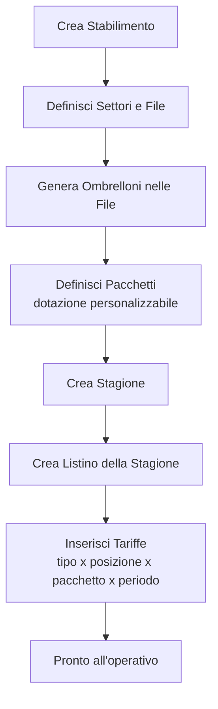
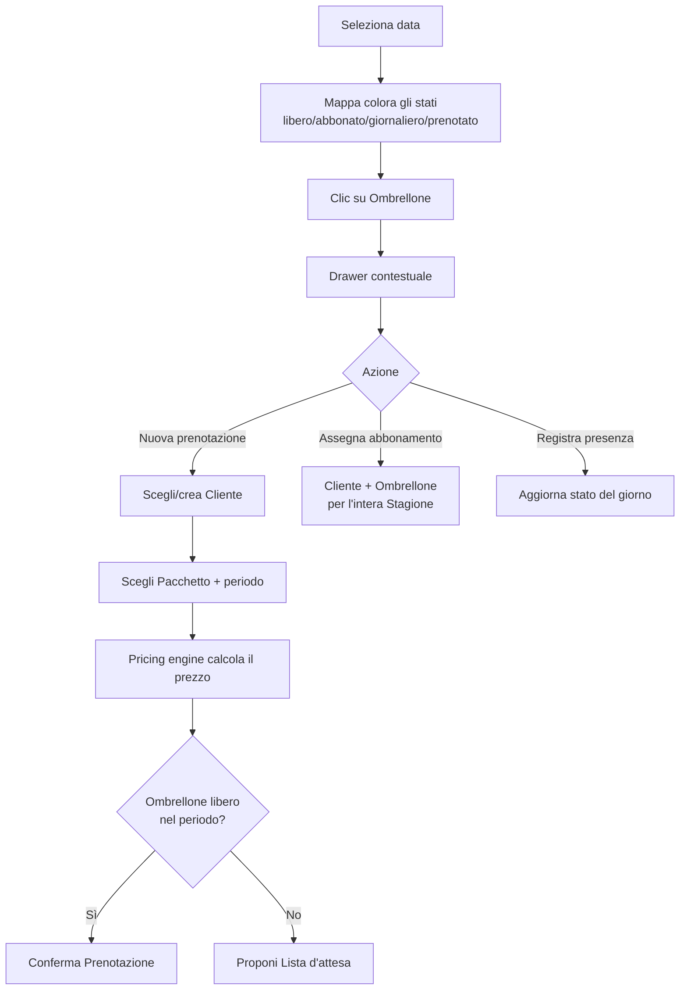
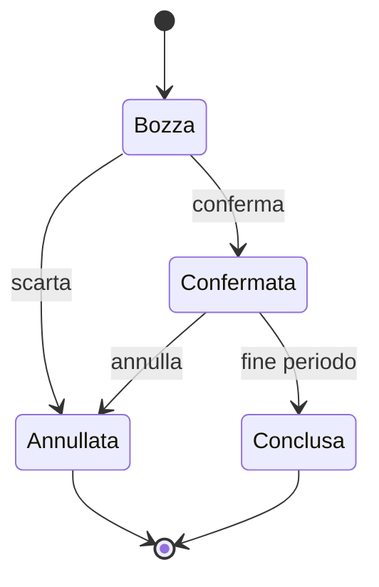

# Flussi principali del Core

Fonte di verità dei flussi operativi. Vedi
[ADR-0006](../architecture/decisions/0006-dominio-prenotazioni-e-pricing.md).

## 1. Setup iniziale (admin dello stabilimento)

## 2. Operativo giornaliero (staff)

## 3. Stati della Prenotazione

> Nota: lo stato "opzione/hold" temporaneo con scadenza automatica è rimandato
> ([D-006](../architecture/deferred.md)); nell'MVP la Lista d'attesa è promossa
> manualmente a Prenotazione.
