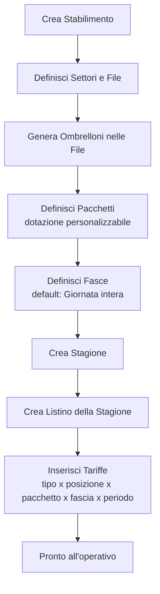
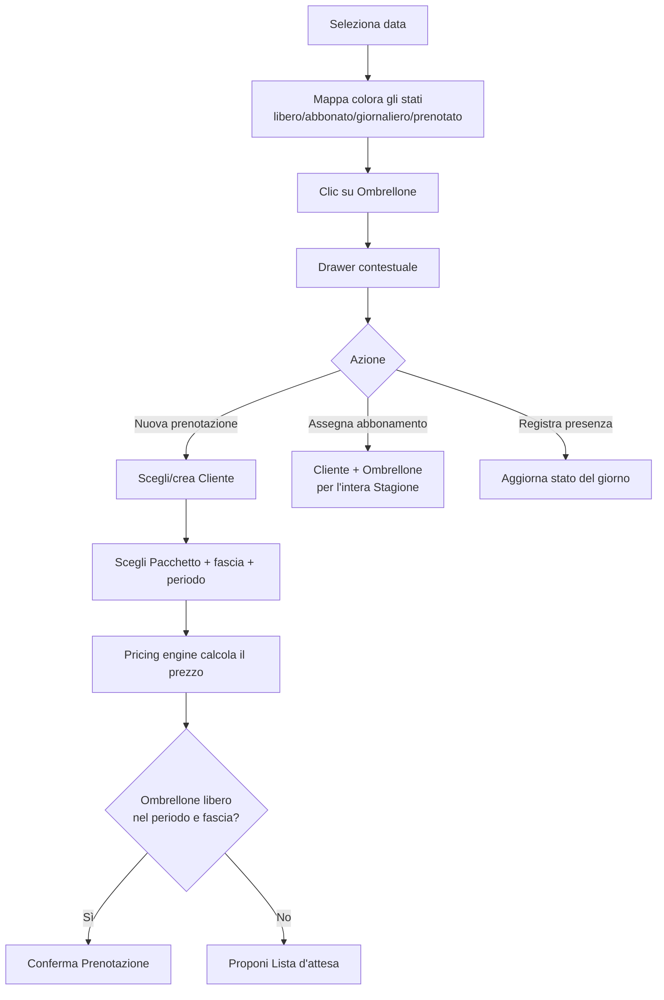
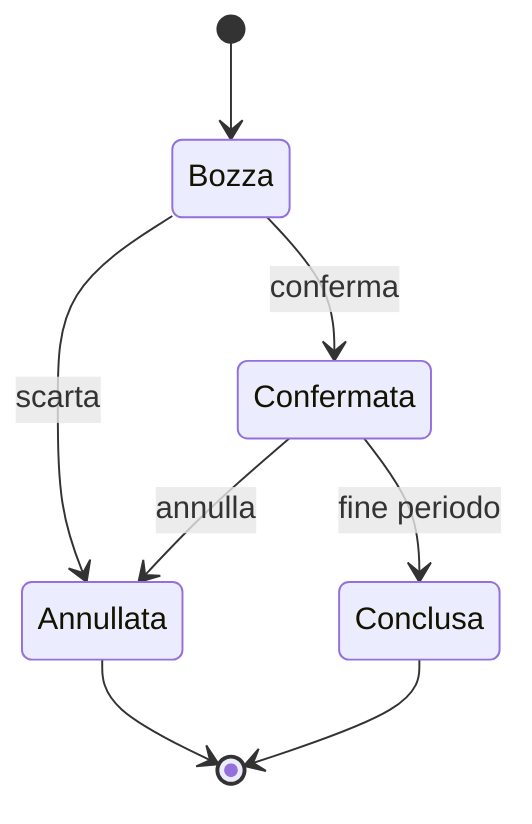
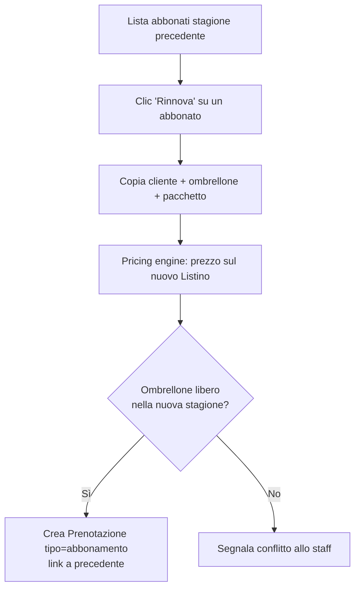
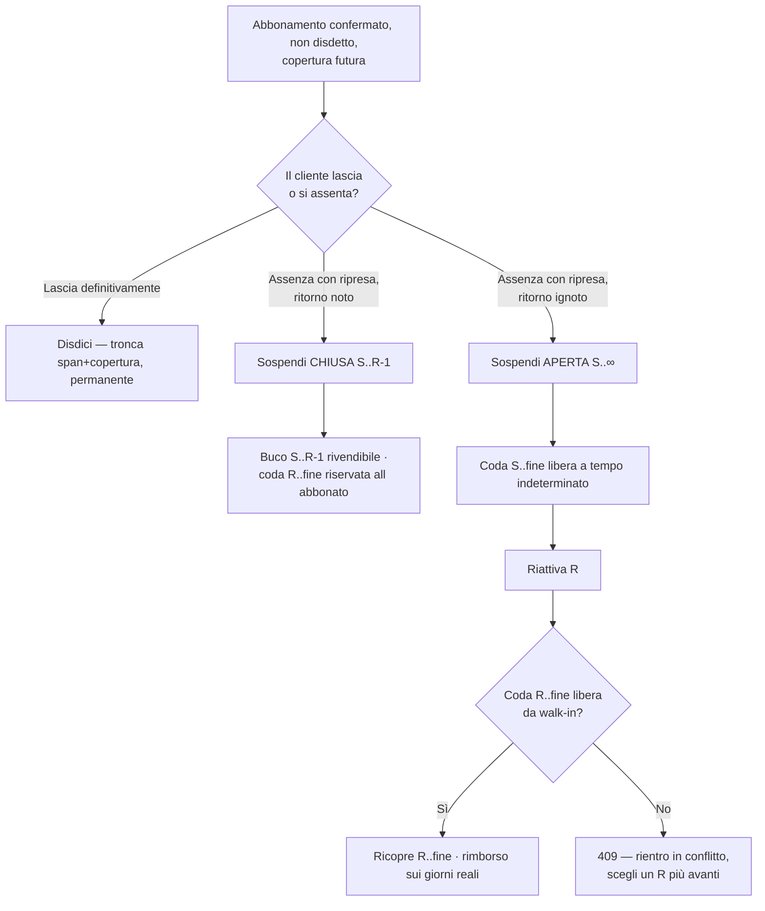
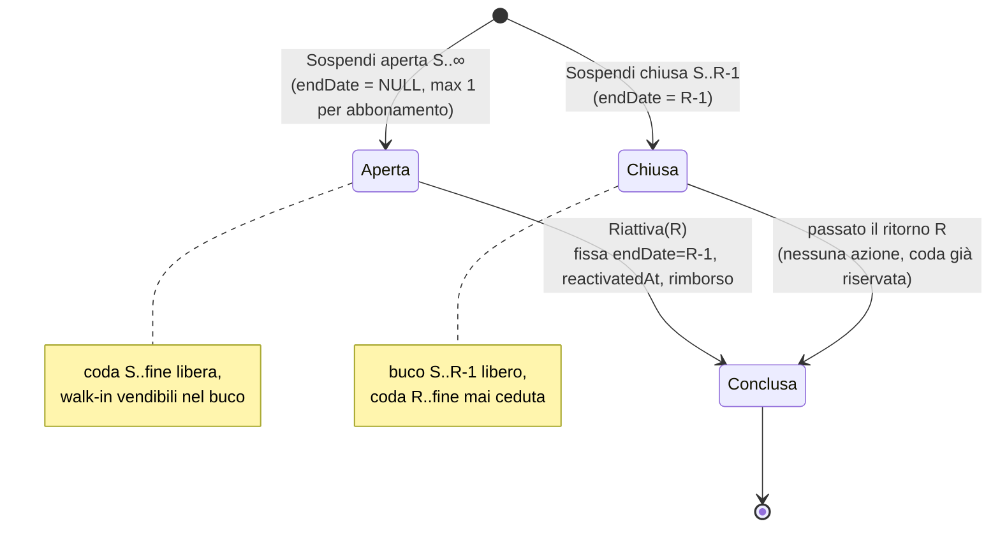
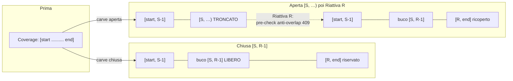
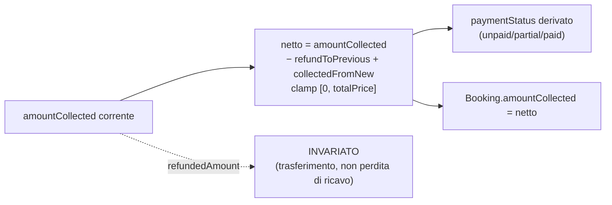

# Flussi principali del Core

Fonte di verità dei flussi operativi. Vedi
[ADR-0006](../architecture/decisions/0006-dominio-prenotazioni-e-pricing.md).

## 1. Setup iniziale (admin dello stabilimento)



## 2. Operativo giornaliero (staff)



## 3. Stati della Prenotazione



> Nota: lo stato "opzione/hold" temporaneo con scadenza automatica è rimandato
> ([D-006](../architecture/deferred.md)); nell'MVP la Lista d'attesa è promossa
> manualmente a Prenotazione.

## 4. Rinnovo abbonamento (inizio stagione)

Vedi [ADR-0012](../architecture/decisions/0012-gestione-abbonamenti.md).



> La **prelazione automatica** (scadenze, rilascio del posto, priorità per anzianità)
> è rimandata ([D-011](../architecture/deferred.md)); nell'MVP la campagna rinnovi è
> guidata ma manuale.

## 5. Sospensione abbonamento (D-013, *in design*)

Un abbonato libera un periodo del proprio abbonamento (rivendita abilitata nel buco) e poi riprende. Agisce
**solo sull'occupazione** (`BookingCoverage`), mai sullo span di contratto: prezzo, rinnovo, prelazione e
seniority restano invariati. Vedi la
[spec](../superpowers/specs/2026-07-08-subscription-suspension-design.md),
[ADR-0046](../architecture/decisions/0046-occupazione-a-intervalli-coverage.md) (occupazione a intervalli),
[ADR-0011](../architecture/decisions/0011-incasso-base-nel-core.md) (rimborso).

**Decisione operatore** (ammin.) sulla Scheda cliente, bottoni adiacenti:



**Macchina a stati del record `BookingSuspension`** (discriminatore = `endDate IS NULL`):



**Meccanica del carve sulla copertura** (dentro la transazione, tenant-scoped):



> **Invarianti chiave** (§6 spec): `S ≥ oggi`; solo `type=subscription`, `status=confirmed`, non disdetto;
> `[S,…]` dentro una copertura **futura** (non un buco già libero → 422); **una sola** sospensione aperta per
> abbonamento (409); la **chiusa** richiede un ritorno **entro** la stagione (`R-1 < endDate`, altrimenti 422
> "usa la disdetta" — invariante server, non nudge FE); il rimborso è discrezione dell'operatore
> (suggerimento pro-rata **solo FE**, il server valida i bound), aggregato su `Booking.refundedAmount`.

## 6. Cessione/subentro abbonamento (D-013, *in design*)

Un abbonato cede il posto a un altro cliente, che eredita il contratto — stesso ombrellone, stessa stagione,
**stessa anzianità e prelazione**. Agisce **solo sulla titolarità** (`Booking.customerId`), mai
sull'occupazione (`BookingCoverage`) né sullo span di contratto: prezzo, rinnovo, prelazione e seniority
seguono automaticamente il subentrante. Vedi la
[spec](../superpowers/specs/2026-07-08-subscription-cession-design.md),
[ADR-0047](../architecture/decisions/0047-cessione-subentro-titolarita-incasso.md) (trasferimento titolarità
+ riconciliazione incasso), [ADR-0011](../architecture/decisions/0011-incasso-base-nel-core.md) (incasso
base), [ADR-0046](../architecture/decisions/0046-occupazione-a-intervalli-coverage.md) (coverage, non
toccata).

**Decisione operatore** (admin) sulla Scheda cliente, bottone adiacente a "Disdici"/"Sospendi":

```mermaid
flowchart TD
    A[Abbonamento confermato, non disdetto,<br/>senza sospensione aperta] --> B[Cedi/Subentro]
    B --> G{Guardie}
    G -->|tipo≠subscription o stato≠confirmed| E1[422]
    G -->|già disdetto| E2[422]
    G -->|sospensione aperta| E3[409]
    G -->|subentrante inesistente nel tenant| E4[404]
    G -->|subentrante anonimizzato o = titolare attuale| E5[422 SAME_HOLDER]
    G -->|effectiveDate fuori [start,end]| E6[422 BAD_DATE]
    G -->|bound cassa violati| E7[422 BAD_REFUND / BAD_COLLECT / OVER_TOTAL]
    G -->|tutte superate| W[Scrivi in transazione]
    W --> W1[BookingTransfer.create<br/>previousCustomerId=A, newCustomerId=B, effectiveDate, movimenti lordi]
    W --> W2["Booking.update<br/>customerId=B, amountCollected=netto, paymentStatus"]
    W1 --> R[BookingDTO aggiornato]
    W2 --> R
    R --> N[Scheda di B: nuovo titolare + storico transfers<br/>Scheda di A: sezione 'Cessioni effettuate']
```

**Riconciliazione incasso** (dentro la transazione, tenant-scoped — vedi
[ADR-0047](../architecture/decisions/0047-cessione-subentro-titolarita-incasso.md) per la motivazione):



> **Invarianti chiave** (§6 spec): tipo `subscription`, stato `confirmed`, non disdetto (422); **nessuna
> sospensione aperta** (409 — si cede un contratto "pulito"); subentrante = `Customer` esistente nel tenant
> (404), non anonimizzato ([ADR-0043](../architecture/decisions/0043-erasure-e-retention-cliente-gdpr.md)),
> diverso dal titolare attuale (422 `SAME_HOLDER`); `effectiveDate ∈ [start, end]` (422 `BAD_DATE`, **nessun**
> vincolo `≥ oggi` — si può registrare una cessione anche per una data passata); bound cassa
> `0 ≤ refundToPrevious ≤ amountCollected` (422 `BAD_REFUND`), `collectedFromNew ≥ 0` (422 `BAD_COLLECT`),
> netto `≤ totalPrice` (422 `OVER_TOTAL`). Il suggerimento pro-rata che pre-compila i due importi è **solo
> FE**, nessun endpoint di preview; il server valida solo i bound. **Occupazione (`BookingCoverage`)
> invariata**: la mappa mostra l'ombrellone occupato con continuità prima e dopo la cessione.

