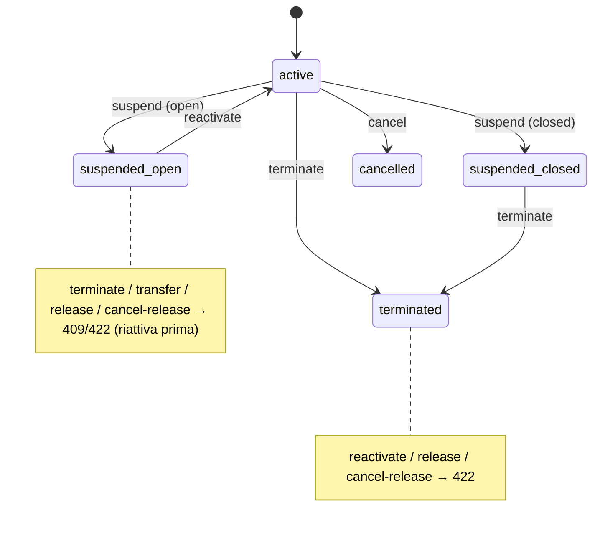

# Hardening macchina a stati CTA abbonamento — Implementation Plan

> **For agentic workers:** REQUIRED SUB-SKILL: Use superpowers:subagent-driven-development (recommended) or superpowers:executing-plans to implement this plan task-by-task. Steps use checkbox (`- [ ]`) syntax for tracking.

**Goal:** Chiudere la macchina a stati dei 7 CTA abbonamento (D-013 + D-035) con le guardie di precondizione mancanti e correggere gli effetti errati di `terminate` su `BookingCoverage` e sulla cassa.

**Architecture:** Additivo su [`bookings.service.ts`](../../../apps/api/src/bookings/bookings.service.ts) (early-return tipizzati → codici d'errore mappati a eccezioni Nest esistenti) + guardie FE speculari in [`CustomerSubscriptionsCard.vue`](../../../apps/web-staff/src/features/customers/CustomerSubscriptionsCard.vue). Nessun cambio a schema/migration/contracts. I metodi service usano `tx` → si verificano **via e2e** (test DB reale); il gating FE ha unit spec (`CustomerSubscriptionsCard.spec.ts`); il solo helper puro toccato (`terminationRefund.ts`) ha la sua unit spec.

**Tech Stack:** NestJS + Prisma (Postgres, RLS) · Jest e2e (`--runInBand`, supertest) · Vue 3 + Vitest (`@vue/test-utils`, `mountApp`).

## Global Constraints

- **Baseline da NON regredire:** api unit **227** · api e2e **289** (`--runInBand`) · web-staff **364** · typecheck pulito.
- **pnpm mai npm** (corepack). Nessun `db push`.
- **Nessun nuovo ADR / nessun cambio schema/migration/contracts** in questo piano.
- **Comandi di verifica** (dalla radice repo):
  - api e2e mirato: `corepack pnpm --filter @coralyn/api exec jest --runInBand -t '<nome test>'`
  - api e2e completo: `corepack pnpm --filter @coralyn/api run test:e2e`
  - api typecheck: `cd apps/api && corepack pnpm exec tsc -p tsconfig.json --noEmit`
  - web-staff unit: `corepack pnpm --filter @coralyn/web-staff run test`
  - web-staff typecheck (gate reale): `corepack pnpm --filter @coralyn/web-staff run typecheck`
- **Branch:** `feat/cta-state-machine-hardening` (già creato; la spec è già committata su di esso).
- **Spec di riferimento:** [`2026-07-09-audit-macchina-stati-cta-abbonamento-design.md`](../specs/2026-07-09-audit-macchina-stati-cta-abbonamento-design.md).

---

## File Structure

- **Modify** `apps/api/src/bookings/bookings.service.ts` — aggiunge guardie a `terminate`/`reactivate`/`releaseAbsence`/`cancelAbsenceRelease` e riscrive il carve+rimborso di `terminate`. Unico file di logica toccato.
- **Modify** `apps/api/test/bookings.e2e-spec.ts` — nuovo `describe('macchina a stati CTA (hardening)')` con la matrice cross-CTA + test coverage/cassa di `terminate`.
- **Modify** `apps/web-staff/src/features/customers/CustomerSubscriptionsCard.vue` — guardie di visibilità speculari.
- **Modify** `apps/web-staff/src/features/customers/CustomerSubscriptionsCard.spec.ts` — unit test del nuovo gating.
- **Modify** `apps/web-staff/src/features/customers/terminationRefund.ts` + `terminationRefund.spec.ts` — clamp del rimborso suggerito al residuo (D4-FE).
- **Modify** `docs/design/flows.md` — macchina a stati + matrice guardie (ADR-0009 DoD).

Ogni task chiude un difetto end-to-end (guardia BE + e2e, oppure gating FE + spec) → gate di review indipendente.

---

## SLICE 1 — Guardie di precondizione + matrice e2e

### Task 1: D1 — `terminate` rifiuta la sospensione aperta (backend + e2e)

**Files:**
- Modify: `apps/api/src/bookings/bookings.service.ts` (metodo `terminate`, ~544-593)
- Test: `apps/api/test/bookings.e2e-spec.ts`

**Interfaces:**
- Consumes: `POST /api/bookings/:id/terminate` `{ effectiveDate, refundAmount, reason? }` (invariato).
- Produces: nuovo esito `409 ConflictException('Sospensione aperta: riattiva prima di disdire')` quando esiste una `BookingSuspension` con `endDate === null`.

- [ ] **Step 1: Scrivi il test e2e che fallisce.** In `bookings.e2e-spec.ts`, aggiungi in fondo (prima della `})` finale del `describe('Bookings (e2e)')`) un nuovo blocco. Usa `logicalOrder: 90` e label `X…` per non collidere con gli altri test di occupazione.

```ts
  describe('macchina a stati CTA (hardening)', () => {
    let xSeq = 0;
    const makeSub = async (): Promise<{ id: string; umbrellaId: string }> => {
      const label = `X${(xSeq += 1)}`;
      const u = await prisma.forTenant(s1, (tx) =>
        tx.umbrella.create({ data: { establishmentId: s1, rowId: ids.rowId, umbrellaTypeId: null, label, logicalOrder: 90 } }),
      );
      const res = await request(app.getHttpServer()).post('/api/bookings').set(...bearer(token1))
        .send(body({ umbrellaId: u.id, type: 'subscription', startDate: '2026-07-01' })).expect(201);
      return { id: res.body.id as string, umbrellaId: u.id };
    };

    it('D1: suspend-open → terminate → 409 (riattiva prima di disdire)', async () => {
      const { id } = await makeSub();
      await request(app.getHttpServer()).post(`/api/bookings/${id}/suspend`).set(...bearer(token1))
        .send({ startDate: '2026-07-20' }).expect(200);
      await request(app.getHttpServer()).post(`/api/bookings/${id}/terminate`).set(...bearer(token1))
        .send({ effectiveDate: '2026-08-01', refundAmount: 0 }).expect(409);
    });
  });
```

- [ ] **Step 2: Esegui il test e verifica che fallisce.**

Run: `corepack pnpm --filter @coralyn/api exec jest --runInBand -t 'D1: suspend-open'`
Expected: FAIL — oggi `terminate` ritorna 200 (nessuna guardia sulla sospensione aperta).

- [ ] **Step 3: Implementa la guardia.** In `bookings.service.ts`, metodo `terminate`, cambia la load per includere le sospensioni e aggiungi la guardia dopo `ALREADY_TERMINATED`.

Da:
```ts
      const existing = await tx.booking.findFirst({ where: { id } });
      if (!existing) return { error: 'NOT_FOUND' as const };
      if (existing.type !== 'subscription') return { error: 'NOT_SUBSCRIPTION' as const };
      if (existing.status !== 'confirmed') return { error: 'NOT_CONFIRMED' as const };
      if (existing.terminatedAt) return { error: 'ALREADY_TERMINATED' as const };
```
A:
```ts
      const existing = await tx.booking.findFirst({ where: { id }, include: { suspensions: true } });
      if (!existing) return { error: 'NOT_FOUND' as const };
      if (existing.type !== 'subscription') return { error: 'NOT_SUBSCRIPTION' as const };
      if (existing.status !== 'confirmed') return { error: 'NOT_CONFIRMED' as const };
      if (existing.terminatedAt) return { error: 'ALREADY_TERMINATED' as const };
      // Coerenza con transfer: non si disdice con una sospensione aperta in corso (riattiva prima).
      if (existing.suspensions.some((s) => s.endDate === null)) return { error: 'OPEN_SUSPENSION' as const };
```

Poi nel blocco di mappatura errori di `terminate`, aggiungi dopo `ALREADY_TERMINATED`:
```ts
      if (e === 'ALREADY_TERMINATED') throw new ConflictException('Abbonamento già disdetto');
      if (e === 'OPEN_SUSPENSION') throw new ConflictException('Sospensione aperta: riattiva prima di disdire');
```

- [ ] **Step 4: Esegui il test e verifica che passa.**

Run: `corepack pnpm --filter @coralyn/api exec jest --runInBand -t 'D1: suspend-open'`
Expected: PASS.

- [ ] **Step 5: Typecheck + commit.**

Run: `cd apps/api && corepack pnpm exec tsc -p tsconfig.json --noEmit` (Expected: nessun errore)
```bash
git add apps/api/src/bookings/bookings.service.ts apps/api/test/bookings.e2e-spec.ts
git commit -m "fix(cta): terminate rifiuta la sospensione aperta (D1, 409)"
```

---

### Task 2: D2 — `reactivate` rifiuta terminated/cancelled (backend + e2e)

**Files:**
- Modify: `apps/api/src/bookings/bookings.service.ts` (metodo `reactivate`, ~692-759)
- Test: `apps/api/test/bookings.e2e-spec.ts` (blocco `macchina a stati CTA (hardening)`)

**Interfaces:**
- Consumes: `POST /api/bookings/:id/reactivate` `{ returnDate, refundAmount, reason? }` · `DELETE /api/bookings/:id` (cancel).
- Produces: `reactivate` ritorna `422 UnprocessableEntityException('Abbonamento non attivo')` se `status !== 'confirmed'`, `422 UnprocessableEntityException('Abbonamento disdetto')` se `terminatedAt`.

- [ ] **Step 1: Scrivi il test e2e che fallisce.** Aggiungi dentro il `describe('macchina a stati CTA (hardening)')`:

```ts
    it('D2: suspend-open → cancel → reactivate → 422 (non attivo)', async () => {
      const { id } = await makeSub();
      await request(app.getHttpServer()).post(`/api/bookings/${id}/suspend`).set(...bearer(token1))
        .send({ startDate: '2026-07-20' }).expect(200);
      await request(app.getHttpServer()).delete(`/api/bookings/${id}`).set(...bearer(token1)).expect(200);
      await request(app.getHttpServer()).post(`/api/bookings/${id}/reactivate`).set(...bearer(token1))
        .send({ returnDate: '2026-08-01', refundAmount: 0 }).expect(422);
    });
```

- [ ] **Step 2: Esegui e verifica che fallisce.**

Run: `corepack pnpm --filter @coralyn/api exec jest --runInBand -t 'D2: suspend-open'`
Expected: FAIL — oggi `reactivate` non guarda `status`/`terminatedAt` e ricopre giorni su un abbonamento annullato (ritorna 200).

- [ ] **Step 3: Implementa le guardie.** In `reactivate`, aggiungi dopo `NOT_SUBSCRIPTION` e prima della ricerca della sospensione aperta.

Da:
```ts
      if (!existing) return { error: 'NOT_FOUND' as const };
      if (existing.type !== 'subscription') return { error: 'NOT_SUBSCRIPTION' as const };
      const open = existing.suspensions.find((s) => s.endDate === null);
      if (!open) return { error: 'NO_OPEN' as const };
```
A:
```ts
      if (!existing) return { error: 'NOT_FOUND' as const };
      if (existing.type !== 'subscription') return { error: 'NOT_SUBSCRIPTION' as const };
      if (existing.status !== 'confirmed') return { error: 'NOT_CONFIRMED' as const };
      if (existing.terminatedAt) return { error: 'TERMINATED' as const };
      const open = existing.suspensions.find((s) => s.endDate === null);
      if (!open) return { error: 'NO_OPEN' as const };
```

Nel blocco di mappatura errori di `reactivate`, aggiungi dopo `NOT_SUBSCRIPTION`:
```ts
      if (e === 'NOT_SUBSCRIPTION') throw new UnprocessableEntityException('Solo gli abbonamenti hanno sospensioni');
      if (e === 'NOT_CONFIRMED') throw new UnprocessableEntityException('Abbonamento non attivo');
      if (e === 'TERMINATED') throw new UnprocessableEntityException('Abbonamento disdetto');
```

- [ ] **Step 4: Esegui e verifica che passa.**

Run: `corepack pnpm --filter @coralyn/api exec jest --runInBand -t 'D2: suspend-open'`
Expected: PASS.

- [ ] **Step 5: Typecheck + commit.**

Run: `cd apps/api && corepack pnpm exec tsc -p tsconfig.json --noEmit`
```bash
git add apps/api/src/bookings/bookings.service.ts apps/api/test/bookings.e2e-spec.ts
git commit -m "fix(cta): reactivate rifiuta terminated/cancelled (D2, 422)"
```

---

### Task 3: D5 + C2 — guardie di ciclo su `cancelAbsenceRelease` e `releaseAbsence` (backend + e2e)

**Files:**
- Modify: `apps/api/src/bookings/bookings.service.ts` (`releaseAbsence` ~864-917, `cancelAbsenceRelease` ~923-964)
- Test: `apps/api/test/bookings.e2e-spec.ts` (blocco hardening)

**Interfaces:**
- Consumes: `POST /api/bookings/:id/absence-releases` `{ date }` · `POST /api/bookings/:id/absence-releases/:rid/cancel`.
- Produces: entrambi ritornano `422 UnprocessableEntityException` con `OPEN_SUSPENSION` se esiste una sospensione aperta; `cancelAbsenceRelease` ritorna inoltre `422` su `cancelled`/`terminated`.

- [ ] **Step 1: Scrivi i test e2e che falliscono.** Aggiungi nel blocco hardening. Servono gli helper `grantConsent` locali (ricopiali qui: il blocco è indipendente).

```ts
    const grantConsent = (id: string) =>
      request(app.getHttpServer()).patch(`/api/bookings/${id}/absence-consent`).set(...bearer(token1))
        .send({ consent: true }).expect(200);
    const rawRelease = (id: string) =>
      prisma.forTenant(s1, (tx) => tx.absenceRelease.findFirst({ where: { bookingId: id }, orderBy: { createdAt: 'desc' } }));

    it('C2: suspend-open → release → 422 (sospensione aperta)', async () => {
      const { id } = await makeSub();
      await grantConsent(id);
      await request(app.getHttpServer()).post(`/api/bookings/${id}/suspend`).set(...bearer(token1))
        .send({ startDate: '2026-07-20' }).expect(200);
      await request(app.getHttpServer()).post(`/api/bookings/${id}/absence-releases`).set(...bearer(token1))
        .send({ date: '2026-07-10' }).expect(422);
    });

    it('C2: release → suspend-open → cancel-release → 422 (sospensione aperta)', async () => {
      const { id } = await makeSub();
      await grantConsent(id);
      await request(app.getHttpServer()).post(`/api/bookings/${id}/absence-releases`).set(...bearer(token1))
        .send({ date: '2026-07-10' }).expect(200);
      await request(app.getHttpServer()).post(`/api/bookings/${id}/suspend`).set(...bearer(token1))
        .send({ startDate: '2026-07-20' }).expect(200);
      const rel = await rawRelease(id);
      await request(app.getHttpServer()).post(`/api/bookings/${id}/absence-releases/${rel!.id}/cancel`).set(...bearer(token1))
        .expect(422);
    });

    it('D5: release → terminate → cancel-release → 422 (disdetto)', async () => {
      const { id } = await makeSub();
      await grantConsent(id);
      // release su un giorno che resta entro lo span dopo la disdetta
      await request(app.getHttpServer()).post(`/api/bookings/${id}/absence-releases`).set(...bearer(token1))
        .send({ date: '2026-07-10' }).expect(200);
      const rel = await rawRelease(id);
      await request(app.getHttpServer()).post(`/api/bookings/${id}/terminate`).set(...bearer(token1))
        .send({ effectiveDate: '2026-09-01', refundAmount: 0 }).expect(200);
      await request(app.getHttpServer()).post(`/api/bookings/${id}/absence-releases/${rel!.id}/cancel`).set(...bearer(token1))
        .expect(422);
    });
```

- [ ] **Step 2: Esegui e verifica che falliscono.**

Run: `corepack pnpm --filter @coralyn/api exec jest --runInBand -t 'C2:|D5:'`
Expected: FAIL — oggi `releaseAbsence` non guarda la sospensione aperta; `cancelAbsenceRelease` non ha alcuna guardia di ciclo (ricopre un giorno oltre lo span/dentro il buco → 200).

- [ ] **Step 3a: Guardia OPEN_SUSPENSION in `releaseAbsence`.** Includi le sospensioni e aggiungi la guardia dopo `TERMINATED`.

Da:
```ts
      const existing = await tx.booking.findFirst({ where: { id }, include: { absenceReleases: true } });
      if (!existing) return { error: 'NOT_FOUND' as const };
      if (existing.type !== 'subscription') return { error: 'NOT_SUBSCRIPTION' as const };
      if (existing.status !== 'confirmed') return { error: 'NOT_CONFIRMED' as const };
      if (existing.terminatedAt) return { error: 'TERMINATED' as const };
      if (existing.absenceConsentAt === null) return { error: 'NO_CONSENT' as const };
```
A:
```ts
      const existing = await tx.booking.findFirst({ where: { id }, include: { absenceReleases: true, suspensions: true } });
      if (!existing) return { error: 'NOT_FOUND' as const };
      if (existing.type !== 'subscription') return { error: 'NOT_SUBSCRIPTION' as const };
      if (existing.status !== 'confirmed') return { error: 'NOT_CONFIRMED' as const };
      if (existing.terminatedAt) return { error: 'TERMINATED' as const };
      if (existing.suspensions.some((s) => s.endDate === null)) return { error: 'OPEN_SUSPENSION' as const };
      if (existing.absenceConsentAt === null) return { error: 'NO_CONSENT' as const };
```

Nel blocco errori di `releaseAbsence`, aggiungi dopo `TERMINATED`:
```ts
      if (e === 'TERMINATED') throw new UnprocessableEntityException('Abbonamento disdetto');
      if (e === 'OPEN_SUSPENSION') throw new UnprocessableEntityException('Sospensione aperta: riattiva prima di segnalare un’assenza');
```

- [ ] **Step 3b: Guardie di ciclo in `cancelAbsenceRelease`.** Includi status/terminated (già sul booking) + suspensions, e aggiungi le guardie dopo il check `ALREADY_CANCELED`.

Da:
```ts
      const booking = await tx.booking.findFirst({ where: { id }, include: { timeSlot: true } });
      if (!booking) return { error: 'NOT_FOUND' as const };
      const release = await tx.absenceRelease.findFirst({ where: { id: releaseId, bookingId: id } });
      if (!release) return { error: 'RELEASE_NOT_FOUND' as const };
      if (release.canceledAt !== null) return { error: 'ALREADY_CANCELED' as const };
```
A:
```ts
      const booking = await tx.booking.findFirst({ where: { id }, include: { timeSlot: true, suspensions: true } });
      if (!booking) return { error: 'NOT_FOUND' as const };
      const release = await tx.absenceRelease.findFirst({ where: { id: releaseId, bookingId: id } });
      if (!release) return { error: 'RELEASE_NOT_FOUND' as const };
      if (release.canceledAt !== null) return { error: 'ALREADY_CANCELED' as const };
      // Ri-coprire un giorno su un abbonamento morto o dentro un buco di sospensione è incoerente.
      if (booking.status !== 'confirmed') return { error: 'NOT_CONFIRMED' as const };
      if (booking.terminatedAt) return { error: 'TERMINATED' as const };
      if (booking.suspensions.some((s) => s.endDate === null)) return { error: 'OPEN_SUSPENSION' as const };
```

Nel blocco errori di `cancelAbsenceRelease`, aggiungi dopo `ALREADY_CANCELED`:
```ts
      if (e === 'ALREADY_CANCELED') throw new ConflictException('Assenza già annullata');
      if (e === 'NOT_CONFIRMED') throw new UnprocessableEntityException('Abbonamento non attivo');
      if (e === 'TERMINATED') throw new UnprocessableEntityException('Abbonamento disdetto');
      if (e === 'OPEN_SUSPENSION') throw new UnprocessableEntityException('Sospensione aperta: riattiva prima di gestire le assenze');
```

- [ ] **Step 4: Esegui e verifica che passano.**

Run: `corepack pnpm --filter @coralyn/api exec jest --runInBand -t 'C2:|D5:'`
Expected: PASS.

- [ ] **Step 5: Typecheck + commit.**

Run: `cd apps/api && corepack pnpm exec tsc -p tsconfig.json --noEmit`
```bash
git add apps/api/src/bookings/bookings.service.ts apps/api/test/bookings.e2e-spec.ts
git commit -m "fix(cta): guardie di ciclo su release/cancel-release (D5+C2, 422)"
```

---

### Task 4: FE — gating speculare (D1/D2/D5/C2) + consenso indipendente (C1)

**Files:**
- Modify: `apps/web-staff/src/features/customers/CustomerSubscriptionsCard.vue`
- Test: `apps/web-staff/src/features/customers/CustomerSubscriptionsCard.spec.ts`

**Interfaces:**
- Consumes: `CustomerBookingDTO` (`status`, `terminatedAt`, `endDate`, `suspensions[]`, `absenceConsentAt`, `absenceReleases[]`).
- Produces: nuovo helper `canToggleConsent(b)`; visibilità dei pulsanti allineata alle guardie backend.

- [ ] **Step 1: Scrivi gli unit test che falliscono.** In `CustomerSubscriptionsCard.spec.ts`, aggiungi le fixture e un nuovo `describe`. Le fixture riusano `activeSub`/`openSuspendedSub` già presenti.

```ts
const openSuspendedSubWithConsent: CustomerBookingDTO = {
  ...openSuspendedSub, id: 'sub-10', absenceConsentAt: '2026-06-01T09:00:00.000Z',
};
const cancelledOpenSuspendedSub: CustomerBookingDTO = {
  ...openSuspendedSub, id: 'sub-11', status: 'cancelled',
};
const openSuspendedSubWithRelease: CustomerBookingDTO = {
  ...openSuspendedSub, id: 'sub-12', absenceConsentAt: '2026-06-01T09:00:00.000Z',
  absenceReleases: [{ id: 'rel-9', date: '2026-07-10', source: 'operator', canceledAt: null, resold: false, createdAt: '2026-07-01T09:00:00.000Z' }],
};
const terminatedSubWithRelease: CustomerBookingDTO = {
  ...terminatedSub, id: 'sub-13',
  absenceReleases: [{ id: 'rel-10', date: '2026-06-10', source: 'operator', canceledAt: null, resold: false, createdAt: '2026-06-01T09:00:00.000Z' }],
};

describe('CustomerSubscriptionsCard — hardening macchina a stati', () => {
  it('D1: sospensione aperta → niente «Disdici»', () => {
    const w = mountApp(CustomerSubscriptionsCard, { props: { bookings: [openSuspendedSub], isAdmin: true } });
    expect(w.find('[data-testid="terminate-sub-3"]').exists()).toBe(false);
  });

  it('D2: annullato con sospensione aperta → niente «Riattiva»', () => {
    const w = mountApp(CustomerSubscriptionsCard, { props: { bookings: [cancelledOpenSuspendedSub], isAdmin: true } });
    expect(w.find('[data-testid="reactivate-sub-11"]').exists()).toBe(false);
  });

  it('C2/D5: sospensione aperta con release attiva → niente «Annulla»', () => {
    const w = mountApp(CustomerSubscriptionsCard, { props: { bookings: [openSuspendedSubWithRelease], isAdmin: true } });
    expect(w.find('[data-testid="absence-cancel-rel-9"]').exists()).toBe(false);
  });

  it('D5: disdetto con release attiva → niente «Annulla»', () => {
    const w = mountApp(CustomerSubscriptionsCard, { props: { bookings: [terminatedSubWithRelease], isAdmin: true } });
    expect(w.find('[data-testid="absence-cancel-rel-10"]').exists()).toBe(false);
  });

  it('C1: sospensione aperta con consenso → «Revoca assenze» resta disponibile, ma niente «Segnala assenza»', () => {
    const w = mountApp(CustomerSubscriptionsCard, { props: { bookings: [openSuspendedSubWithConsent], isAdmin: true } });
    expect(w.find('[data-testid="absence-consent-sub-10"]').exists()).toBe(true);
    expect(w.text()).toContain('Revoca assenze');
    expect(w.find('[data-testid="absence-sub-10"]').exists()).toBe(false);
  });

  it('C1: disdetto → niente toggle consenso', () => {
    const w = mountApp(CustomerSubscriptionsCard, { props: { bookings: [terminatedSub], isAdmin: true } });
    expect(w.find('[data-testid="absence-consent-sub-2"]').exists()).toBe(false);
  });
});
```

- [ ] **Step 2: Esegui e verifica che falliscono.**

Run: `corepack pnpm --filter @coralyn/web-staff run test -- CustomerSubscriptionsCard`
Expected: FAIL — oggi `Disdici` appare su sospeso-aperto; `Riattiva` appare su annullato-con-sospensione; `Annulla` appare su sospeso/disdetto; la toggle consenso è nascosta durante la sospensione.

- [ ] **Step 3: Implementa il gating.** In `CustomerSubscriptionsCard.vue`, riordina `openSuspension` sopra `canTerminate`, aggiungi `!openSuspension` a `canTerminate`, e aggiungi `canToggleConsent`. Sostituisci il blocco `<script setup>` degli helper (righe 19-28) con:

```ts
const openSuspension = (b: CustomerBookingDTO): SuspensionDTO | undefined =>
  (b.suspensions ?? []).find((s) => !s.endDate);
const canTerminate = (b: CustomerBookingDTO): boolean =>
  b.status === 'confirmed' && !b.terminatedAt && b.endDate >= todayIso() && !openSuspension(b);
const pastSuspensions = (b: CustomerBookingDTO): SuspensionDTO[] =>
  (b.suspensions ?? []).filter((s) => s.endDate);
const canSuspend = (b: CustomerBookingDTO): boolean =>
  b.status === 'confirmed' && !b.terminatedAt && b.endDate >= todayIso() && !openSuspension(b);
const canToggleConsent = (b: CustomerBookingDTO): boolean =>
  b.status === 'confirmed' && !b.terminatedAt;
const dayOf = (iso: string): string => iso.slice(0, 10);
const consentActive = (b: CustomerBookingDTO): boolean => !!b.absenceConsentAt;
```

Nel template:
- La toggle consenso (riga 53): cambia `v-if="isAdmin && canSuspend(b)"` in `v-if="isAdmin && canToggleConsent(b)"`.
- Il pulsante `Riattiva` (riga 66): cambia `v-if="isAdmin"` in `v-if="isAdmin && b.status === 'confirmed' && !b.terminatedAt"`.
- Il pulsante `Annulla` release (riga 73): cambia `v-if="isAdmin && !r.canceledAt && !r.resold"` in `v-if="isAdmin && !r.canceledAt && !r.resold && b.status === 'confirmed' && !b.terminatedAt && !openSuspension(b)"`.

- [ ] **Step 4: Esegui e verifica che passano (incl. non-regressione della suite card).**

Run: `corepack pnpm --filter @coralyn/web-staff run test -- CustomerSubscriptionsCard`
Expected: PASS (nuovi test + tutti i pre-esistenti verdi).

- [ ] **Step 5: Typecheck + commit.**

Run: `corepack pnpm --filter @coralyn/web-staff run typecheck`
```bash
git add apps/web-staff/src/features/customers/CustomerSubscriptionsCard.vue apps/web-staff/src/features/customers/CustomerSubscriptionsCard.spec.ts
git commit -m "fix(cta): gating FE speculare + consenso indipendente dalla sospensione (D1/D2/D5/C2/C1)"
```

---

## SLICE 2 — Correttezza coverage/cassa di `terminate`

### Task 5: D3 — carve per-frammento in `terminate` (backend + e2e)

**Files:**
- Modify: `apps/api/src/bookings/bookings.service.ts` (metodo `terminate`, blocco coverage ~574-578)
- Test: `apps/api/test/bookings.e2e-spec.ts` (blocco hardening)

**Interfaces:**
- Consumes: `terminate` (invariato nel contratto).
- Produces: dopo `terminate`, `BookingCoverage` del booking non contiene mai `startDate > endDate` né frammenti che eccedono `lastValid` (frammenti interamente oltre eliminati, quello a cavallo troncato).

- [ ] **Step 1: Scrivi i test e2e che falliscono.** Aggiungi nel blocco hardening un helper di lettura coverage e due test.

```ts
    const coverageOf = (id: string) =>
      prisma.forTenant(s1, (tx) => tx.bookingCoverage.findMany({ where: { bookingId: id }, orderBy: { startDate: 'asc' } }));
    const iso = (d: Date): string => d.toISOString().slice(0, 10);

    it('D3: terminate dopo sospensione chiusa non lascia range invertiti (coda oltre lastValid eliminata)', async () => {
      const { id } = await makeSub();
      // sospensione chiusa [07-20, 07-26] → head [.., 07-19] + coda [07-27, 09-30]
      await request(app.getHttpServer()).post(`/api/bookings/${id}/suspend`).set(...bearer(token1))
        .send({ startDate: '2026-07-20', endDate: '2026-07-26' }).expect(200);
      // disdici con lastValid = 07-09 (< inizio coda): la coda va ELIMINATA, non invertita
      await request(app.getHttpServer()).post(`/api/bookings/${id}/terminate`).set(...bearer(token1))
        .send({ effectiveDate: '2026-07-10', refundAmount: 0 }).expect(200);
      const cov = await coverageOf(id);
      for (const c of cov) expect(c.startDate.getTime()).toBeLessThanOrEqual(c.endDate.getTime()); // nessun range invertito
      for (const c of cov) expect(iso(c.endDate) <= '2026-07-09').toBe(true); // niente oltre lastValid
      expect(cov).toHaveLength(1); // resta solo la testa troncata [05-01, 07-09]
    });

    it('D3/C3: terminate con release attiva tronca i frammenti e preserva la storia della release', async () => {
      const { id } = await makeSub();
      await grantConsent(id);
      // release del 08-15 → frammenti [.., 08-14] + [08-16, 09-30]
      await request(app.getHttpServer()).post(`/api/bookings/${id}/absence-releases`).set(...bearer(token1))
        .send({ date: '2026-08-15' }).expect(200);
      // disdici con lastValid = 08-31: il frammento di coda [08-16, 09-30] va troncato a 08-31
      await request(app.getHttpServer()).post(`/api/bookings/${id}/terminate`).set(...bearer(token1))
        .send({ effectiveDate: '2026-09-01', refundAmount: 0 }).expect(200);
      const cov = await coverageOf(id);
      for (const c of cov) expect(c.startDate.getTime()).toBeLessThanOrEqual(c.endDate.getTime());
      for (const c of cov) expect(iso(c.endDate) <= '2026-08-31').toBe(true);
      const rel = await rawRelease(id);
      expect(rel).not.toBeNull(); // la release resta come fatto storico
    });
```

- [ ] **Step 2: Esegui e verifica che falliscono.**

Run: `corepack pnpm --filter @coralyn/api exec jest --runInBand -t 'D3:'`
Expected: FAIL — il primo test fallisce con **500** (l'`updateMany` a tappeto imposta `endDate=07-09` sulla coda `[07-27, 09-30]` → `daterange` invertito rifiutato dal DB).

- [ ] **Step 3: Riscrivi il carve per-frammento.** In `terminate`, sostituisci il blocco `updateMany`.

Da:
```ts
      // L'abbonamento ha 1 coverage (ADR-0046): tronca lo span fisico in sincrono con quello contrattuale.
      await tx.bookingCoverage.updateMany({
        where: { bookingId: id },
        data: { endDate: lastValid },
      });
```
A:
```ts
      // Post-carve (sospensione chiusa / release) l'abbonamento può avere PIÙ frammenti coverage: tronca
      // per-frammento in sincrono con lo span contrattuale, senza mai creare range invertiti.
      const covs = await tx.bookingCoverage.findMany({ where: { bookingId: id } });
      for (const c of covs) {
        if (c.startDate > lastValid) {
          await tx.bookingCoverage.delete({ where: { id: c.id } }); // frammento interamente oltre lo span troncato
        } else if (c.endDate > lastValid) {
          await tx.bookingCoverage.update({ where: { id: c.id }, data: { endDate: lastValid } }); // clamp del frammento a cavallo
        }
      }
```

- [ ] **Step 4: Esegui e verifica che passano (+ non-regressione dei test disdetta pre-esistenti).**

Run: `corepack pnpm --filter @coralyn/api exec jest --runInBand -t 'D3:|disdetta abbonamento'`
Expected: PASS (nuovi + i test `disdetta abbonamento (D-013)` restano verdi: lo span singolo prende il ramo di clamp).

- [ ] **Step 5: Typecheck + commit.**

Run: `cd apps/api && corepack pnpm exec tsc -p tsconfig.json --noEmit`
```bash
git add apps/api/src/bookings/bookings.service.ts apps/api/test/bookings.e2e-spec.ts
git commit -m "fix(cta): terminate carve per-frammento su BookingCoverage (D3, no range invertiti)"
```

---

### Task 6: D4 — `refundedAmount` ledger cumulativo in `terminate` (backend + e2e + FE helper)

**Files:**
- Modify: `apps/api/src/bookings/bookings.service.ts` (metodo `terminate`, bound rimborso ~558-561 e update ~571)
- Test: `apps/api/test/bookings.e2e-spec.ts` (blocco hardening)
- Modify: `apps/web-staff/src/features/customers/terminationRefund.ts` + `terminationRefund.spec.ts`

**Interfaces:**
- Consumes: `terminate` `{ effectiveDate, refundAmount, reason? }`.
- Produces: `refundedAmount` finale = `refundedAmount_precedente + input.refundAmount` (increment); bound `0 ≤ refundAmount ≤ (amountCollected − refundedAmount_precedente)`. FE `suggestedRefund` ora Pick include `refundedAmount` e clampa al residuo.

- [ ] **Step 1: Scrivi i test e2e che falliscono.** Aggiungi nel blocco hardening (dipende da Task 5: `terminate` dopo sospensione chiusa deve già essere coverage-safe).

```ts
    it('D4: suspend-closed(rimborso 100) → terminate(rimborso 50) → refundedAmount cumulativo = 150', async () => {
      const { id } = await makeSub();
      await request(app.getHttpServer()).patch(`/api/bookings/${id}/payment`).set(...bearer(token1))
        .send({ amountCollected: 800, paymentMethod: 'cash' }).expect(200);
      await request(app.getHttpServer()).post(`/api/bookings/${id}/suspend`).set(...bearer(token1))
        .send({ startDate: '2026-07-20', endDate: '2026-07-26', refundAmount: 100 }).expect(200);
      const res = await request(app.getHttpServer()).post(`/api/bookings/${id}/terminate`).set(...bearer(token1))
        .send({ effectiveDate: '2026-08-01', refundAmount: 50 }).expect(200);
      expect(res.body.refundedAmount).toBe(150); // 100 (sospensione) + 50 (disdetta), non 50
    });

    it('D4: bound sul residuo — rimborso disdetta > residuo → 422', async () => {
      const { id } = await makeSub();
      await request(app.getHttpServer()).patch(`/api/bookings/${id}/payment`).set(...bearer(token1))
        .send({ amountCollected: 800, paymentMethod: 'cash' }).expect(200);
      await request(app.getHttpServer()).post(`/api/bookings/${id}/suspend`).set(...bearer(token1))
        .send({ startDate: '2026-07-20', endDate: '2026-07-26', refundAmount: 100 }).expect(200);
      // residuo = 800 − 100 = 700; chiedere 750 deve essere rifiutato
      await request(app.getHttpServer()).post(`/api/bookings/${id}/terminate`).set(...bearer(token1))
        .send({ effectiveDate: '2026-08-01', refundAmount: 750 }).expect(422);
    });
```

- [ ] **Step 2: Esegui e verifica che falliscono.**

Run: `corepack pnpm --filter @coralyn/api exec jest --runInBand -t 'D4:'`
Expected: FAIL — oggi `terminate` SETTA `refundedAmount` (→ 50 invece di 150) e il bound è su `amountCollected` (→ 750 passerebbe con 200).

- [ ] **Step 3: Bound sul residuo + increment.** In `terminate`, sostituisci il calcolo del bound e l'update.

Bound — da:
```ts
      const collected = Number(existing.amountCollected);
      if (!(input.refundAmount >= 0 && input.refundAmount <= collected)) {
        return { error: 'BAD_REFUND' as const };
      }
```
A:
```ts
      const residual = Number(existing.amountCollected) - Number(existing.refundedAmount);
      if (!(input.refundAmount >= 0 && input.refundAmount <= residual)) {
        return { error: 'BAD_REFUND' as const };
      }
```

Update — nel `tx.booking.update` di `terminate`, cambia la riga del rimborso da:
```ts
          refundedAmount: input.refundAmount,
```
A:
```ts
          refundedAmount: { increment: input.refundAmount }, // ledger cumulativo (coerente con suspend/reactivate)
```

- [ ] **Step 4: Esegui e verifica che passano (+ non-regressione disdetta).**

Run: `corepack pnpm --filter @coralyn/api exec jest --runInBand -t 'D4:|disdetta abbonamento'`
Expected: PASS. (Il test pre-esistente `refundedAmount = 400` parte da `refundedAmount = 0` → increment dà 400; `rimborso > incassato → 422` su sub non pagato ha residuo 0 → resta 422.)

- [ ] **Step 5: FE — clamp del rimborso suggerito al residuo.** In `terminationRefund.ts`, includi `refundedAmount` nel Pick e clampa al residuo.

Da:
```ts
export function suggestedRefund(
  b: Pick<CustomerBookingDTO, 'startDate' | 'endDate' | 'totalPrice' | 'amountCollected'>,
  effectiveDate: string,
): number {
  const plannedDays = dayDiff(b.startDate, b.endDate) + 1;
  if (plannedDays <= 0) return 0;
  const servedDays = dayDiff(b.startDate, effectiveDate);
  const frac = clamp(servedDays / plannedDays, 0, 1);
  const earned = round2(b.totalPrice * frac);
  return clamp(round2(b.amountCollected - earned), 0, b.amountCollected);
}
```
A:
```ts
export function suggestedRefund(
  b: Pick<CustomerBookingDTO, 'startDate' | 'endDate' | 'totalPrice' | 'amountCollected' | 'refundedAmount'>,
  effectiveDate: string,
): number {
  const plannedDays = dayDiff(b.startDate, b.endDate) + 1;
  if (plannedDays <= 0) return 0;
  const servedDays = dayDiff(b.startDate, effectiveDate);
  const frac = clamp(servedDays / plannedDays, 0, 1);
  const earned = round2(b.totalPrice * frac);
  const residual = round2(b.amountCollected - (b.refundedAmount ?? 0));
  return clamp(round2(b.amountCollected - earned), 0, residual); // non superare il residuo (rimborsi già erogati)
}
```

- [ ] **Step 6: FE — test del clamp al residuo.** In `terminationRefund.spec.ts`, aggiungi un caso.

```ts
  it('clampa al residuo quando ci sono già rimborsi (es. sospensione)', () => {
    // pianificati 153 giorni (05-01→09-30), serviti pochi → suggerimento grezzo alto,
    // ma residuo = 800 − 700 = 100 → il suggerimento non supera 100
    const out = suggestedRefund(
      { startDate: '2026-05-01', endDate: '2026-09-30', totalPrice: 800, amountCollected: 800, refundedAmount: 700 },
      '2026-05-10',
    );
    expect(out).toBeLessThanOrEqual(100);
  });
```

- [ ] **Step 7: Esegui i test FE + typecheck.**

Run: `corepack pnpm --filter @coralyn/web-staff run test -- terminationRefund`
Expected: PASS.
Run: `corepack pnpm --filter @coralyn/web-staff run typecheck` (Expected: nessun errore — verifica che i chiamanti di `suggestedRefund` passino un `b` che include `refundedAmount`; `CustomerBookingDTO` lo espone già come opzionale, quindi nessun cambto ai call-site.)

- [ ] **Step 8: Commit.**

```bash
git add apps/api/src/bookings/bookings.service.ts apps/api/test/bookings.e2e-spec.ts apps/web-staff/src/features/customers/terminationRefund.ts apps/web-staff/src/features/customers/terminationRefund.spec.ts
git commit -m "fix(cta): terminate refundedAmount ledger cumulativo con bound sul residuo (D4)"
```

---

### Task 7: Docs — macchina a stati + matrice guardie in `flows.md` (ADR-0009 DoD)

**Files:**
- Modify: `docs/design/flows.md`

- [ ] **Step 1: Individua la sezione stati abbonamento.** Apri `docs/design/flows.md` e trova la sezione della macchina a stati abbonamento / carve (D-013/D-035, es. la §7 aggiunta con la release). Se non esiste una sezione «macchina a stati CTA», aggiungine una nuova in coda alle sezioni abbonamento.

- [ ] **Step 2: Aggiungi la matrice guardie.** Inserisci la tabella stato × CTA con i codici d'errore (copiala dalla spec §5) e un diagramma Mermaid `stateDiagram-v2` degli stati `active → {suspended-open, suspended-closed, terminated, cancelled}` con le transizioni lecite e le guardie (OPEN_SUSPENSION su terminate/transfer/release/cancel-release; NOT_CONFIRMED/TERMINATED su reactivate/cancel-release). Esempio minimo da estendere:



- [ ] **Step 3: Verifica il render Mermaid** (nessun errore di sintassi nel preview IDE/GitHub) e coerenza con la matrice della spec.

- [ ] **Step 4: Commit.**

```bash
git add docs/design/flows.md
git commit -m "docs(cta): macchina a stati + matrice guardie CTA abbonamento (ADR-0009)"
```

---

## Verifica finale di slice (prima di presentare per il merge)

- [ ] **Suite completa senza regressioni.**
  - Run: `corepack pnpm --filter @coralyn/api run test:e2e` (Expected: verde, conteggio ≥ 289 + i nuovi test)
  - Run: `corepack pnpm --filter @coralyn/api run test` (Expected: 227 invariato — nessun unit toccato)
  - Run: `corepack pnpm --filter @coralyn/web-staff run test` (Expected: 364 + i nuovi test, verde)
  - Run: `cd apps/api && corepack pnpm exec tsc -p tsconfig.json --noEmit` + `corepack pnpm --filter @coralyn/web-staff run typecheck` (Expected: puliti)
- [ ] **Verifica LIVE su Docker** (Postgres reale + auth reale): riproduci a mano le sequenze chiave — `suspend-open→terminate 409`, `suspend-closed(100)→terminate(50)` con `refundedAmount=150` e coverage senza range invertiti, `terminate` dopo release con la storia preservata.

---

## Self-Review

**1. Spec coverage:** D1→Task 1 · D2→Task 2 · D5+C2→Task 3 · C1 + gating FE→Task 4 · D3→Task 5 · D4→Task 6 · C3→coperto da Task 5 (test D3/C3) · matrice e2e→distribuita nei Task 1-3/5-6 · `flows.md`/ADR-0009→Task 7 · baseline/no-ADR/no-schema→Global Constraints. Nessuna sezione della spec resta senza task.

**2. Placeholder scan:** nessun TBD/TODO; ogni step di codice mostra il codice reale (before/after) e ogni comando ha l'output atteso.

**3. Type consistency:** `OPEN_SUSPENSION`/`NOT_CONFIRMED`/`TERMINATED` usati come `error` tag coerenti in service+mapping; `suggestedRefund` Pick esteso con `refundedAmount` (già opzionale su `CustomerBookingDTO`); i `data-testid` FE (`terminate-`/`reactivate-`/`absence-cancel-`/`absence-consent-`/`absence-`) combaciano con quelli del template esistente. `openSuspension` spostato sopra `canTerminate` così il riferimento è definito prima dell'uso.
