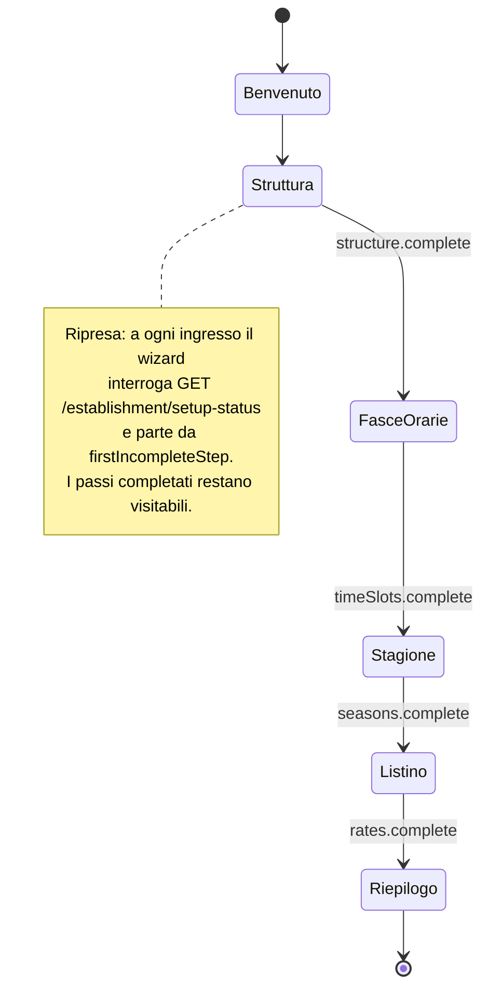

# Onboarding guidato di prima configurazione — Implementation Plan

> **For agentic workers:** REQUIRED SUB-SKILL: Use superpowers:subagent-driven-development (recommended) or superpowers:executing-plans to implement this plan task-by-task. Steps use checkbox (`- [ ]`) syntax for tracking.

**Goal:** Wizard `/onboarding` in web-staff che guida l'admin nella prima configurazione del lido (struttura → fasce → stagione → tariffe), con completezza misurata dal nuovo endpoint `GET /establishment/setup-status` e flag `setupComplete` nella Platform Console.

**Architecture:** Modello incrementale con ripresa (spec [2026-07-23-onboarding-prima-configurazione-design.md](../specs/2026-07-23-onboarding-prima-configurazione-design.md), ADR-0054): il wizard orchestra gli endpoint per-entità esistenti; il server misura la completezza con una projection pura (`computeSetupStatus`) riusata anche dalla Platform Console. Nessuna migration: la feature non tocca lo schema.

**Tech Stack:** NestJS + Prisma (api), Vue 3 + TanStack Query + Pinia (web-staff/web-platform), contracts TS condivisi, vitest + MSW (FE), jest + supertest (api).

## Global Constraints

- **Branch:** `feat/onboarding-prima-configurazione` (già creato, contiene la spec).
- **Nessuna migration**: zero modifiche a `schema.prisma`.
- **Suite di pacchetti diversi SEMPRE una alla volta**, mai in parallelo (falsi rossi da contesa su questo host). Dopo ogni task: l'INTERA suite del pacchetto toccato, mai il solo spec.
- Le e2e api sono sequenziali per config (`maxWorkers: 1` in `apps/api/test/jest-e2e.json`): **non toccarlo**.
- **«Oggi» nelle e2e api è il 2026-07-15 per sempre** (calendario congelato, `jest-frozen-calendar.setup.ts`): date «usable» = `endDate >= 2026-07-15`; date passate = prima. La suite unit api NON è congelata: nei test unit di projection passare i count già calcolati (la funzione è pura, non legge l'orologio).
- Copy UI in **italiano**; nessun hex fuori da `theme.css`; **non esiste tema dark**; primitivi ui-kit esistenti (`Card`, `Callout`, `Badge`, `EmptyState`, `Field`, `Input`, `Select`, `Button`); `ConfirmDialog` solo per azioni distruttive (il wizard non ne ha).
- vue-query: nei passi del wizard i componenti restano montati → `mutate()` + `onSuccess` va bene (il pattern `mutateAsync().then()` serve solo nei flussi che smontano).
- Nessuna nuova dipendenza npm.
- Commit frequenti, messaggi convenzionali in italiano (`feat(api): …`, `feat(web-staff): …`, `test: …`, `docs: …`).
- Comandi test (dalla root): `corepack pnpm -C apps/api test` · `corepack pnpm -C apps/api test:e2e` · `corepack pnpm -C apps/web-staff test` · `corepack pnpm -C apps/web-platform test` · `corepack pnpm -r typecheck`.

---

### Task 1: Contratto `SetupStatusDTO` + projection pura `computeSetupStatus`

**Files:**
- Modify: `packages/contracts/src/index.ts` (dopo il blocco `EstablishmentOverviewDTO`, ~riga 556)
- Create: `apps/api/src/establishment/setup-status.projection.ts`
- Test: `apps/api/src/establishment/setup-status.projection.spec.ts`

**Interfaces:**
- Consumes: niente (funzione pura su count).
- Produces: `SetupStatusDTO`/`SetupStepKey` (contracts) e `computeSetupStatus(c: SetupStatusCounts): SetupStatusDTO` + `interface SetupStatusCounts` — usati da Task 2, 3, 5, 7.

- [ ] **Step 1: aggiungi i tipi al contratto**

In `packages/contracts/src/index.ts`, dopo `UpdateEstablishmentInput`:

```ts
/** Passi della prima configurazione, nell'ordine della catena di prerequisiti (ADR-0054). */
export type SetupStepKey = 'structure' | 'timeSlots' | 'seasons' | 'rates';

/** Stato di completezza della prima configurazione (GET /establishment/setup-status, admin-only).
 *  Misura la catena reale dei prerequisiti di prenotazione: la stessa semantica dei 422
 *  NO_SEASON / NO_RATE / UMBRELLA_NOT_FOUND, resa interrogabile (ADR-0054). */
export interface SetupStatusDTO {
  structure: { sectors: number; rows: number; activeUmbrellas: number; complete: boolean };
  timeSlots: { count: number; complete: boolean };
  /** usable = stagioni con endDate >= oggi (Europe/Rome): una stagione tutta nel passato non permette di incassare. */
  seasons: { usable: number; complete: boolean };
  /** count = tariffe delle stagioni usable; hasCatchAll = esiste una tariffa tutta-wildcard (advisory, non blocca). */
  rates: { count: number; hasCatchAll: boolean; complete: boolean };
  complete: boolean;
  firstIncompleteStep: SetupStepKey | null;
}
```

- [ ] **Step 2: scrivi i test della projection (falliscono: file non esiste)**

`apps/api/src/establishment/setup-status.projection.spec.ts`:

```ts
import { computeSetupStatus, type SetupStatusCounts } from './setup-status.projection';

const base: SetupStatusCounts = {
  sectors: 1, rows: 2, activeUmbrellas: 10, timeSlots: 1,
  usableSeasons: 1, ratesInUsableSeasons: 1, usableSeasonsWithRates: 1, hasCatchAll: true,
};

describe('computeSetupStatus', () => {
  it('tenant vuoto: tutto incompleto, primo passo structure', () => {
    const s = computeSetupStatus({ ...base, sectors: 0, rows: 0, activeUmbrellas: 0, timeSlots: 0, usableSeasons: 0, ratesInUsableSeasons: 0, usableSeasonsWithRates: 0, hasCatchAll: false });
    expect(s.complete).toBe(false);
    expect(s.firstIncompleteStep).toBe('structure');
    expect(s.structure.complete).toBe(false);
  });

  it('struttura senza ombrelloni attivi (tutti ritirati) resta incompleta', () => {
    const s = computeSetupStatus({ ...base, activeUmbrellas: 0 });
    expect(s.structure.complete).toBe(false);
    expect(s.firstIncompleteStep).toBe('structure');
  });

  it('struttura ok, niente fasce → firstIncompleteStep = timeSlots', () => {
    const s = computeSetupStatus({ ...base, timeSlots: 0 });
    expect(s.firstIncompleteStep).toBe('timeSlots');
  });

  it('nessuna stagione usable → firstIncompleteStep = seasons anche se esistono tariffe', () => {
    const s = computeSetupStatus({ ...base, usableSeasons: 0, ratesInUsableSeasons: 0, usableSeasonsWithRates: 0 });
    expect(s.firstIncompleteStep).toBe('seasons');
    expect(s.seasons.complete).toBe(false);
  });

  it('stagione usable senza tariffe → firstIncompleteStep = rates', () => {
    const s = computeSetupStatus({ ...base, ratesInUsableSeasons: 0, usableSeasonsWithRates: 0, hasCatchAll: false });
    expect(s.firstIncompleteStep).toBe('rates');
    expect(s.rates.complete).toBe(false);
  });

  it('configurazione completa: complete=true, firstIncompleteStep=null', () => {
    const s = computeSetupStatus(base);
    expect(s.complete).toBe(true);
    expect(s.firstIncompleteStep).toBeNull();
  });

  it('hasCatchAll è advisory: false non impedisce complete', () => {
    const s = computeSetupStatus({ ...base, hasCatchAll: false });
    expect(s.complete).toBe(true);
    expect(s.rates.hasCatchAll).toBe(false);
  });
});
```

- [ ] **Step 3: verifica che fallisca**

Run: `corepack pnpm -C apps/api test -- setup-status.projection`
Expected: FAIL (`Cannot find module './setup-status.projection'`)

- [ ] **Step 4: implementa la projection**

`apps/api/src/establishment/setup-status.projection.ts`:

```ts
import type { SetupStatusDTO, SetupStepKey } from '@coralyn/contracts';

/** Count grezzi tenant-scoped da cui derivare lo stato (calcolati dal service, la projection è pura). */
export interface SetupStatusCounts {
  sectors: number;
  rows: number;
  activeUmbrellas: number;      // retiredAt IS NULL (ADR-0053: i ritirati non contano)
  timeSlots: number;
  usableSeasons: number;        // endDate >= oggi (Europe/Rome)
  ratesInUsableSeasons: number;
  usableSeasonsWithRates: number;
  hasCatchAll: boolean;         // esiste una Rate tutta-wildcard su una stagione usable
}

export function computeSetupStatus(c: SetupStatusCounts): SetupStatusDTO {
  const structure = {
    sectors: c.sectors, rows: c.rows, activeUmbrellas: c.activeUmbrellas,
    complete: c.sectors > 0 && c.rows > 0 && c.activeUmbrellas > 0,
  };
  const timeSlots = { count: c.timeSlots, complete: c.timeSlots > 0 };
  const seasons = { usable: c.usableSeasons, complete: c.usableSeasons > 0 };
  // Criterio «il lido può incassare»: basta una stagione usable con almeno una tariffa.
  const rates = { count: c.ratesInUsableSeasons, hasCatchAll: c.hasCatchAll, complete: c.usableSeasonsWithRates > 0 };
  const steps: [SetupStepKey, boolean][] = [
    ['structure', structure.complete],
    ['timeSlots', timeSlots.complete],
    ['seasons', seasons.complete],
    ['rates', rates.complete],
  ];
  const firstIncomplete = steps.find(([, ok]) => !ok);
  return {
    structure, timeSlots, seasons, rates,
    complete: !firstIncomplete,
    firstIncompleteStep: firstIncomplete ? firstIncomplete[0] : null,
  };
}
```

- [ ] **Step 5: verifica verde + typecheck**

Run: `corepack pnpm -C apps/api test -- setup-status.projection` → PASS (7 test)
Run: `corepack pnpm -C packages/contracts typecheck` (se lo script non esiste: `corepack pnpm -r typecheck`) → exit 0

- [ ] **Step 6: commit**

```bash
git add packages/contracts/src/index.ts apps/api/src/establishment/setup-status.projection.ts apps/api/src/establishment/setup-status.projection.spec.ts
git commit -m "feat(api): SetupStatusDTO nei contracts + projection pura computeSetupStatus (ADR-0054)"
```

---

### Task 2: `SetupStatusService` + `GET /establishment/setup-status` + e2e

**Files:**
- Create: `apps/api/src/establishment/setup-status.service.ts`
- Modify: `apps/api/src/establishment/establishment.controller.ts`
- Modify: `apps/api/src/establishment/establishment.module.ts`
- Test: `apps/api/test/setup-status.e2e-spec.ts`

**Interfaces:**
- Consumes: `computeSetupStatus`/`SetupStatusCounts` (Task 1), `PrismaService.forTenant`, `TenantContext.require()`, `todayInRome`/`toDbDate` da `../common/dates`.
- Produces: `SetupStatusService.getStatus(): Promise<SetupStatusDTO>` e `SetupStatusService.computeForTx(tx: Prisma.TransactionClient): Promise<SetupStatusDTO>` (riusato da Task 3). Endpoint `GET /api/establishment/setup-status` (admin-only) usato da Task 5.

- [ ] **Step 1: scrivi la e2e (fallisce: 404)**

`apps/api/test/setup-status.e2e-spec.ts` — pattern di `establishment-structure.e2e-spec.ts` (tenant dedicato + `createTestApp` + `seed-auth`). Calendario congelato: oggi = **2026-07-15**.

```ts
import { INestApplication } from '@nestjs/common';
import { Test } from '@nestjs/testing';
import request from 'supertest';
import { AppModule } from '../src/app.module';
import { PrismaService } from '../src/prisma/prisma.service';
import { createTestApp } from './helpers/create-test-app';
import { createUser, login } from './helpers/seed-auth';

describe('GET /api/establishment/setup-status (e2e)', () => {
  let app: INestApplication;
  let prisma: PrismaService;
  let adminToken: string;
  let staffToken: string;
  let estId: string;

  const ADMIN = 'setup-admin@e2e.test';
  const STAFF = 'setup-staff@e2e.test';
  const PASS = 'password-e2e';

  beforeAll(async () => {
    const moduleRef = await Test.createTestingModule({ imports: [AppModule] }).compile();
    app = await createTestApp(moduleRef);
    prisma = app.get(PrismaService);
    const est = await prisma.establishment.create({ data: { name: 'Lido Setup E2E' } });
    estId = est.id;
    await createUser(prisma, { email: ADMIN, password: PASS, role: 'admin', establishmentId: estId });
    await createUser(prisma, { email: STAFF, password: PASS, role: 'staff', establishmentId: estId });
    adminToken = await login(app, ADMIN, PASS);
    staffToken = await login(app, STAFF, PASS);
  });

  afterAll(async () => {
    // Cleanup in ordine FK-safe, tenant-scoped.
    await prisma.forTenant(estId, async (tx) => {
      await tx.rate.deleteMany();
      await tx.pricing.deleteMany();
      await tx.season.deleteMany();
      await tx.timeSlot.deleteMany();
      await tx.umbrella.deleteMany();
      await tx.row.deleteMany();
      await tx.sector.deleteMany();
    });
    await prisma.user.deleteMany({ where: { establishmentId: estId } });
    await prisma.establishment.delete({ where: { id: estId } });
    await app.close();
  });

  const get = (token: string) =>
    request(app.getHttpServer()).get('/api/establishment/setup-status').set('Authorization', `Bearer ${token}`);

  it('403 per lo staff (admin-only)', async () => {
    await get(staffToken).expect(403);
  });

  it('tenant vuoto: incompleto, primo passo structure', async () => {
    const res = await get(adminToken).expect(200);
    expect(res.body.complete).toBe(false);
    expect(res.body.firstIncompleteStep).toBe('structure');
    expect(res.body.structure).toEqual({ sectors: 0, rows: 0, activeUmbrellas: 0, complete: false });
  });

  it('progressione: struttura → fasce → stagione → tariffa fino a complete', async () => {
    const auth = (r: request.Test) => r.set('Authorization', `Bearer ${adminToken}`);

    // Struttura via API reali (stesso flusso del wizard).
    const sector = await auth(request(app.getHttpServer()).post('/api/establishment/sectors'))
      .send({ name: 'Centro', kind: 'grid' }).expect(201);
    const row = await auth(request(app.getHttpServer()).post('/api/establishment/rows'))
      .send({ sectorId: sector.body.id, label: 'Fila 1' }).expect(201);
    await auth(request(app.getHttpServer()).post('/api/establishment/umbrellas/generate'))
      .send({ rowId: row.body.id, prefix: '', start: 1, count: 3, umbrellaTypeId: null }).expect(201);

    let s = (await get(adminToken).expect(200)).body;
    expect(s.structure.complete).toBe(true);
    expect(s.firstIncompleteStep).toBe('timeSlots');

    await auth(request(app.getHttpServer()).post('/api/time-slots'))
      .send({ name: 'Giornata', startTime: '08:00', endTime: '19:00' }).expect(201);
    s = (await get(adminToken).expect(200)).body;
    expect(s.firstIncompleteStep).toBe('seasons');

    // Stagione PASSATA (endDate < 2026-07-15, calendario congelato): NON usable.
    const past = await auth(request(app.getHttpServer()).post('/api/seasons'))
      .send({ name: 'Primavera 2026', startDate: '2026-03-01', endDate: '2026-04-30' }).expect(201);
    s = (await get(adminToken).expect(200)).body;
    expect(s.seasons).toEqual({ usable: 0, complete: false });
    expect(s.firstIncompleteStep).toBe('seasons');

    // Tariffa sulla stagione passata: non completa rates (e seasons resta il primo buco).
    await auth(request(app.getHttpServer()).post('/api/rates'))
      .send({ seasonId: past.body.id, price: 10 }).expect(201);
    s = (await get(adminToken).expect(200)).body;
    expect(s.rates.complete).toBe(false);
    expect(s.firstIncompleteStep).toBe('seasons');

    // Stagione usable (contiene il 2026-07-15).
    const season = await auth(request(app.getHttpServer()).post('/api/seasons'))
      .send({ name: 'Estate Setup', startDate: '2026-06-01', endDate: '2026-09-15' }).expect(201);
    s = (await get(adminToken).expect(200)).body;
    expect(s.seasons).toEqual({ usable: 1, complete: true });
    expect(s.firstIncompleteStep).toBe('rates');
    expect(s.rates.hasCatchAll).toBe(false);

    // Catch-all sulla stagione usable → complete.
    await auth(request(app.getHttpServer()).post('/api/rates'))
      .send({ seasonId: season.body.id, price: 25 }).expect(201);
    s = (await get(adminToken).expect(200)).body;
    expect(s.rates).toEqual({ count: 1, hasCatchAll: true, complete: true });
    expect(s.complete).toBe(true);
    expect(s.firstIncompleteStep).toBeNull();
  });

  it('ombrelloni tutti ritirati: structure torna incompleta', async () => {
    const auth = (r: request.Test) => r.set('Authorization', `Bearer ${adminToken}`);
    const tree = (await auth(request(app.getHttpServer()).get('/api/establishment/structure')).expect(200)).body;
    const ids: string[] = tree.sectors.flatMap((se: any) => se.rows.flatMap((r: any) => r.umbrellas.map((u: any) => u.id)));
    for (const id of ids) {
      await auth(request(app.getHttpServer()).post(`/api/establishment/umbrellas/${id}/retire`)).expect(201);
    }
    const s = (await get(adminToken).expect(200)).body;
    expect(s.structure.activeUmbrellas).toBe(0);
    expect(s.structure.complete).toBe(false);
    expect(s.firstIncompleteStep).toBe('structure');
  });
});
```

Nota per l'implementatore: se il POST di `sectors`/`rows`/`generate`/`time-slots`/`seasons`/`rates` risponde 200 invece di 201, allinea gli `expect` allo status reale osservato (controller esistenti, non modificarli).

- [ ] **Step 2: verifica che fallisca**

Run: `corepack pnpm -C apps/api test:e2e -- setup-status`
Expected: FAIL (404 su `/api/establishment/setup-status`)

- [ ] **Step 3: implementa il service**

`apps/api/src/establishment/setup-status.service.ts`:

```ts
import { Injectable } from '@nestjs/common';
import type { Prisma } from '@prisma/client';
import type { SetupStatusDTO } from '@coralyn/contracts';
import { PrismaService } from '../prisma/prisma.service';
import { TenantContext } from '../tenant/tenant-context';
import { todayInRome, toDbDate } from '../common/dates';
import { computeSetupStatus } from './setup-status.projection';

@Injectable()
export class SetupStatusService {
  constructor(
    private readonly prisma: PrismaService,
    private readonly tenant: TenantContext,
  ) {}

  async getStatus(): Promise<SetupStatusDTO> {
    const tenantId = this.tenant.require();
    return this.prisma.forTenant(tenantId, (tx) => this.computeForTx(tx));
  }

  /** Riusabile dentro una forTenant già aperta (Platform Console, ADR-0054). */
  async computeForTx(tx: Prisma.TransactionClient): Promise<SetupStatusDTO> {
    const today = toDbDate(todayInRome());
    const [sectors, rows, activeUmbrellas, timeSlots, usable] = await Promise.all([
      tx.sector.count(),
      tx.row.count(),
      tx.umbrella.count({ where: { retiredAt: null } }),
      tx.timeSlot.count(),
      tx.season.findMany({ where: { endDate: { gte: today } }, select: { id: true } }),
    ]);
    let ratesInUsableSeasons = 0;
    let usableSeasonsWithRates = 0;
    let hasCatchAll = false;
    if (usable.length > 0) {
      const pricings = await tx.pricing.findMany({
        where: { seasonId: { in: usable.map((s) => s.id) } },
        select: { id: true },
      });
      const rates = await tx.rate.findMany({
        where: { pricingId: { in: pricings.map((p) => p.id) } },
        select: {
          pricingId: true, type: true, sectorId: true, rowId: true,
          packageId: true, timeSlotId: true, periodStart: true, periodEnd: true,
        },
      });
      ratesInUsableSeasons = rates.length;
      usableSeasonsWithRates = new Set(rates.map((r) => r.pricingId)).size;
      hasCatchAll = rates.some((r) =>
        r.type === null && r.sectorId === null && r.rowId === null &&
        r.packageId === null && r.timeSlotId === null && r.periodStart === null && r.periodEnd === null);
    }
    return computeSetupStatus({
      sectors, rows, activeUmbrellas, timeSlots,
      usableSeasons: usable.length, ratesInUsableSeasons, usableSeasonsWithRates, hasCatchAll,
    });
  }
}
```

- [ ] **Step 4: controller + module**

`establishment.controller.ts` — aggiungi al controller esistente (import `SetupStatusService` e `SetupStatusDTO`):

```ts
@Get('setup-status')
@Roles(Role.Admin)
setupStatus(): Promise<SetupStatusDTO> {
  return this.setupStatus_.getStatus();
}
```

con `private readonly setupStatus_: SetupStatusService` aggiunto al costruttore (nome `setupStatus_` per non collidere col nome del metodo; se preferisci, metodo `getSetupStatus()` e campo `setupStatus` — coerente basta).

`establishment.module.ts`: `providers` += `SetupStatusService`; aggiungi `exports: [SetupStatusService]`.

- [ ] **Step 5: verifica verde**

Run: `corepack pnpm -C apps/api test:e2e -- setup-status` → PASS
Run: `corepack pnpm -C apps/api test:e2e` (INTERA suite) → tutte verdi (393 + le nuove)

- [ ] **Step 6: commit**

```bash
git add apps/api/src/establishment/setup-status.service.ts apps/api/src/establishment/establishment.controller.ts apps/api/src/establishment/establishment.module.ts apps/api/test/setup-status.e2e-spec.ts
git commit -m "feat(api): GET /establishment/setup-status admin-only con completezza misurata (ADR-0054)"
```

---

### Task 3: `setupComplete` nella Platform Console (api)

**Files:**
- Modify: `packages/contracts/src/index.ts` (`PlatformEstablishmentDTO`, ~riga 645)
- Modify: `apps/api/src/platform/platform-metrics.service.ts`
- Modify: `apps/api/src/platform/platform.module.ts` (import di `EstablishmentModule`)
- Test: estendi la e2e platform esistente (individuala con `ls apps/api/test/platform*.e2e-spec.ts`)

**Interfaces:**
- Consumes: `SetupStatusService.computeForTx(tx)` (Task 2, esportato da `EstablishmentModule`).
- Produces: `PlatformEstablishmentDTO.setupComplete: boolean` — usato da Task 4.

- [ ] **Step 1: contratto**

In `PlatformEstablishmentDTO` aggiungi in coda:

```ts
  // configurazione
  setupComplete: boolean; // SetupStatusDTO.complete del lido (ADR-0054) — PII-free
```

- [ ] **Step 2: estendi la e2e platform (fallisce: campo assente)**

Nella e2e platform esistente, nel test che asserisce la forma della lista (`GET /api/platform/establishments`), aggiungi:

```ts
expect(res.body[0]).toHaveProperty('setupComplete');
expect(typeof res.body[0].setupComplete).toBe('boolean');
```

e, se la suite crea un lido vuoto ad hoc, asserisci `setupComplete === false` su quello.

Run: `corepack pnpm -C apps/api test:e2e -- platform` → FAIL (property assente)

- [ ] **Step 3: implementa**

`platform.module.ts`: `imports` += `EstablishmentModule`.

`platform-metrics.service.ts`: inietta `private readonly setupStatus: SetupStatusService` (import da `../establishment/setup-status.service`); dentro il callback `forTenant` di `metricsFor` aggiungi:

```ts
const setupComplete = (await this.setupStatus.computeForTx(tx)).complete;
```

includilo nel `return` dell'`agg` e nel DTO finale (`setupComplete: agg.setupComplete`).

- [ ] **Step 4: verifica**

Run: `corepack pnpm -C apps/api test:e2e -- platform` → PASS
Run: `corepack pnpm -C apps/api test` (unit, INTERA) → verdi
Run: `corepack pnpm -r typecheck` → **atteso FAIL in `web-platform` SOLO se** i suoi mock/fixture costruiscono `PlatformEstablishmentDTO` letterali: in tal caso aggiungi `setupComplete: true` alle fixture (file spec/mocks di `apps/web-platform`) nello stesso commit. Poi exit 0.

- [ ] **Step 5: commit**

```bash
git add packages/contracts/src/index.ts apps/api/src/platform/platform-metrics.service.ts apps/api/src/platform/platform.module.ts apps/api/test/
git add apps/web-platform  # solo se fixture toccate
git commit -m "feat(api): setupComplete in PlatformEstablishmentDTO via SetupStatusService (ADR-0054)"
```

---

### Task 4: badge «Da configurare» nella lista lidi (web-platform)

**Files:**
- Modify: `apps/web-platform/src/features/establishments/EstablishmentsListView.vue` (template `#cell-suspendedAt`, ~riga 97)
- Test: `apps/web-platform/src/features/establishments/EstablishmentsListView.spec.ts`

**Interfaces:**
- Consumes: `PlatformEstablishmentDTO.setupComplete` (Task 3).
- Produces: niente.

- [ ] **Step 1: test (fallisce)**

Nello spec della lista, aggiungi un caso col pattern già in uso nel file (handler MSW o fixture della suite):

```ts
it('mostra «Da configurare» per un lido attivo con setupComplete=false', async () => {
  // Usa il meccanismo di mock della suite: un lido con suspendedAt: null e setupComplete: false,
  // un secondo con setupComplete: true.
  // ...mount + settle come gli altri test del file...
  expect(w.text()).toContain('Da configurare');
});
```

Adatta il setup dei dati allo stile del file (fixture/handler esistenti) e aggiungi `setupComplete` a TUTTE le fixture della suite. Run: `corepack pnpm -C apps/web-platform test` → FAIL sul nuovo caso.

- [ ] **Step 2: implementa**

Nel template `#cell-suspendedAt`:

```html
<template #cell-suspendedAt="{ row }">
  <span class="inline-flex items-center gap-1.5">
    <Badge :tone="(row as unknown as PlatformEstablishmentDTO).suspendedAt ? 'neutral' : 'success'">{{ (row as unknown as PlatformEstablishmentDTO).suspendedAt ? 'Sospeso' : 'Attivo' }}</Badge>
    <Badge v-if="!(row as unknown as PlatformEstablishmentDTO).suspendedAt && !(row as unknown as PlatformEstablishmentDTO).setupComplete" tone="neutral" data-testid="setup-incomplete">Da configurare</Badge>
  </span>
</template>
```

- [ ] **Step 3: verifica + commit**

Run: `corepack pnpm -C apps/web-platform test` (INTERA) → verdi.

```bash
git add apps/web-platform/src/features/establishments/
git commit -m "feat(web-platform): badge «Da configurare» per lidi con setup incompleto"
```

---

### Task 5: data layer web-staff — `useSetupStatus` + invalidazioni estese

**Files:**
- Modify: `apps/web-staff/src/lib/queryKeys.ts`
- Create: `apps/web-staff/src/features/onboarding/useSetupStatus.ts`
- Modify: `apps/web-staff/src/features/establishment/useEstablishmentStructure.ts` (`structureKeys`)
- Modify: `apps/web-staff/src/features/pricing/useSeasons.ts`, `useTimeSlots.ts`, `useRates.ts` (invalidates)
- Modify: handlers MSW di default (file del mock server, individuato da `apps/web-staff/src/mocks/`)

**Interfaces:**
- Consumes: endpoint Task 2; `queryResource`, `queryKeys`, `apiFetch`, `useSessionStore` esistenti.
- Produces: `queryKeys.setupStatus(tenantId)` e `useSetupStatus(): ritorno di queryResource<SetupStatusDTO>` — usati da Task 7 e 11.

- [ ] **Step 1: chiave + composable**

`queryKeys.ts`:

```ts
  setupStatus: (tenantId: string) => ['establishment', tenantId, 'setup-status'] as const,
```

`features/onboarding/useSetupStatus.ts`:

```ts
import type { SetupStatusDTO } from '@coralyn/contracts';
import { Role } from '@coralyn/contracts';
import { apiFetch } from '@/lib/http';
import { queryKeys } from '@/lib/queryKeys';
import { useSessionStore } from '@/stores/session';
import { queryResource } from '@/lib/useQueryResource';

/** Stato di completezza della prima configurazione (admin-only: disabilitata per lo staff). */
export function useSetupStatus() {
  const session = useSessionStore();
  return queryResource({
    queryKey: () => queryKeys.setupStatus(session.establishmentId),
    queryFn: () => apiFetch<SetupStatusDTO>('/establishment/setup-status'),
    enabled: () => session.role === Role.Admin,
  });
}
```

- [ ] **Step 2: invalidazioni**

- `useEstablishmentStructure.ts`, `structureKeys`: aggiungi `queryKeys.setupStatus(establishmentId)` all'array (commento: «ogni mutazione di struttura può cambiare lo stato dell'onboarding»). `retireKeys` la eredita.
- `useSeasons.ts` (`useCreateSeason`/`useDeleteSeason`), `useTimeSlots.ts` (`invalidateSlotsAndMap`), `useRates.ts` (tutte le mutation): aggiungi `queryKeys.setupStatus(session.establishmentId)` alla lista `invalidates`. Per lo staff la query è disabilitata: invalidare una query inattiva è un no-op, nessun effetto collaterale.

- [ ] **Step 3: handler MSW di default**

Nel file handlers dei mock aggiungi (accanto agli handler `establishment/*`):

```ts
http.get('/api/establishment/setup-status', () =>
  HttpResponse.json({
    structure: { sectors: 3, rows: 6, activeUmbrellas: 41, complete: true },
    timeSlots: { count: 3, complete: true },
    seasons: { usable: 1, complete: true },
    rates: { count: 4, hasCatchAll: true, complete: true },
    complete: true,
    firstIncompleteStep: null,
  })),
```

(default «configurato»: i test esistenti non cambiano comportamento; i test del wizard useranno `server.use` con stati parziali).

- [ ] **Step 4: verifica + commit**

Run: `corepack pnpm -C apps/web-staff test` (INTERA: include ui-kit) → verdi (nessuna regressione da invalidazioni).
Run: `corepack pnpm -r typecheck` → exit 0.

```bash
git add apps/web-staff/src/lib/queryKeys.ts apps/web-staff/src/features/onboarding/ apps/web-staff/src/features/establishment/useEstablishmentStructure.ts apps/web-staff/src/features/pricing/ apps/web-staff/src/mocks/
git commit -m "feat(web-staff): useSetupStatus + invalidazione setup-status dalle mutation struttura/catalogo"
```

---

### Task 6: estrazione `UmbrellaGeneratorForm` da `RowPanel`

**Files:**
- Create: `apps/web-staff/src/features/establishment/UmbrellaGeneratorForm.vue`
- Modify: `apps/web-staff/src/features/establishment/panels/RowPanel.vue`

**Interfaces:**
- Consumes: `useGenerateUmbrellas`, `GENERATE_MAX` da `./structureSelection`, `pushToast`.
- Produces: componente `UmbrellaGeneratorForm` con props `{ rowId: string; types: UmbrellaTypeDTO[] }` (nessun emit: toast su successo, invalidazioni via mutation) — riusato da Task 8. **Conserva i `data-testid` esistenti** (`gen-form`, `gen-prefix`, `gen-start`, `gen-count`, `gen-type`, `gen-save`): gli spec del Cantiere li usano.

- [ ] **Step 1: crea il componente**

`UmbrellaGeneratorForm.vue` — sposta qui, IDENTICI, lo script del generatore di `RowPanel.vue` (righe 24-42: `genPrefix`/`genStart`/`genCount`/`genTypeId`/`genCountOverMax`/`genPreview`/`doGenerate`) e il markup del form (righe 72-89), con due sole differenze: `props.row.id` → `props.rowId`, e le props sono `defineProps<{ rowId: string; types: UmbrellaTypeDTO[] }>()`.

- [ ] **Step 2: riusa in RowPanel**

In `RowPanel.vue`: elimina script e markup spostati, importa il componente e rendi `<UmbrellaGeneratorForm :row-id="row.id" :types="types" />` al posto del form (dentro il ramo `v-if="isAdmin"`).

- [ ] **Step 3: verifica + commit**

Run: `corepack pnpm -C apps/web-staff test` (INTERA) → verdi (gli spec Cantiere che usano `gen-*` devono passare invariati; se uno fallisce, il refactor ha cambiato comportamento: correggi il componente, non lo spec).

```bash
git add apps/web-staff/src/features/establishment/
git commit -m "refactor(web-staff): estrae UmbrellaGeneratorForm da RowPanel per riuso nel wizard"
```

---

### Task 7: rotta `/onboarding` + `OnboardingView` + stepper + ripresa + Benvenuto/Riepilogo

**Files:**
- Modify: `apps/web-staff/src/router/index.ts`
- Create: `apps/web-staff/src/features/onboarding/OnboardingView.vue`
- Create: `apps/web-staff/src/features/onboarding/OnboardingStepper.vue`
- Create: `apps/web-staff/src/features/onboarding/steps/StepWelcome.vue`
- Create: `apps/web-staff/src/features/onboarding/steps/StepSummary.vue`
- Test: `apps/web-staff/src/features/onboarding/OnboardingView.spec.ts`

**Interfaces:**
- Consumes: `useSetupStatus` (Task 5); ui-kit `Card`, `Button`, `Icon`, `SkeletonText`, `useDelayedLoading`.
- Produces: tipo `WizardStep = 'welcome' | 'structure' | 'timeSlots' | 'seasons' | 'rates' | 'summary'` (esportato da `OnboardingView.vue` o da un `types.ts` della feature); contratto dei componenti passo: props `{ status: SetupStatusDTO }`, emit `next: []`. I passi 8-10 si innestano nello `switch` del template senza toccare la logica di ripresa. Ogni step wrapper ha `data-testid="ob-step-<key>"`.

- [ ] **Step 1: test (fallisce)**

`OnboardingView.spec.ts` (pattern `mountApp` + `server.use` di `EstablishmentView.spec.ts`; sessione admin come nel caso «admin:» di quel file):

```ts
import { describe, it, expect, afterEach } from 'vitest';
import { flushPromises } from '@vue/test-utils';
import { http, HttpResponse } from 'msw';
import { Role } from '@coralyn/contracts';
import { mountApp } from '@/test/utils';
import { server } from '@/mocks/server';
import { useSessionStore } from '@/stores/session';
import OnboardingView from './OnboardingView.vue';

const settle = async () => { await flushPromises(); await new Promise((r) => setTimeout(r, 0)); await flushPromises(); };

const partial = (firstIncompleteStep: string, overrides = {}) => ({
  structure: { sectors: 0, rows: 0, activeUmbrellas: 0, complete: false },
  timeSlots: { count: 0, complete: false },
  seasons: { usable: 0, complete: false },
  rates: { count: 0, hasCatchAll: false, complete: false },
  complete: false,
  firstIncompleteStep,
  ...overrides,
});

function mountAsAdmin() {
  const w = mountApp(OnboardingView);
  const session = useSessionStore();
  session.user = { id: 'u-1', email: 'admin@coralyn.dev', role: Role.Admin, establishmentId: 'e-1', establishmentName: 'Lido Maestrale' };
  return w;
}

describe('OnboardingView', () => {
  afterEach(() => server.resetHandlers());

  it('lido vergine: parte dal passo structure (ripresa dal primo incompleto)', async () => {
    server.use(http.get('/api/establishment/setup-status', () => HttpResponse.json(partial('structure'))));
    const w = mountAsAdmin();
    await settle();
    expect(w.find('[data-testid="ob-step-structure"]').exists()).toBe(true);
  });

  it('configurazione a metà: riprende da rates', async () => {
    server.use(http.get('/api/establishment/setup-status', () => HttpResponse.json(partial('rates', {
      structure: { sectors: 1, rows: 1, activeUmbrellas: 5, complete: true },
      timeSlots: { count: 1, complete: true },
      seasons: { usable: 1, complete: true },
    }))));
    const w = mountAsAdmin();
    await settle();
    expect(w.find('[data-testid="ob-step-rates"]').exists()).toBe(true);
  });

  it('configurazione completa: mostra il riepilogo con le spunte', async () => {
    const w = mountAsAdmin(); // handler default: complete
    await settle();
    expect(w.find('[data-testid="ob-step-summary"]').exists()).toBe(true);
    expect(w.text()).toContain('Configurazione completa');
  });

  it('lo stepper consente di rivisitare un passo completato', async () => {
    const w = mountAsAdmin(); // complete
    await settle();
    await w.find('[data-testid="stepper-structure"]').trigger('click');
    expect(w.find('[data-testid="ob-step-structure"]').exists()).toBe(true);
  });
});
```

Run: `corepack pnpm -C apps/web-staff test -- OnboardingView` → FAIL (view non esiste)

- [ ] **Step 2: rotta**

In `router/index.ts` dopo la rotta `establishment-structure`:

```ts
{ path: '/onboarding', name: 'onboarding', component: () => import('@/features/onboarding/OnboardingView.vue'), meta: { title: 'Configurazione guidata', subtitle: 'Prepara il lido a incassare la prima prenotazione', role: Role.Admin } },
```

- [ ] **Step 3: implementa stepper e view**

`OnboardingStepper.vue`: props `{ items: { key: string; label: string; state: 'done' | 'active' | 'todo' }[] }`, emit `select: [key: string]`. Lista orizzontale di bottoni (stile card di `StructureGuidedSetup`: cerchietto numerato/✓, `--color-success-bg`/`--color-brand-tint`), ogni item `data-testid="stepper-<key>"`, `aria-current="step"` sull'attivo.

`OnboardingView.vue` — logica chiave:

```ts
import { ref, watch, computed } from 'vue';
import type { SetupStatusDTO, SetupStepKey } from '@coralyn/contracts';
import { useSetupStatus } from './useSetupStatus';

const STEP_ORDER = ['welcome', 'structure', 'timeSlots', 'seasons', 'rates', 'summary'] as const;
export type WizardStep = (typeof STEP_ORDER)[number];
const STEP_LABEL: Record<WizardStep, string> = {
  welcome: 'Benvenuto', structure: 'Struttura', timeSlots: 'Fasce orarie',
  seasons: 'Stagione', rates: 'Listino', summary: 'Riepilogo',
};

const { data: status, isPending } = useSetupStatus();
const current = ref<WizardStep | null>(null);

// Ripresa: SOLO al primo load posiziona sul primo passo incompleto (o sul riepilogo).
watch(status, (s) => {
  if (!s || current.value !== null) return;
  current.value = s.complete ? 'summary' : (s.firstIncompleteStep as WizardStep);
}, { immediate: true });

function stepComplete(s: SetupStatusDTO, key: WizardStep): boolean {
  if (key === 'welcome') return true;
  if (key === 'summary') return s.complete;
  return s[key as SetupStepKey].complete;
}
const stepperItems = computed(() => STEP_ORDER.map((k) => ({
  key: k, label: STEP_LABEL[k],
  state: k === current.value ? ('active' as const) : status.value && stepComplete(status.value, k) ? ('done' as const) : ('todo' as const),
})));
function goNext() {
  const i = STEP_ORDER.indexOf(current.value ?? 'welcome');
  current.value = STEP_ORDER[Math.min(i + 1, STEP_ORDER.length - 1)];
}
```

Template: `SkeletonText` sotto `useDelayedLoading(() => isPending.value)`; stepper; poi il passo corrente in una `Card`, ogni wrapper con `data-testid="ob-step-<key>"`. Per questo task rendi `StepWelcome` (emit next → `goNext`) e `StepSummary`; per `structure`/`timeSlots`/`seasons`/`rates` rendi un placeholder `<div :data-testid="'ob-step-' + current">` con il solo titolo (i Task 8-10 lo sostituiscono col componente reale — il testid resta identico, i test di questo task non cambiano).

`StepWelcome.vue` — copy:

> **Prepariamo il tuo lido.** Per incassare la prima prenotazione servono quattro cose, in quest'ordine: la **struttura** della spiaggia (settori, file, ombrelloni), almeno una **fascia oraria**, una **stagione** e un **listino**. Questo percorso ti guida passo per passo, con una spiegazione per ognuno. Puoi interromperlo e riprenderlo quando vuoi: si riparte sempre dal primo passo mancante e nessun dato viene mai cancellato.

Bottone `data-testid="ob-start"` «Iniziamo» → emit `next`.

`StepSummary.vue` — props `{ status: SetupStatusDTO }`: titolo «Configurazione completa» se `status.complete`, altrimenti «Quasi fatto» + elenco dei passi con ✓/• (riusa i token di `StructureGuidedSetup`); righe: `Struttura · {sectors} settori, {activeUmbrellas} ombrelloni`, `Fasce orarie · {count}`, `Stagioni valide · {usable}`, `Tariffe · {count}`; `Callout tone="warm"` se `!status.rates.hasCatchAll && status.rates.complete`: «Non c'è una tariffa base valida ovunque: alcune combinazioni potrebbero restare senza prezzo.»; CTA `Button` «Vai alla mappa» → `router.push('/map')` + link secondario a `/rentals/catalogo` («Vuoi noleggiare pedalò e attrezzatura? Configura il catalogo noleggio — facoltativo.»).

- [ ] **Step 4: verifica + commit**

Run: `corepack pnpm -C apps/web-staff test -- OnboardingView` → PASS
Run: `corepack pnpm -C apps/web-staff test` (INTERA) → verdi

```bash
git add apps/web-staff/src/router/index.ts apps/web-staff/src/features/onboarding/
git commit -m "feat(web-staff): rotta /onboarding con stepper, ripresa dal primo passo incompleto, benvenuto e riepilogo"
```

---

### Task 8: passo Struttura

**Files:**
- Create: `apps/web-staff/src/features/onboarding/steps/StepStructure.vue`
- Modify: `apps/web-staff/src/features/onboarding/OnboardingView.vue` (sostituisce il placeholder `structure`)
- Test: `apps/web-staff/src/features/onboarding/steps/StepStructure.spec.ts`

**Interfaces:**
- Consumes: `useEstablishmentStructure`, `useCreateSector`, `useCreateRow` (composable esistenti), `UmbrellaGeneratorForm` (Task 6), props `{ status: SetupStatusDTO }`, emit `next: []`.
- Produces: componente passo montato da `OnboardingView` dentro `[data-testid="ob-step-structure"]`.

- [ ] **Step 1: test (fallisce)**

`StepStructure.spec.ts` (mount diretto del componente con `mountApp`, sessione admin, `server.use` per struttura vuota → `GET /api/establishment/structure` con `{ sectors: [], umbrellaTypes: [] }`):

```ts
it('struttura vuota: mostra il form settore; il POST parte con name e kind', async () => {
  const seen: unknown[] = [];
  server.use(
    http.get('/api/establishment/structure', () => HttpResponse.json({ sectors: [], umbrellaTypes: [] })),
    http.post('/api/establishment/sectors', async ({ request }) => {
      seen.push(await request.json());
      return HttpResponse.json({ id: 's-1', name: 'Centro', sortOrder: 0, kind: 'grid', rows: [] });
    }),
  );
  // mount, settle, compila ob-sector-name, submit ob-sector-save
  expect(seen[0]).toEqual({ name: 'Centro', kind: 'grid' });
});

it('con settore senza file: mostra il form fila legato al settore', async () => { /* GET structure con 1 settore 0 file; compila ob-row-label; POST /rows riceve { sectorId: 's-1', label: 'Fila 1' } */ });

it('con fila: rende il generatore (gen-form) per la fila selezionata', async () => { /* GET structure con settore+fila; expect gen-form exists */ });

it('emette next dal bottone continua quando status.structure.complete', async () => { /* props status complete; click ob-structure-next; expect emitted next */ });
```

(Scrivi i 4 casi per intero seguendo lo stile del primo; i commenti indicano SOLO il contenuto dei mock, non passi da saltare.)

- [ ] **Step 2: implementa**

`StepStructure.vue` — props `{ status: SetupStatusDTO }`, emit `next`. Struttura del template:

1. Intro (copy): «**La struttura è la tua spiaggia dentro Coralyn.** Un *settore* è una zona («Centro», «Zona nord»); ogni settore ha delle *file*, dalla più vicina al mare in giù; ogni fila contiene gli *ombrelloni*, che sono ciò che i clienti prenotano.» + `<details data-testid="ob-why-structure"><summary>Perché serve?</summary>Una prenotazione è sempre su un ombrellone specifico: senza almeno un ombrellone il sistema risponde «Ombrellone non valido» e la mappa resta vuota. Potrai sempre aggiungere, rinominare e riorganizzare tutto dal Cantiere.</details>`
2. Stato reale: contatori da `useEstablishmentStructure()` (`{{ sectors.length }} settori · {{ rowCount }} file · {{ umbrellaCount }} ombrelloni`).
3. Form settore (sempre visibile in modalità «aggiungi»): `Field «Nome del settore»` + `Input data-testid="ob-sector-name"`, `Select data-testid="ob-sector-kind"` con opzioni `grid` («Griglia — file regolari») / `special` («Speciali — posti fuori schema»), `Button data-testid="ob-sector-save"` → `useCreateSector().mutate({ name, kind })`, reset del campo in `onSuccess`.
4. Form fila (visibile se `sectors.length > 0`): `Select data-testid="ob-row-sector"` dei settori + `Input data-testid="ob-row-label"` + `Button data-testid="ob-row-save"` → `useCreateRow().mutate({ sectorId, label })`.
5. Generatore (visibile se esiste almeno una fila): `Select data-testid="ob-gen-row"` delle file (default: ultima creata) + `<UmbrellaGeneratorForm :row-id="selectedRowId" :types="structure.umbrellaTypes" />`.
6. Footer: link `router-link to="/establishment/structure"` («Apri il Cantiere per l'editor completo») + `Button data-testid="ob-structure-next"` «Continua» `:disabled="!status.structure.complete"` → emit `next`.

In `OnboardingView.vue` sostituisci il placeholder `structure` con `<StepStructure :status="status" @next="goNext" />`.

- [ ] **Step 3: verifica + commit**

Run: `corepack pnpm -C apps/web-staff test -- StepStructure && corepack pnpm -C apps/web-staff test` → PASS / verdi

```bash
git add apps/web-staff/src/features/onboarding/
git commit -m "feat(web-staff): passo Struttura dell'onboarding (settore, fila, generatore riusato)"
```

---

### Task 9: passi Fasce orarie e Stagione

**Files:**
- Create: `apps/web-staff/src/features/onboarding/steps/StepTimeSlots.vue`
- Create: `apps/web-staff/src/features/onboarding/steps/StepSeasons.vue`
- Modify: `apps/web-staff/src/features/onboarding/OnboardingView.vue` (sostituisce i placeholder)
- Test: `apps/web-staff/src/features/onboarding/steps/StepTimeSlots.spec.ts`, `StepSeasons.spec.ts`

**Interfaces:**
- Consumes: `useTimeSlots`/`useCreateTimeSlot`, `useSeasons`/`useCreateSeason` (esistenti); props `{ status: SetupStatusDTO }`, emit `next: []`.
- Produces: componenti passo dentro `ob-step-timeSlots` / `ob-step-seasons`.

- [ ] **Step 1: test StepTimeSlots (fallisce), poi implementa**

Spec: fasce esistenti elencate; submit del form → POST `/api/time-slots` con `{ name, startTime, endTime }` (testid `ob-slot-name`, `ob-slot-start`, `ob-slot-end`, `ob-slot-save`); `ob-timeslots-next` disabilitato se `!status.timeSlots.complete`.

Componente — intro: «**Le fasce orarie sono i "tagli" prenotabili della giornata**: ad esempio una fascia unica «Giornata», oppure «Mattina» e «Pomeriggio». Ogni prenotazione appartiene a una fascia.» + `<details>`: «Senza fasce non si può scegliere *quando* prenotare. Se usi solo la giornata intera, creane una sola (es. 08:00–19:00): potrai aggiungerne altre in ogni momento dal Listino.» Form: `Input type="text"` nome + due `Input type="time"` + Button → `useCreateTimeSlot().mutate({ name, startTime, endTime })`. Elenco fasce esistenti (`name · startTime–endTime`). Footer con «Continua» come Task 8.

- [ ] **Step 2: test StepSeasons (fallisce), poi implementa**

Spec: stagioni esistenti elencate; submit → POST `/api/seasons` con `{ name, startDate, endDate }` (testid `ob-season-name`, `ob-season-start`, `ob-season-end`, `ob-season-save`); avviso `data-testid="ob-season-past-warning"` visibile quando la endDate digitata è precedente a oggi; `ob-seasons-next` gated su `status.seasons.complete`.

Componente — intro: «**La stagione è l'arco di date in cui il lido è aperto** (es. 1 maggio – 30 settembre). Prezzi e abbonamenti vivono dentro una stagione: una prenotazione fuori stagione viene rifiutata.» + `<details>`: «Puoi avere più stagioni (anche il prossimo anno, in anticipo). Conta che la stagione copra le date in cui vuoi vendere: una stagione già finita non permette di incassare.» Avviso data passata:

```ts
// ADR-0031: il fuso operativo è Europe/Rome.
const todayIso = new Intl.DateTimeFormat('en-CA', { timeZone: 'Europe/Rome' }).format(new Date());
const endInPast = computed(() => !!endDate.value && endDate.value < todayIso);
```

`Callout tone="warm"` con l'avviso quando `endInPast`: «Questa stagione finisce nel passato: non permetterà nuove prenotazioni.» (non blocca il submit: il dominio ammette stagioni storiche).

- [ ] **Step 3: monta in OnboardingView, verifica, commit**

Run: `corepack pnpm -C apps/web-staff test` (INTERA) → verdi

```bash
git add apps/web-staff/src/features/onboarding/
git commit -m "feat(web-staff): passi Fasce orarie e Stagione dell'onboarding"
```

---

### Task 10: passo Listino (tariffa catch-all)

**Files:**
- Create: `apps/web-staff/src/features/onboarding/steps/StepRates.vue`
- Modify: `apps/web-staff/src/features/onboarding/OnboardingView.vue` (sostituisce il placeholder `rates`)
- Test: `apps/web-staff/src/features/onboarding/steps/StepRates.spec.ts`

**Interfaces:**
- Consumes: `useSeasons`, `useRates(getSeasonId)`, `useCreateRate(getSeasonId)` (esistenti); props `{ status: SetupStatusDTO }`, emit `next: []`.
- Produces: componente passo dentro `ob-step-rates`.

- [ ] **Step 1: test (fallisce)**

Spec: con una stagione usable selezionata e prezzo `25`, il submit fa POST `/api/rates` con body **esattamente** `{ seasonId: 's-1', price: 25 }` (nessuna dimensione: il server le azzera a wildcard); con più stagioni usable compare `ob-rate-season`; `Callout data-testid="ob-no-catchall"` visibile quando `status.rates.count > 0 && !status.rates.hasCatchAll`; `ob-rates-next` gated su `status.rates.complete`.

- [ ] **Step 2: implementa**

Intro: «**Il listino dice al sistema quanto costa un ombrellone.** Il modo più solido per partire è una *tariffa base*: un prezzo al giorno valido per tutta la spiaggia, ogni fascia e ogni tipo di prenotazione. Le tariffe specifiche (per settore, fila, fascia o pacchetto) si aggiungono dopo, dal Listino, e vincono su quella base.» + `<details>`: «Senza una tariffa applicabile la prenotazione fallisce con «configurare il listino». La tariffa base è la rete di sicurezza: garantisce che nessuna combinazione resti senza prezzo.»

Logica: `usableSeasons = computed(() => (seasons.value ?? []).filter((s) => s.endDate >= todayIso))` (stesso `todayIso` di Task 9); `selectedSeasonId` = prima usable (Select `ob-rate-season` se più d'una); `useCreateRate(() => selectedSeasonId.value).mutate({ seasonId: selectedSeasonId.value, price: Number(price.value) })`; Input prezzo `type="number" step="0.5" min="0"` testid `ob-rate-price`; elenco tariffe esistenti della stagione (conteggio + `formatEuro`); Callout no-catch-all; footer «Continua» → `next`.

- [ ] **Step 3: verifica + commit**

Run: `corepack pnpm -C apps/web-staff test` (INTERA) → verdi

```bash
git add apps/web-staff/src/features/onboarding/
git commit -m "feat(web-staff): passo Listino con tariffa base catch-all guidata"
```

---

### Task 11: ingressi — card in Stabilimento + empty-state Mappa

**Files:**
- Modify: `apps/web-staff/src/features/establishment/EstablishmentView.vue`
- Modify: `apps/web-staff/src/features/map/MapView.vue`
- Test: aggiorna `EstablishmentView.spec.ts` + `apps/web-staff/src/features/map/MapView.spec.ts` (o crea il caso nel file spec mappa esistente)

**Interfaces:**
- Consumes: `useSetupStatus` (Task 5), rotta `onboarding` (Task 7), ui-kit `Callout`, `EmptyState`, `Button`.
- Produces: niente.

- [ ] **Step 1: test (falliscono)**

`EstablishmentView.spec.ts`, nuovi casi (sessione admin come i casi esistenti):

```ts
it('admin con setup incompleto: Callout con CTA verso /onboarding', async () => {
  server.use(http.get('/api/establishment/setup-status', () => HttpResponse.json({
    structure: { sectors: 0, rows: 0, activeUmbrellas: 0, complete: false },
    timeSlots: { count: 0, complete: false },
    seasons: { usable: 0, complete: false },
    rates: { count: 0, hasCatchAll: false, complete: false },
    complete: false, firstIncompleteStep: 'structure',
  })));
  // mount admin + settle
  expect(w.find('[data-testid="setup-callout"]').exists()).toBe(true);
  expect(w.find('[data-testid="open-onboarding"]').exists()).toBe(true);
});

it('admin con setup completo: niente Callout, resta il link permanente', async () => {
  // handler default (complete) → setup-callout assente, open-onboarding presente
});

it('staff: nessun elemento onboarding', async () => {
  // sessione staff → né setup-callout né open-onboarding
});
```

Spec mappa: `GET /api/map?...` (handler della suite mappa) con `sectors: []` → admin vede `[data-testid="map-empty-onboarding"]` con bottone; staff vede l'empty-state senza bottone.

- [ ] **Step 2: implementa EstablishmentView**

Script: `import { useSetupStatus } from '@/features/onboarding/useSetupStatus';` + `const { data: setupStatus } = useSetupStatus();` (già disabilitata per staff). Template, dopo la Card «Struttura della spiaggia»:

```html
<Card v-if="isAdmin" class="mb-4">
  <div class="flex items-center justify-between gap-3 p-[22px]">
    <div class="min-w-0">
      <h3 class="text-[15px] font-bold text-[var(--color-text)]">Configurazione guidata</h3>
      <p class="mt-1 text-[12.5px] text-[var(--color-text-muted)]">Il percorso passo-passo per preparare il lido: struttura, fasce, stagione e listino. Riapribile in ogni momento.</p>
      <Callout v-if="setupStatus && !setupStatus.complete" tone="warm" class="mt-2.5" data-testid="setup-callout">
        La configurazione non è completa: il lido non può ancora incassare una prenotazione.
      </Callout>
    </div>
    <Button data-testid="open-onboarding" @click="router.push('/onboarding')">Apri</Button>
  </div>
</Card>
```

- [ ] **Step 3: implementa MapView**

Script: `const isAdmin = computed(() => session.role === Role.Admin);` (import `Role`; `EmptyState` aggiunto all'import ui-kit). Template: nel ramo `v-else-if="!isLoading"` (riga ~304), PRIMA del contenuto attuale della stage:

```html
<div v-if="sectors.length === 0" class="px-[26px] py-10">
  <EmptyState data-testid="map-empty-onboarding" icon="umbrella" title="La spiaggia non è ancora configurata"
    message="Qui vedrai la mappa degli ombrelloni: prima serve creare la struttura del lido.">
    <template v-if="isAdmin" #action>
      <Button data-testid="map-open-onboarding" @click="router.push('/onboarding')">Configura il tuo lido</Button>
    </template>
  </EmptyState>
</div>
<template v-else><!-- contenuto stage esistente, invariato --></template>
```

(Se l'icona `umbrella` non esiste nell'icon-registry ui-kit, usa un'icona esistente — verifica in `packages/ui-kit/src/components/Icon.vue` — senza aggiungerne di nuove.)

- [ ] **Step 4: verifica + commit**

Run: `corepack pnpm -C apps/web-staff test` (INTERA) → verdi

```bash
git add apps/web-staff/src/features/establishment/EstablishmentView.vue apps/web-staff/src/features/map/ apps/web-staff/src/features/establishment/EstablishmentView.spec.ts
git commit -m "feat(web-staff): ingressi onboarding — card Stabilimento con Callout e empty-state Mappa"
```

---

### Task 12: documentazione di design (ADR-0054, flows, mockup)

**Files:**
- Create: `docs/architecture/decisions/0054-onboarding-incrementale-setup-status.md`
- Modify: `docs/design/flows.md` (nuova sezione in coda)
- Create: `docs/design/mockups/onboarding-wizard.html`

**Interfaces:** nessuna (solo docs).

- [ ] **Step 1: ADR-0054**

Segui il formato di `docs/architecture/decisions/0053-*.md` (Status/Context/Decision/Consequences, in italiano). Contenuto obbligatorio:
- **Status:** Accepted (2026-07-23).
- **Context:** catena di prerequisiti sparsa su 4 rotte; anelli mancanti visibili solo come 422 a valle (`UMBRELLA_NOT_FOUND`/`NO_SEASON`/`NO_RATE`); requisiti «atomico», «riavviabile», rilancio su lido operativo dove il dominio vieta reset distruttivi (guardie 409, ritiro ADR-0053).
- **Decision:** onboarding **incrementale con ripresa**; atomicità per-passo; completezza **misurata server-side** da `GET /establishment/setup-status` (projection pura `computeSetupStatus`, stessa semantica dei 422); wizard = orchestratore degli endpoint per-entità esistenti; `setupComplete` in Platform Console (PII-free, ADR-0040). **Alternativa rigettata:** endpoint aggregato transazionale — secondo write-path permanente parallelo ai sei service, e comunque inapplicabile al rilancio su lido già configurato.
- **Consequences:** lo stato parziale è di prima classe (non un errore); il setup-status DEVE evolvere insieme alla catena dei prerequisiti (se un nuovo 422 di configurazione nasce nel quote, va riflesso qui); nessun reset distruttivo promesso; la stessa projection serve staff-side e platform-side (una sola definizione di «configurato»).

- [ ] **Step 2: flows.md**

Aggiungi la sezione «Onboarding di prima configurazione (ADR-0054)» con due righe di contesto e:



- [ ] **Step 3: mockup**

`onboarding-wizard.html` self-contained (CSS inline, nessun asset esterno): copia `<head>`/palette da un mockup esistente in `docs/design/mockups/` per coerenza visiva; contenuto: stepper orizzontale a 6 voci (Benvenuto ✓ · **Struttura** attivo · Fasce · Stagione · Listino · Riepilogo), card del passo Struttura con intro didattica, blocco «Perché serve?» richiuso, i tre form (settore/fila/generatore) e footer con link Cantiere + Continua disabilitato. Struttura e intenzione, non pixel-perfection.

- [ ] **Step 4: commit**

```bash
git add docs/architecture/decisions/0054-onboarding-incrementale-setup-status.md docs/design/flows.md docs/design/mockups/onboarding-wizard.html
git commit -m "docs(design): ADR-0054 onboarding incrementale + flusso wizard + mockup"
```

---

### Task 13: verifica finale whole-branch

**Files:** nessuno (solo esecuzione e eventuale fix).

- [ ] **Step 1: suite complete, UNA ALLA VOLTA, in quest'ordine**

```bash
corepack pnpm -C apps/api test
corepack pnpm -C apps/api test:e2e
corepack pnpm -C apps/web-staff test
corepack pnpm -C apps/web-customer test
corepack pnpm -C apps/web-platform test
corepack pnpm -r typecheck
```

Expected: tutte verdi (baseline pre-branch: 268 · 393 · 541 · 25 · 17 · exit 0 — i primi cinque numeri devono solo CRESCERE). Se una suite mostra errori di *collection* con 0 test rossi, è il flake noto dell'host: rilancia quella suite da sola.

- [ ] **Step 2: nessun commit di residui**

`git status` pulito; nessun `console.log`/import inutilizzato introdotto (ripassa i diff: `git diff main --stat`).

---

## Note per l'esecuzione subagent-driven

- Scratch: prefisso **`task-sg-N`** in `.superpowers/sdd/`; ledger `.superpowers/sdd/progress.md` **append-only**.
- Reviewer per task; review finale whole-branch su modello top; fix-loop con re-review.
- Il gate visivo finale (wizard nel browser) richiede il **login dell'utente** (web-staff dev usa il backend reale): chiederlo esplicitamente, l'agente non può fare screenshot autenticati da solo.
- **Nessun merge su main senza ok esplicito dell'utente.**
